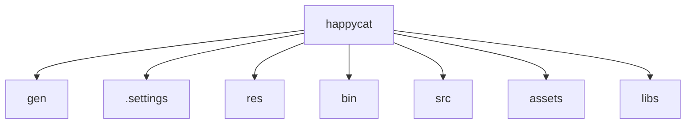

# 基础信息

|      |      |
|------|------|
| 名称 | happycat |
| 编码语言 | .java |
| 代码路径 | happycat |
| 概述说明 | Android资源索引系统，管理资源ID并提供Java常量引用。支持编译时静态绑定和UI构建，依赖AAPT工具生成。跨平台社交分享模块，支持图文编辑和多平台分发，含智能图像加载框架和电商组件，覆盖O2O流程。 |

### 包内部结构视图

该流程图展示了happycat项目的目录结构，包含7个直接子目录/文件：gen、.settings、res、bin、src、assets和libs。这些节点均以happycat为根目录，呈现扁平化的层级关系，没有进一步的子目录展开，完整反映了给定路径的并列结构。

# 模块列表 File List

| 名称   | 类型  | 说明 |
|-------|------|-------------|

