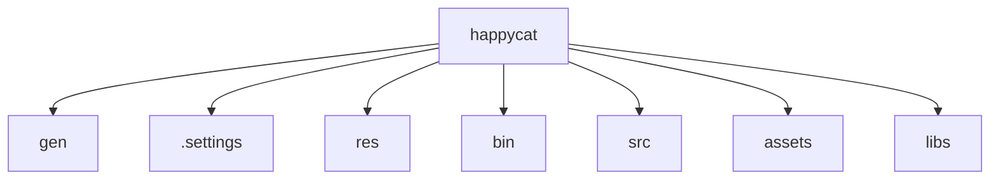

# Basic Information

|      |      |
|------|------|
| Name | happycat |
| Language | .java |
| Code Path | happycat |
| Brief Description | Android resource management and build configuration module, including R.java resource indexing and BuildConfig debugging switches, supporting full lifecycle resource invocation. Cross-platform social sharing and image loading module, enabling edit-share loop and asynchronous loading, relying on third-party services and foundational libraries. |

### Package Internal Structure View

This flowchart illustrates the directory structure of the happycat project, which includes 7 direct subdirectories/files: gen, .settings, res, bin, src, assets, and libs. All nodes are first-level children with no deeper nesting, fully presenting the foundational directory layout of the happycat project. Such a flat structure is commonly seen in Android or Java projects, featuring standard directories like src for source code, res for resource files, and libs for dependency libraries.

# Module List

| Name   | Type  | Description |
|-------|------|-------------|

