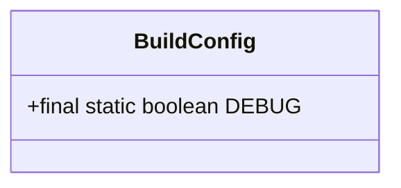
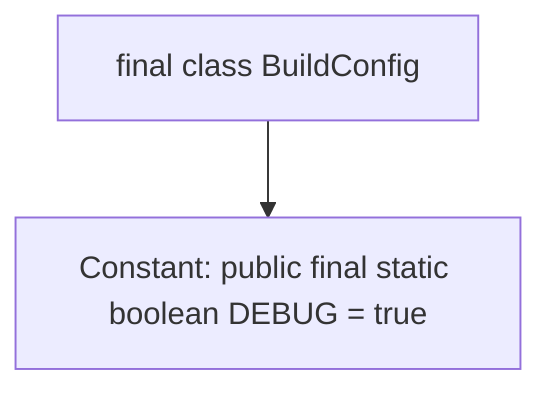

# Basic Information

|      |      |
|------|------|
| Name | BuildConfig |
| Language | .java |
| Code Path | happycat/gen/com/example/happucat/BuildConfig.java |
| Package Name | com.example.happucat |
| Dependencies | [] |
| Brief Description | The BuildConfig class contains a static DEBUG constant with a value of true, indicating the current debug mode. |

# Description

The content defines an immutable public class named BuildConfig, which contains a public static immutable Boolean variable DEBUG with its value set to true. This class is typically used for build configurations, where the DEBUG variable identifies whether the current mode is debug.

# Class Summary

| Name   | Type  | Description |
|-------|------|-------------|
| BuildConfig | class | This is a Java class that defines a public immutable BuildConfig class, containing a public static immutable DEBUG boolean variable with a value of true. |

## Class BuildConfig

|      |      |
|------|------|
| Access Modifier | public final |
| Type | class |
| Name | BuildConfig |
| Description | This is a Java class that defines a public immutable BuildConfig class, containing a public static immutable DEBUG boolean variable with a value of true. |

### UML Class Diagram

This code defines an immutable final class `BuildConfig`, which contains a public, static, unmodifiable boolean constant `DEBUG` initialized to `true`. This class is typically used for build configurations, where the `DEBUG` flag determines whether the current mode is debug, enabling different logic handling between development and production environments. The `final` class and `static final` members ensure global uniqueness and thread safety.

### Internal Method Call Graph

This code defines a non-inheritable final class BuildConfig, which contains a public static final boolean constant DEBUG initialized to true. The constant is determined at compile time and cannot be modified, typically used to indicate whether the current mode is debug. The entire class structure is extremely simple, containing only a constant declaration without methods or other member variables. This design pattern is commonly used in automatically generated configuration files for Android projects.

### Field List

| Name  | Type  | Description |
|-------|-------|------|
| DEBUG = true | boolean | Define a public static constant DEBUG with the value true, used as a switch for debug mode. |

### Method List

| Name  | Type  | Description |
|-------|-------|------|

