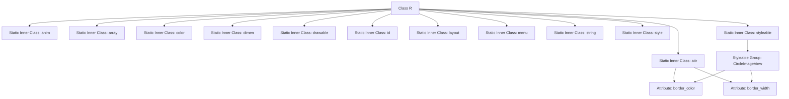

# Basic Information

|      |      |
|------|------|
| Name | R |
| Language | .java |
| Code Path | happycat/gen/com/example/happucat/R.java |
| Package Name | com.example.happucat |
| Dependencies | [] |
| Brief Description | This is an R.java file for an Android application, containing resource ID definitions such as animations, arrays, attributes, colors, dimensions, layouts, menus, strings, and styles. |

# Description

This is an Android application's resource file R.java, which contains ID definitions for various types of resources. The file has a clear structure, divided into multiple inner classes corresponding to different resource types:

1. **anim class**: Defines 6 animation resource IDs, including left/right entry/exit animations and dialog animations.

2. **array class**: Contains 1 array resource ID.

3. **attr class**: Defines 2 custom attributes (`border_color` and `border_width`) for the `CircleImageView` control.

4. **color class**: Defines 21 color resource IDs, including various shades of gray, basic colors, and application-specific colors.

5. **dimen class**: Includes a large number of dimension definitions, covering margins, text sizes, indicator dimensions, etc.

6. **drawable class**: Lists 144 image resource IDs, including icons, button state images, etc.

7. **id class**: Defines 357 view IDs corresponding to various controls in layout files.

8. **layout class**: Contains 77 layout file IDs.

9. **menu class**: Defines 9 menu resource IDs.

10. **string class**: Includes 129 string resources, covering application text, sharing-related text, etc.

11. **style class**: Defines 44 styles, including base themes and various custom styles.

12. **styleable class**: Defines custom attributes for `CircleImageView`.

This file is an auto-generated resource index file in Android application development, providing developers with a unified access point to all resources in the program.

# Class Summary

| Name   | Type  | Description |
|-------|------|-------------|
| R | class | This is the resource file R.java for an Android application, containing definitions for resources such as animations, arrays, attributes, colors, dimensions, drawables, IDs, layouts, menus, strings, and styles. Key points include: animation resources like left and right swipe effects, color resources such as background and text colors, dimension resources like margins and text sizes, drawable resources like icons and background images, layout resources like login and main interfaces, as well as string resources and style definitions. |


## Class R

|      |      |
|------|------|
| Access Modifier | public final |
| Type | class |
| Name | R |
| Description | This is the resource file R.java for an Android application, containing definitions for resources such as animations, arrays, attributes, colors, dimensions, drawables, IDs, layouts, menus, strings, and styles. Key points include: animation resources like left and right swipe effects, color resources such as background and text colors, dimension resources like margins and text sizes, drawable resources like icons and background images, layout resources like login and main interfaces, as well as string resources and style definitions. |


### UML Class Diagram

```mermaid
classDiagram
    class R {
        <<final>>
    }
    class anim {
        <<static>> <<final>>
        +int anim_left_to_right_in
        +int anim_left_to_right_out
        +int anim_right_to_left_in
        +int anim_right_to_left_out
        +int photo_dialog_in_anim
        +int photo_dialog_out_anim
    }
    class array {
        <<static>> <<final>>
        +int xiaoxi_welcome
    }
    class attr {
        <<static>> <<final>>
        +int border_color
        +int border_width
    }
    class color {
        <<static>> <<final>>
        +int app_content_background_color
        +int background
        +int black
        // ... (other color constants)
    }
    class dimen {
        <<static>> <<final>>
        +int activity_horizontal_margin
        +int activity_vertical_margin
        // ... (other dimension constants)
    }
    class drawable {
        <<static>> <<final>>
        +int aa
        +int aaa
        // ... (other drawable resource IDs)
    }
    class id {
        <<static>> <<final>>
        +int Djbt
        +int Tj
        // ... (other ID constants)
    }
    class layout {
        <<static>> <<final>>
        +int activity_address_add
        +int activity_group_member_item
        // ... (other layout resource IDs)
    }
    class menu {
        <<static>> <<final>>
        +int address
        +int dai_ping_jia_order_pingjia
        // ... (other menu resource IDs)
    }
    class string {
        <<static>> <<final>>
        +int action_settings
        +int alipay
        // ... (other string resource IDs)
    }
    class style {
        <<static>> <<final>>
        +int AppBaseTheme
        +int AppTheme
        // ... (other style resource IDs)
    }
    class styleable {
        <<static>> <<final>>
        +int[] CircleImageView
        +int CircleImageView_border_color
        +int CircleImageView_border_width
    }

    R --> anim : contains
    R --> array : contains
    R --> attr : contains
    R --> color : contains
    R --> dimen : contains
    R --> drawable : contains
    R --> id : contains
    R --> layout : contains
    R --> menu : contains
    R --> string : contains
    R --> style : contains
    R --> styleable : contains
```

This code represents a typical Android resource class R.java, automatically generated by the aapt tool, which centrally manages all resource IDs for an application. The class diagram illustrates the R class as a top-level container that includes multiple static inner classes (anim, array, color, etc.), each storing constants for specific types of resource IDs. This structure provides type-safe resource access for Android applications, such as R.drawable.icon or R.string.app_name. All inner classes are declared as final and contain static constants, ensuring that resource IDs are determined at compile time and cannot be modified. The class diagram clearly shows the resource categorization and hierarchical relationships, which is the core design pattern of Android's resource management system.


### Internal Method Call Graph



This code defines an Android resource management class R, containing multiple static inner classes for storing different types of resource IDs. The core structure consists of a top-level final class R, which nests static classes for resource types such as anim (animations), array (arrays), attr (custom attributes), color (colors), etc. The attr class includes two custom attributes, border_color and border_width, while the styleable class defines a styleable group called CircleImageView for these attributes. All resources are represented as hexadecimal integer constants in the format 0x7fXXXXXX, which is the resource identifier format automatically generated by Android's aapt tool. This class is primarily used to reference resources in Java code via R.xxx.yyy syntax, enabling type-safe resource access.

### Field List

| Name  | Type  | Description |
|-------|-------|------|

### Method List

| Name  | Type  | Description |
|-------|-------|------|


