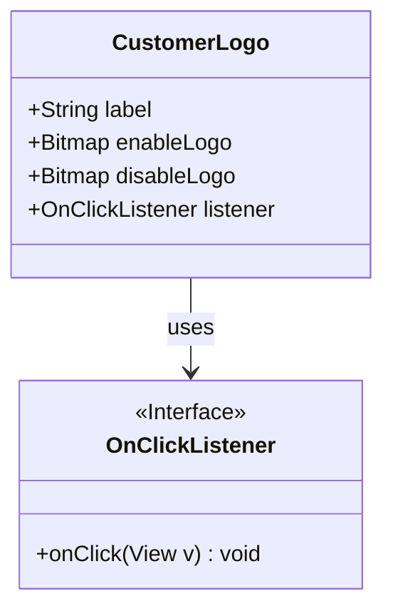
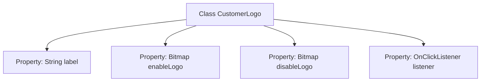

# Basic Information

|      |      |
|------|------|
| Name | CustomerLogo |
| Language | .java |
| Code Path | happycat/src/cn/sharesdk/onekeyshare/CustomerLogo.java |
| Package Name | cn.sharesdk.onekeyshare |
| Dependencies | ['android.graphics.Bitmap', 'android.view.View.OnClickListener'] |
| Brief Description | The CustomerLogo class includes labels, enabled/disabled logo bitmaps, and click listeners. |

# Description

The code defines a public class named CustomerLogo, which contains four member variables: label is of string type, storing the label text; enableLogo and disableLogo are both of Bitmap type, representing the icons for enabled and disabled states respectively; listener is of OnClickListener type, used to handle click events. This class is designed to manage the display and interaction functionality of customer logos.

# Class Summary

| Name   | Type  | Description |
|-------|------|-------------|
| CustomerLogo | class | The CustomerLogo class contains four members: a label string, enableLogo and disableLogo bitmaps, and a listener click event listener. |

## Class CustomerLogo

|      |      |
|------|------|
| Access Modifier | public |
| Type | class |
| Name | CustomerLogo |
| Description | The CustomerLogo class contains four members: a label string, enableLogo and disableLogo bitmaps, and a listener click event listener. |

### UML Class Diagram

This class diagram illustrates the structure of the CustomerLogo class and its relationship with the OnClickListener interface. CustomerLogo contains four public members: a String-type label, two Bitmap-type logos (enableLogo and disableLogo), and an OnClickListener-type listener. OnClickListener is an interface that defines the onClick method. The diagram clearly shows that CustomerLogo depends on the OnClickListener interface to handle click events. The overall structure is straightforward, demonstrating a typical interaction pattern between view components and event listeners.

### Internal Method Call Graph

This flowchart illustrates the structure of the CustomerLogo class, which contains four public properties: a String-type label, Bitmap-type enableLogo and disableLogo, and an OnClickListener-type listener. The class is designed to store customer logo-related data, where enable/disableLogo represent icons for enabled/disabled states respectively, and the listener handles interaction events. This structure is commonly used for UI component state management, though it should be noted that directly exposing properties may pose data security risks.

### Field List

| Name  | Type  | Description |
|-------|-------|------|
| label | String | Common string variable label. |
| enableLogo | Bitmap | A public bitmap variable enableLogo is defined. |
| disableLogo | Bitmap | Disabled Flag Bitmap |
| listener | OnClickListener | Defined a public click listener object named listener. |

### Method List

| Name  | Type  | Description |
|-------|-------|------|

