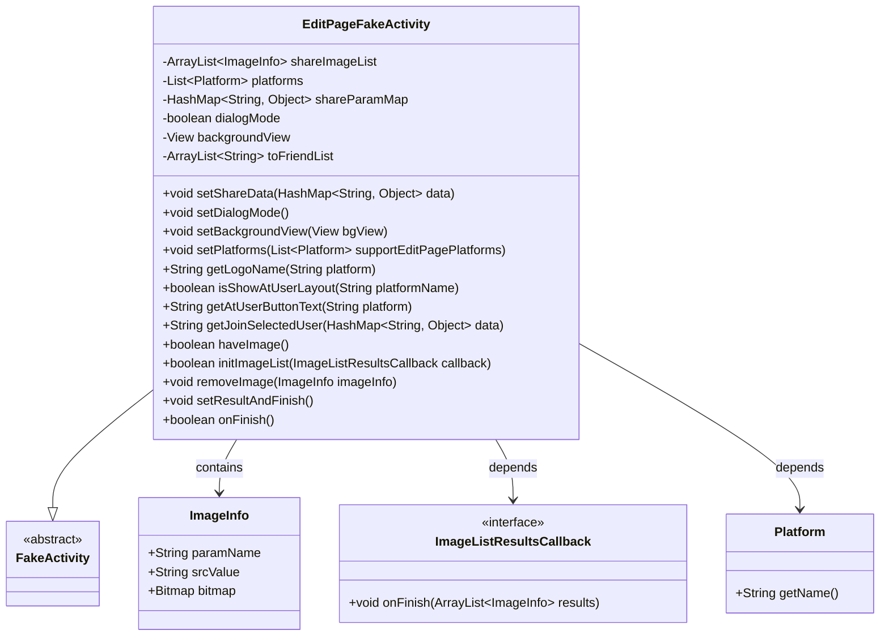
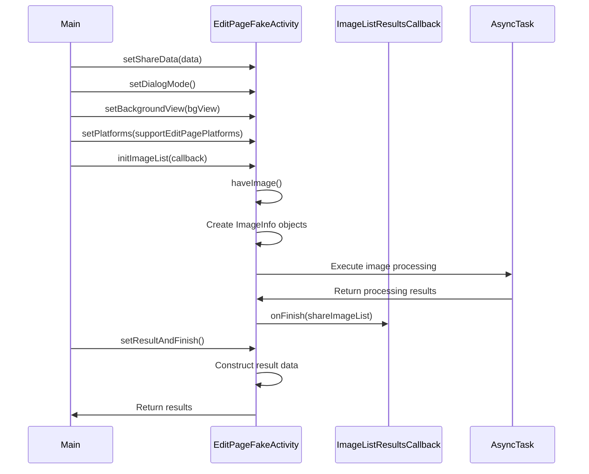

# Basic Information

|      |      |
|------|------|
| Name | EditPageFakeActivity |
| Language | .java |
| Code Path | happycat/src/cn/sharesdk/onekeyshare/EditPageFakeActivity.java |
| Package Name | cn.sharesdk.onekeyshare |
| Dependencies | ['com.mob.tools.utils.R.getStringRes', 'java.io.File', 'java.util.ArrayList', 'java.util.HashMap', 'java.util.List', 'android.graphics.Bitmap', 'android.os.AsyncTask', 'android.text.TextUtils', 'android.view.View', 'android.widget.Toast', 'cn.sharesdk.framework.Platform', 'com.mob.tools.FakeActivity', 'com.mob.tools.utils.BitmapHelper'] |
| Brief Description | The EditPageFakeActivity class is used to handle the logic of the sharing page, supporting multi-platform sharing, managing image data, providing dialog mode, processing user selections and image handling, and ultimately generating the sharing result. |

# Description

EditPageFakeActivity is a class designed to handle social platform share editing pages, inheriting from FakeActivity. It includes properties such as platform lists, share parameter mappings, dialog mode flags, and background views. Key functionalities involve setting share data, managing image resources (supporting various sources like URLs, paths, bitmaps, etc.), handling @user mentions (for platforms like Weibo and Facebook), initializing image lists, and loading images through asynchronous tasks. The class also implements result return logic, specifically handling friend selection for the Facebook Messenger platform, ultimately packaging the editing results for return and cleaning up resources.

# Class Summary

| Name   | Type  | Description |
|-------|------|-------------|
| EditPageFakeActivity | class | The EditPageFakeActivity class is used to handle social platform sharing functionality, supporting multiple image sources, providing dialog mode, managing sharing parameters and image lists, and processing user selections and result returns. |

## Class EditPageFakeActivity

|      |      |
|------|------|
| Access Modifier | public |
| Type | class |
| Name | EditPageFakeActivity |
| Description | The EditPageFakeActivity class is used to handle social platform sharing functionality, supporting multiple image sources, providing dialog mode, managing sharing parameters and image lists, and processing user selections and result returns. |

### UML Class Diagram

This class diagram illustrates that EditPageFakeActivity inherits from FakeActivity, contains the ImageInfo inner class, and depends on the ImageListResultsCallback interface and Platform class. Its core functionalities include social sharing parameter management, image processing (via ImageInfo objects storing image data), platform configuration, and result callback handling. It uses HashMap to store sharing parameters, provides various image manipulation methods and platform adaptation features, and supports Dialog mode display with background asynchronous image loading.

### Internal Method Call Graph

```mermaid
graph TD
    A["Class EditPageFakeActivity"]
    B["Property: List<Platform> platforms"]
    C["Property: HashMap<String, Object> shareParamMap"]
    D["Property: boolean dialogMode"]
    E["Property: View backgroundView"]
    F["Property: ArrayList<String> toFriendList"]
    G["Property: ArrayList<ImageInfo> shareImageList"]
    H["Inner Class ImageInfo"]
    I["Interface ImageListResultsCallback"]
    J["Method: setShareData(HashMap<String, Object>)"]
    K["Method: setDialogMode()"]
    L["Method: setBackgroundView(View)"]
    M["Method: setPlatforms(List<Platform>)"]
    N["Method: getLogoName(String)"]
    O["Method: isShowAtUserLayout(String)"]
    P["Method: getAtUserButtonText(String)"]
    Q["Method: getJoinSelectedUser(HashMap<String, Object>)"]
    R["Method: haveImage()"]
    S["Method: initImageList(ImageListResultsCallback)"]
    T["Method: removeImage(ImageInfo)"]
    U["Method: setResultAndFinish()"]
    V["Method: onFinish()"]

    A --> B
    A --> C
    A --> D
    A --> E
    A --> F
    A --> G
    A --> H
    A --> I
    A --> J
    A --> K
    A --> L
    A --> M
    A --> N
    A --> O
    A --> P
    A --> Q
    A --> R
    A --> S
    A --> T
    A --> U
    A --> V
```

This code defines an EditPageFakeActivity class primarily used for handling social platform sharing functionalities. The class contains multiple properties for storing sharing parameters, platform information, image data, etc., along with a series of methods for setting sharing data, processing images, constructing results, etc. The flowchart illustrates the class structure and internal relationships, while the sequence diagram depicts the calling order of main methods and data flow. The class supports processing various image sources including local paths, network URLs, Bitmap objects, etc., and performs image loading and processing through asynchronous tasks, ultimately returning results to the caller.

### Field List

| Name  | Type  | Description |
|-------|-------|------|
| toFriendList | ArrayList<String> | A string dynamic array of protected type, used to store the friend list. |
| shareImageList | ArrayList<ImageInfo> | Private image information list, storing ImageInfo objects. |
| backgroundView | View | Protected View Background View |
| shareParamMap | HashMap<String, Object> | A thread-safe HashMap with String keys and Object values, used for storing shared parameters. |
| dialogMode | boolean | The protected boolean variable dialogMode in the class is used to control the state of the dialog mode. |
| platforms | List<Platform> | This is a protected list variable that stores objects of the Platform type. |

### Method List

| Name  | Type  | Description |
|-------|-------|------|
| setDialogMode | void | Set dialogMode to true. |
| setBackgroundView | void | The method to set the background view assigns the parameter bgView to the backgroundView property of the current object. |
| getJoinSelectedUser | String | The method `getJoinSelectedUser` processes the `selected` list in the data. If the platform is FacebookMessenger, it returns `null`; otherwise, it concatenates the usernames into a string formatted as "@user ". If there is no data or no `selected` field, it returns `null`. |
| setShareData | void | The method `setShareData` takes a `HashMap` parameter and assigns it to the member variable `shareParamMap`. |
| setPlatforms | void | Set the list of platforms that support editing pages. |
| getLogoName | String | The method retrieves the corresponding logo name based on the platform parameter. If the platform is empty, it returns an empty string; otherwise, it looks up the resource ID and returns the corresponding string. |
| isShowAtUserLayout | boolean | Determine whether the platform displays the user layout: returns true for Sina Weibo, Tencent Weibo, Facebook, Twitter, or Facebook Messenger. |
| getAtUserButtonText | String | The method returns "To" (Facebook Messenger) or "@" (other platforms) based on platform parameters. |
| haveImage | boolean | Check if an image exists: Returns true if any of imageUrl, imagePath, viewToShare, or imageArray is valid; otherwise, returns false. |
| initImageList | boolean | Initialize the image list method, prioritizing checking local paths, bitmaps, URLs, or images in arrays, and asynchronously loading network images before returning the result via callback. Returns true on success, false on failure. |
| removeImage | void | Remove specified image: After verifying that both the list and the image are non-empty, delete the given image information from the shared image list. |
| setResultAndFinish | void | The method setResultAndFinish processes the shared image data by storing imagePath and imageUrl into shareParamMap, saving viewToShare as a bitmap, and converting imageArray into an array. It checks whether the Facebook Messenger platform has a recipient address; if not, it prompts to select a friend. Finally, it packages the result and finishes the activity. |
| onFinish | boolean | Override the method, clear the shared image list, and invoke the parent class's termination handling. |

