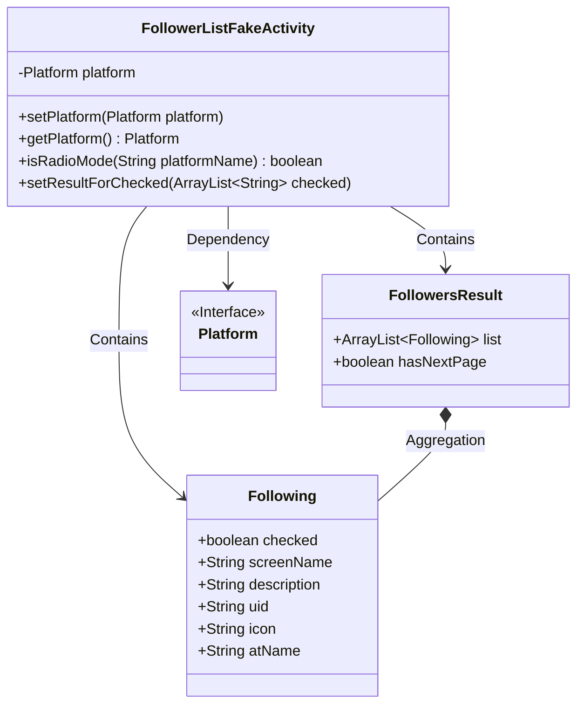

# Basic Information

|      |      |
|------|------|
| Name | FollowerListFakeActivity |
| Language | .java |
| Code Path | happycat/src/cn/sharesdk/onekeyshare/FollowerListFakeActivity.java |
| Package Name | cn.sharesdk.onekeyshare |
| Dependencies | ['java.util.ArrayList', 'java.util.HashMap', 'com.mob.tools.FakeActivity', 'cn.sharesdk.framework.Platform'] |
| Brief Description | The FollowerListFakeActivity class is designed to handle follower list data across different social media platforms. It includes functionalities such as setting the platform, checking single-selection mode, configuring selected results, and parsing follower data. It supports platforms like Weibo, Facebook, and Twitter, parsing user information and returning lists along with pagination status. |

# Description

FollowerListFakeActivity is a mock activity class designed to handle follower list data from different social platforms. It includes methods for setting and retrieving the platform, as well as logic to determine whether the platform is Facebook Messenger. The inner class Following represents individual follower information, containing attributes such as selection status, username, description, UID, icon, and @handle. The FollowersResult class consists of a follower list and a flag indicating whether there is a next page. The parseFollowers method parses follower data in different formats based on the platform name, supporting Sina Weibo, Tencent Weibo, Facebook, Twitter, and Facebook Messenger platforms. It extracts user information, populates it into Following objects, and finally returns a FollowersResult object containing the processed results.

# Class Summary

| Name   | Type  | Description |
|-------|------|-------------|
| FollowerListFakeActivity | class | The FollowerListFakeActivity class is designed to handle follower list data from various social platforms, including functionalities for retrieving platform information, setting selected results, and parsing follower data. It supports platforms such as Weibo, Facebook, Twitter, and others. |

## Class FollowerListFakeActivity

|      |      |
|------|------|
| Access Modifier | public |
| Type | class |
| Name | FollowerListFakeActivity |
| Description | The FollowerListFakeActivity class is designed to handle follower list data from various social platforms, including functionalities for retrieving platform information, setting selected results, and parsing follower data. It supports platforms such as Weibo, Facebook, Twitter, and others. |

### UML Class Diagram

This code describes the core structure of a social platform follower list management system. The FollowerListFakeActivity serves as the main class, incorporating the Platform interface and two static inner classes: Following (follower information) and FollowersResult (query results). The system supports parsing follower data from various social platforms (Weibo, Facebook, etc.), converting raw data into a unified format via the parseFollowers method. The class diagram illustrates dependency and containment relationships between them, where FollowersResult aggregates multiple Following objects, reflecting the business logic of "one result containing multiple followers."

### Internal Method Call Graph

```mermaid
graph TD
    A["Class FollowerListFakeActivity"]
    B["Property: Platform platform"]
    C["Method: setPlatform(Platform platform)"]
    D["Method: getPlatform()"]
    E["Method: isRadioMode(String platformName)"]
    F["Method: setResultForChecked(ArrayList<String> checked)"]
    G["Inner Class: Following"]
    H["Inner Class: FollowersResult"]
    I["Static Method: parseFollowers(String platformName, HashMap<String, Object> res, HashMap<String, Boolean> uidMap)"]

    A --> B
    A --> C
    A --> D
    A --> E
    A --> F
    A --> G
    A --> H
    A -.-> I

    G --> J["Property: boolean checked"]
    G --> K["Property: String screenName"]
    G --> L["Property: String description"]
    G --> M["Property: String uid"]
    G --> N["Property: String icon"]
    G --> O["Property: String atName"]

    H --> P["Property: ArrayList<Following> list"]
    H --> Q["Property: boolean hasNextPage"]

    I --> R["Validate res"]
    I --> S["Process SinaWeibo data"]
    I --> T["Process TencentWeibo data"]
    I --> U["Process Facebook data"]
    I --> V["Process Twitter data"]
    I --> W["Process FacebookMessenger data"]
    I --> X["Construct FollowersResult object"]
```

This code represents a social platform follower list handler class, primarily managing platform objects, setting check results, and parsing follower data from various platforms (Sina Weibo, Tencent Weibo, Facebook, etc.). The core method parseFollowers processes raw data according to platform type, constructs Following object lists, and determines pagination status. The class contains two static inner classes: Following (stores user info) and FollowersResult (stores parsed results). The flowchart clearly illustrates the class structure, property relationships, and method invocation paths, particularly highlighting the branching logic for multi-platform data processing.

### Field List

| Name  | Type  | Description |
|-------|-------|------|
| platform | Platform | Protected platform objects. |

### Method List

| Name  | Type  | Description |
|-------|-------|------|
| getPlatform | Platform | Methods to obtain the current platform object, returns the value of the platform property. |
| isRadioMode | boolean | Check if the platform name is FacebookMessenger and return a boolean value. |
| setPlatform | void | Set the platform attributes of the current object to the specified parameter values. |
| setResultForChecked | void | The method `setResultForChecked` takes a list of strings `checked`, stores them together with `platform` in a HashMap, and returns the result via `setResult`. |
| parseFollowers | FollowersResult | Analyze fan data from different platforms to generate a FollowersResult object. Process data from Sina Weibo, Tencent Weibo, Facebook, Twitter, and Facebook Messenger, extracting information such as user ID, name, description, and avatar. Check for the presence of a next page and avoid duplicate additions. |

