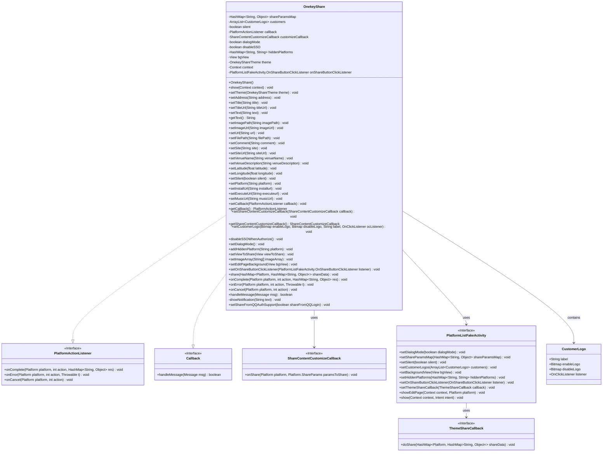

# Basic Information

|      |      |
|------|------|
| Name | OnekeyShare |
| Language | .java |
| Code Path | happycat/src/cn/sharesdk/onekeyshare/OnekeyShare.java |
| Package Name | cn.sharesdk.onekeyshare |
| Dependencies | ['com.mob.tools.utils.BitmapHelper.captureView', 'com.mob.tools.utils.R.getStringRes', 'java.io.File', 'java.util.ArrayList', 'java.util.HashMap', 'java.util.Map.Entry', 'android.app.NotificationManager', 'android.content.Context', 'android.graphics.Bitmap', 'android.os.Handler.Callback', 'android.os.Message', 'android.text.TextUtils', 'android.view.View', 'android.view.View.OnClickListener', 'android.widget.Toast', 'cn.sharesdk.framework.CustomPlatform', 'cn.sharesdk.framework.Platform', 'cn.sharesdk.framework.PlatformActionListener', 'cn.sharesdk.framework.ShareSDK', 'com.mob.tools.utils.UIHandler'] |
| Brief Description | The OnekeyShare class implements one-click sharing functionality, supporting multiple platforms (WeChat, Weibo, etc.), configurable sharing content (text, images, etc.), and providing silent sharing, custom UI, and callback handling. |

# Description

The OnekeyShare class is a utility tool that implements one-click sharing functionality, supporting multiple social platforms. It includes features such as sharing parameter configuration, platform selection, and content customization. The class defines various sharing types (text, image, webpage, etc.) and supports silent sharing, custom icons, and hidden platforms. Sharing result callbacks—including success, failure, and cancellation—are handled via the PlatformActionListener. It also incorporates client validity checks, notification prompts, and sharing statistics. The overall design is flexible, catering to the sharing requirements of different platforms.

# Class Summary

| Name   | Type  | Description |
|-------|------|-------------|
| OnekeyShare | class | The OnekeyShare class implements one-click sharing functionality, supporting multi-platform sharing with customizable content, themes, and callbacks. It includes silent sharing, an editing page, and error handling. |

## Class OnekeyShare

|      |      |
|------|------|
| Access Modifier | public |
| Type | class |
| Name | OnekeyShare |
| Description | The OnekeyShare class implements one-click sharing functionality, supporting multi-platform sharing with customizable content, themes, and callbacks. It includes silent sharing, an editing page, and error handling. |

### UML Class Diagram

This code defines a class named OnekeyShare that implements the PlatformActionListener and Callback interfaces, designed to handle one-click sharing functionality. The class includes features for setting sharing parameters, selecting platforms, and customizing shared content, supporting sharing operations across various social platforms. The PlatformListFakeActivity displays a list of sharing platforms and executes corresponding sharing operations based on platform-specific characteristics and user settings. The class diagram illustrates the relationships between OnekeyShare and related interfaces/helper classes, including parameter passing, callback handling, and UI presentation interactions.

### Internal Method Call Graph

This flowchart illustrates the core architecture of OnekeyShare, comprising three main modules: 1) The parameter setting module provides 20+ set methods to configure sharing content; 2) The show method implements dual-path processing: direct sharing or displaying UI via PlatformListFakeActivity; 3) The sharing process adopts the chain-of-responsibility pattern, where ShareCore executes actual sharing operations and handles platform-specific validations. The sequence diagram highlights two execution paths of the show method and callback mechanism, demonstrating key control logic such as platform validation and content type judgment.

### Field List

| Name  | Type  | Description |
|-------|-------|------|
| MSG_CANCEL_NOTIFY = 3 | int | The private static constant MSG_CANCEL_NOTIFY has a value of 3, which is used to cancel notifications. |
| MSG_ACTION_CCALLBACK = 2 | int | The private static constant MSG_ACTION_CCALLBACK has a value of 2, which is used to identify callback operations. |
| shareParamsMap | HashMap<String, Object> | Private hash map with string keys and object values. |
| onShareButtonClickListener | PlatformListFakeActivity.OnShareButtonClickListener | Private member variable of type PlatformListFakeActivity's internal interface OnShareButtonClickListener, used to handle share button click events. |
| silent | boolean | The boolean variable silent indicates the silent state. |
| context | Context | Private context object. |
| customers | ArrayList<CustomerLogo> | List of Private Client Logos. |
| MSG_TOAST = 1 | int | Define a private static constant MSG_TOAST with a value of 1, used for message identification. |
| hiddenPlatforms | HashMap<String, String> | Hidden platform mapping table, both keys and values are of string type. |
| disableSSO | boolean | Disable single sign-on flag, boolean type. |
| dialogMode = false | boolean | The variable `dialogMode` is used to control the dialog mode, with a default value of `false`. |
| theme | OnekeyShareTheme | The private member variable `theme`, of type `OnekeyShareTheme`. |
| customizeCallback | ShareContentCustomizeCallback | The private member variable `customizeCallback`, of type `ShareContentCustomizeCallback` interface. |
| callback | PlatformActionListener | Private platform action listener callback. |
| bgView | View | The private view variable bgView. |

### Method List

| Name  | Type  | Description |
|-------|-------|------|
| setImageUrl | void | The method `setImageUrl` accepts a string `imageUrl`, and when it is not empty, stores it in `shareParamsMap` with the key "imageUrl". |
| setCallback | void | Set the callback function, assigning the passed PlatformActionListener to the callback property of the current object. |
| setLongitude | void | The method `setLongitude` accepts a float parameter `longitude` and stores it in the `shareParamsMap` with the key "longitude". |
| disableSSOWhenAuthorize | void | The method disableSSOWhenAuthorize sets disableSSO to true, which is used to disable single sign-on. |
| setVenueName | void | The method `setVenueName` stores the input parameter `venueName` into the `shareParamsMap` with the key "venueName". |
| handleMessage | boolean | Methods for handling messages: Display a Toast, process sharing callbacks (success, failure, cancellation) and show notifications, or cancel notifications. Check the exception type and display corresponding prompts upon failure. |
| showNotification | void | This is a Java method used to display a brief notification message (Toast) in an Android application. It takes a string parameter `text` as the display content and uses `Toast.makeText` to create and show a short prompt. |
| setShareFromQQAuthSupport | void | Set up QQ authorization sharing support and store the parameters in the sharing mapping table. |
| getText | String | Get the text value from the sharing parameters, or return empty if none exists. |
| setSiteUrl | void | The method `setSiteUrl` takes a string `siteUrl` and stores it in `shareParamsMap` with the key `"siteUrl"`. |
| setShareContentCustomizeCallback | void | Set the custom callback function for sharing content, assign the passed-in callback to customizeCallback. |
| setPlatform | void | The method `setPlatform` accepts a string parameter `platform` and stores it in the `shareParamsMap` with the key "platform". |
| setText | void | This is a Java method that stores the input string `text` into `shareParamsMap` with the key "text". |
| setTitleUrl | void | Set the title link URL and store it in the shared parameters dictionary. |
| setUrl | void | The method `setUrl` accepts a string parameter `url` and stores it in `shareParamsMap` with the key "url". |
| setSilent | void | Methods for setting the silent state, with the parameter being a boolean value `silent`, used to control whether the object is silent. |
| setDialogMode | void | Set the dialog mode of the method to true and store this state in the shared parameter map. |
| setOnShareButtonClickListener | void | Set up a click listener for the share button, passing in a custom listener interface instance. |
| onCancel | void | The method `onCancel` handles the cancellation operation: it creates the `MSG_ACTION_CCALLBACK` message, sets the parameters and sends it, and finally logs the share failure statistics. |
| getCallback | PlatformActionListener | Get the callback function instance. |
| show | void | This method initializes the sharing SDK and handles the sharing logic. If a specific platform is designated and meets the conditions for silent sharing, client-side sharing, or custom platforms, it directly performs the sharing; otherwise, it creates a sharing page based on the theme, configures the parameters, and displays either the editing page or the nine-grid interface. |
| setViewToShare | void | This method captures a bitmap of the specified view and stores it in the shared parameter map, printing the stack trace in case of an exception. |
| setTitle | void | The method `setTitle` takes a string `title` and stores it in `shareParamsMap` with the key "title". |
| setEditPageBackground | void | The method `setEditPageBackground` takes a `View` parameter `bgView` and assigns it to the `bgView` property of the current object. |
| setCustomerLogo | void | Set the customer logo, including images for enabled and disabled states, labels, and click event listeners, and add it to the customer list. |
| addHiddenPlatform | void | Method to add hidden platforms: Store the platform name in the hiddenPlatforms mapping. |
| setAddress | void | The method `setAddress` stores the input `address` string into the `shareParamsMap` with the key "address". |
| onError | void | The method `onError` handles platform operation errors: prints the exception, encapsulates the error information (type 2, operation `action`, and the exception object) and sends it to `UIHandler`, while logging the statistics of failed sharing. |
| setSite | void | This is a Java method that stores the parameter site into shareParamsMap with the key "site". |
| setImagePath | void | The method setImagePath accepts a string imagePath and stores it in the "imagePath" key of shareParamsMap when it is not empty. |
| setExecuteUrl | void | The method `setExecuteUrl` stores the passed `executeurl` string into the `shareParamsMap` with the key "executeurl". |
| setComment | void | The method `setComment` takes a string `comment` and stores it in `shareParamsMap` with the key "comment". |
| setMusicUrl | void | The method `setMusicUrl` takes the `musicUrl` parameter and stores it in the `shareParamsMap` with the key "musicUrl". |
| setLatitude | void | The method `setLatitude` accepts a floating-point parameter `latitude` and stores it in `shareParamsMap` with the key "latitude". |
| setImageArray | void | The method `setImageArray` accepts a string array parameter and stores it in `shareParamsMap` with the key "imageArray". |
| getShareContentCustomizeCallback | ShareContentCustomizeCallback | The method to obtain the custom callback function for shared content returns the `customizeCallback` object. |
| setTheme | void | The method `setTheme` is used to set the OnekeyShare theme, assigning the parameter `theme` to the current object property. |
| onComplete | void | The method `onComplete` handles the callback for platform operation completion, creates a message and sets parameters, then sends the message via `UIHandler`. |
| setFilePath | void | The method `setFilePath` accepts a string parameter `filePath` and stores it in the `shareParamsMap` with the key "filePath". |
| setInstallUrl | void | The method `setInstallUrl` stores the passed `installurl` string into `shareParamsMap` with the key "installurl". |
| setVenueDescription | void | The method `setVenueDescription` takes a string `venueDescription` and stores it in the `shareParamsMap` with the key `"venueDescription"`. |
| share | void | The method iterates through the sharing platform data, checks whether each platform client is valid, and sends a prompt message if invalid. It sets the sharing type (text, image, webpage, etc.) based on the data type, and finally calls the core sharing function to complete the sharing. |

