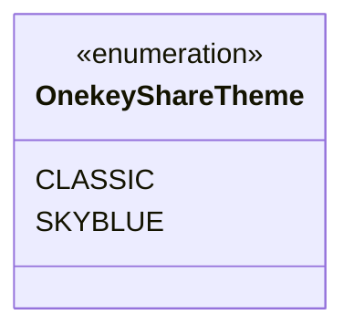
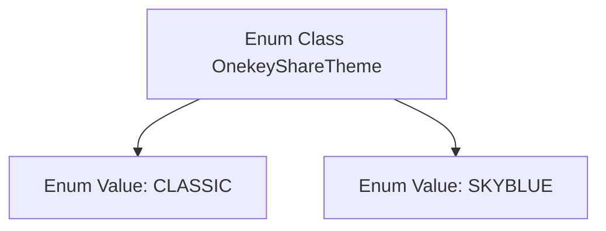

# Basic Information

|      |      |
|------|------|
| Name | OnekeyShareTheme |
| Language | .java |
| Code Path | happycat/src/cn/sharesdk/onekeyshare/OnekeyShareTheme.java |
| Package Name | cn.sharesdk.onekeyshare |
| Dependencies | [] |
| Brief Description | The OnekeyShareTheme enumeration includes two themes: Classic style (CLASSIC) and Sky Blue style (SKYBLUE). |

# Description

OnekeyShareTheme is an enumeration type that includes two optional values: CLASSIC and SKYBLUE, representing the classic theme and sky blue theme respectively.

# Class Summary

| Name   | Type  | Description |
|-------|------|-------------|
| OnekeyShareTheme | enum | The OnekeyShareTheme enumeration includes two themes: Classic style (CLASSIC) and Sky Blue style (SKYBLUE). |

## Class OnekeyShareTheme

|      |      |
|------|------|
| Access Modifier | public |
| Type | enum |
| Name | OnekeyShareTheme |
| Description | The OnekeyShareTheme enumeration includes two themes: Classic style (CLASSIC) and Sky Blue style (SKYBLUE). |

### UML Class Diagram

This class diagram describes an enumeration type named OnekeyShareTheme, which contains two enum constants: CLASSIC and SKYBLUE. In Java, an enumeration is a special class used to define a fixed set of constant values. This enumeration might be used to represent different theme styles for a one-click sharing feature, where CLASSIC denotes the classic theme and SKYBLUE represents the sky-blue theme. The enumeration type is clearly marked with the <<enumeration>> stereotype, effectively illustrating its structure and available options.

### Internal Method Call Graph

This flowchart illustrates the structure of the OnekeyShareTheme enum class, which contains two enum values: CLASSIC and SKYBLUE. An enum class is a special type of class used to define a fixed set of constants, here representing two theme styles for the one-click sharing feature. By organizing code in this structured manner, it ensures that only predefined valid theme values are used, enhancing code readability and safety.

### Field List

| Name  | Type  | Description |
|-------|-------|------|

### Method List

| Name  | Type  | Description |
|-------|-------|------|

