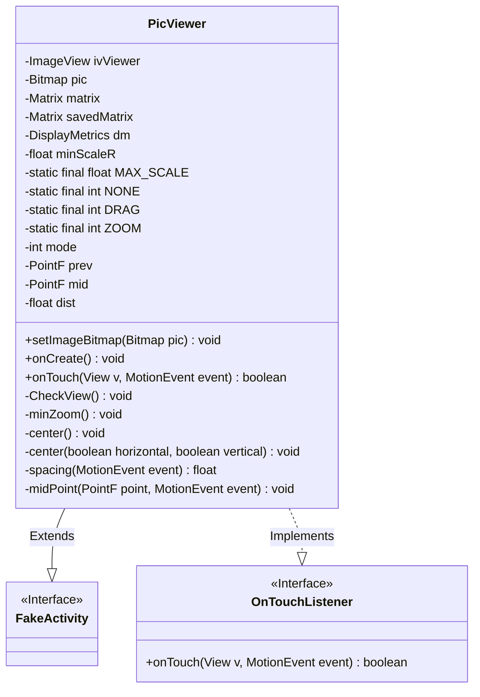
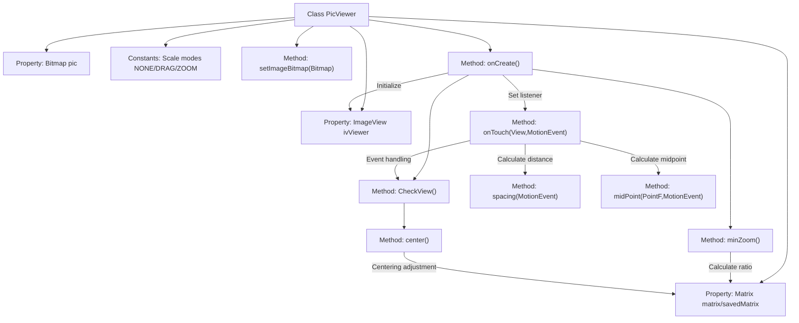

# Basic Information

|      |      |
|------|------|
| Name | PicViewer |
| Language | .java |
| Code Path | happycat/src/cn/sharesdk/onekeyshare/PicViewer.java |
| Package Name | cn.sharesdk.onekeyshare |
| Dependencies | ['android.graphics.Bitmap', 'android.graphics.Matrix', 'android.graphics.PointF', 'android.graphics.RectF', 'android.util.DisplayMetrics', 'android.util.FloatMath', 'android.view.MotionEvent', 'android.view.View', 'android.view.View.OnTouchListener', 'android.widget.ImageView', 'android.widget.ImageView.ScaleType', 'com.mob.tools.FakeActivity'] |
| Brief Description | The PicViewer class implements image viewing functionality, supporting drag and zoom operations, automatic centering adjustment, and limiting minimum and maximum zoom ratios. |

# Description

PicViewer is an image viewing class that inherits from FakeActivity and implements the OnTouchListener interface. It contains an ImageView control and a Bitmap object, supporting drag and zoom functionalities for images. The class defines minimum and maximum zoom scales, as well as three operation modes: NONE, DRAG, and ZOOM. Image transformations, including translation and scaling, are handled through a Matrix object. The onTouch method monitors touch events, switches operation modes based on different gestures, and updates the image display. The CheckView method restricts the zoom range and ensures the image is centered. The minZoom method calculates the minimum zoom scale to fit the screen. The center method achieves horizontal and vertical centering of the image. Additionally, methods for calculating the distance and midpoint between two points are provided. The entire class implements basic image viewing functionalities, including gesture operations and adaptive display.

# Class Summary

| Name   | Type  | Description |
|-------|------|-------------|
| PicViewer | class | The PicViewer class implements image viewing functionality, supporting touch drag and pinch-to-zoom gestures. It automatically calculates the minimum zoom scale and limits the maximum zoom to 10x, ensuring the image remains centered on screen. |

## Class PicViewer

|      |      |
|------|------|
| Access Modifier | public |
| Type | class |
| Name | PicViewer |
| Description | The PicViewer class implements image viewing functionality, supporting touch drag and pinch-to-zoom gestures. It automatically calculates the minimum zoom scale and limits the maximum zoom to 10x, ensuring the image remains centered on screen. |

### UML Class Diagram

Class diagram description:
PicViewer is an image viewer class that extends FakeActivity and implements the OnTouchListener interface for handling touch events. The class contains core members such as image display (ImageView), bitmap processing (Bitmap), and matrix transformations (Matrix). It provides functionalities including image setting, touch-based zooming/dragging, and view centering correction. By maintaining state variables like zoom scale and touch mode, it enables multi-touch zooming and single-finger dragging operations on images while ensuring they remain within reasonable display boundaries.

### Internal Method Call Graph

This code implements a multi-touch enabled image viewer supporting zooming and dragging. Core functionalities include: 1) Matrix transformations for image manipulation; 2) Touch event handling to distinguish between DRAG and ZOOM modes; 3) CheckView method to constrain zoom range with auto-centering; 4) minZoom calculation for initial screen-adaptive scaling. The flowchart demonstrates the complete call chain from initialization to touch event processing, highlighting the coordinated control mechanism between matrix transformations and touch states.

### Field List

| Name  | Type  | Description |
|-------|-------|------|
| savedMatrix = new Matrix() | Matrix | Create a new instance of the Matrix object named savedMatrix. |
| ivViewer | ImageView | Private ImageView control ivViewer. |
| pic | Bitmap | Private bitmap variable pic |
| matrix = new Matrix() | Matrix | Create a new instance of the Matrix class named matrix. |
| dm | DisplayMetrics | Define a DisplayMetrics object dm to store screen display parameters. |
| dist = 1f | float | Define a floating-point variable dist with an initial value of 1.0. |
| mid = new PointF() | PointF | Create an instance of the mid object for the PointF class. |
| MAX_SCALE = 10f | float | Define a static constant MAX_SCALE with a value of 10.0, which cannot be modified. |
| ZOOM = 2 | int | Define a static constant ZOOM with a value of 2. |
| mode = NONE | int | The variable mode is initialized to NONE. |
| prev = new PointF() | PointF | Create a variable named prev of type PointF and initialize it to the default value. |
| minScaleR = 1f | float | Define the minimum zoom scale as 1. |
| NONE = 0 | int | Define a static constant NONE with a value of 0. |
| DRAG = 1 | int | Define a static constant DRAG with a value of 1. |

### Method List

| Name  | Type  | Description |
|-------|-------|------|
| onCreate | void | Create an ImageView and initialize it, set the scaling type, background color, and touch listener. If the image is valid, load it. After obtaining the screen resolution, adjust the minimum scaling, check the view, and apply matrix transformation. Finally, set it as the active view. |
| center | void | This method is used to center an image by adjusting its position based on horizontal and vertical parameters. If the image is smaller than the screen, it will be centered; if larger, the empty space will be adjusted. Translation is achieved through matrix transformation. |
| spacing | float | Calculate the distance between two points: Obtain the difference between the coordinates of the two contact points, sum their squares, and return the square root. |
| midPoint | void | Calculate the midpoint coordinates of a two-touch event and store them in a PointF object. |
| center | void | This is a private method that calls the center method with two boolean parameters, both defaulting to true. |
| minZoom | void | Calculate the minimum scaling ratio of the image to fit the screen width or height, and set the matrix scaling with this ratio. |
| CheckView | void | Check the view zoom level; if it is less than the minimum value, set it to the minimum; if it exceeds the maximum value, restore the original matrix, and finally center it. |
| setImageBitmap | void | The method `setImageBitmap` takes a `Bitmap` parameter `pic`, assigns it to the member variable `pic`, and if `ivViewer` is not null, calls its `setImageBitmap` method to display the image. |
| onTouch | boolean | Handling touch events: Primary point press triggers drag mode, secondary point press with distance greater than 10 triggers zoom mode. During movement, execute drag or zoom operations based on the mode, then update the image matrix and check the view. |

