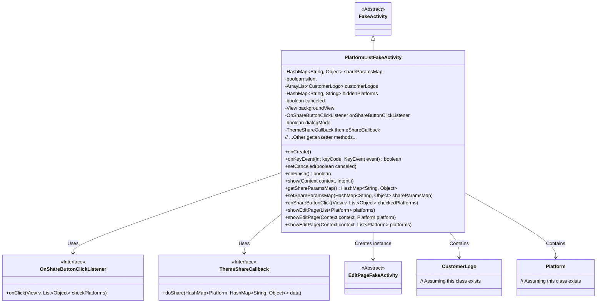

# Basic Information

|      |      |
|------|------|
| Name | PlatformListFakeActivity |
| Language | .java |
| Code Path | happycat/src/cn/sharesdk/onekeyshare/PlatformListFakeActivity.java |
| Package Name | cn.sharesdk.onekeyshare |
| Dependencies | ['android.content.Context', 'android.content.Intent', 'android.view.KeyEvent', 'android.view.View', 'java.util.ArrayList', 'java.util.HashMap', 'java.util.List', 'com.mob.tools.FakeActivity', 'cn.sharesdk.framework.Platform', 'cn.sharesdk.framework.ShareSDK'] |
| Brief Description | PlatformListFakeActivity is a class designed for sharing functionality, containing attributes such as sharing parameters, client logos, and hidden platforms. It supports silent sharing and editor page sharing, providing button click callbacks and theme sharing callbacks. |

# Description

PlatformListFakeActivity is a class that inherits from FakeActivity, primarily designed to handle functionalities related to sharing platform lists. It contains multiple member variables, such as shareParamsMap for storing sharing parameters, silent for controlling silent sharing, customerLogos for storing customer logos, and hiddenPlatforms for recording hidden platforms. The class provides various methods to set and retrieve these variables. Core functionalities include handling share button click events via onShareButtonClick, and performing silent sharing or navigating to the edit page showEditPage based on conditions. In onCreate, it checks if themeShareCallback is null and terminates the activity if so. onKeyEvent handles back key events and marks the cancellation status, while onFinish records statistical events upon cancellation. The class also supports dialog mode and processes sharing results through callback interfaces.

# Class Summary

| Name   | Type  | Description |
|-------|------|-------------|
| PlatformListFakeActivity | class | PlatformListFakeActivity serves as the base class for sharing functionality, managing sharing parameters, platform lists, and click events. It supports silent sharing and editor-page sharing, while incorporating cancellation logic and callback handling. |

## Class PlatformListFakeActivity

|      |      |
|------|------|
| Access Modifier | public |
| Type | class |
| Name | PlatformListFakeActivity |
| Description | PlatformListFakeActivity serves as the base class for sharing functionality, managing sharing parameters, platform lists, and click events. It supports silent sharing and editor-page sharing, while incorporating cancellation logic and callback handling. |

### UML Class Diagram

This class diagram illustrates the complete structure of PlatformListFakeActivity, which inherits from FakeActivity and contains multiple member variables such as share parameters, customer logo lists, etc. It implements UI display, key event handling, and sharing logic. Button clicks are processed via the OnShareButtonClickListener interface, sharing operations are executed through ThemeShareCallback dependency, and it can create EditPageFakeActivity instances for content editing. The diagram clearly reflects inheritance, implementation, and dependency relationships among components in the code, including interaction patterns between 6 main classes and 2 interfaces.

### Internal Method Call Graph

```mermaid
graph TD
    A["Class PlatformListFakeActivity"]
    B["Property: HashMap<String,Object> shareParamsMap"]
    C["Property: boolean silent"]
    D["Property: ArrayList<CustomerLogo> customerLogos"]
    E["Property: HashMap<String,String> hiddenPlatforms"]
    F["Property: boolean canceled"]
    G["Property: View backgroundView"]
    H["Property: OnShareButtonClickListener"]
    I["Property: boolean dialogMode"]
    J["Property: ThemeShareCallback"]
    K["Interface: OnShareButtonClickListener"]
    L["Method: onCreate()"]
    M["Method: onKeyEvent(int,KeyEvent)"]
    N["Method: setCanceled(boolean)"]
    O["Method: onFinish()"]
    P["Method: show(Context,Intent)"]
    Q["Method: getter/setter method group"]
    R["Method: onShareButtonClick(View,List<Object>)"]
    S["Method: showEditPage overload method group"]
    T["Inner Class: FakeActivity anonymous class"]

    A --> B
    A --> C
    A --> D
    A --> E
    A --> F
    A --> G
    A --> H
    A --> I
    A --> J
    A --> K
    A --> L
    A --> M
    A --> N
    A --> O
    A --> P
    A --> Q
    A --> R
    A --> S
    S --> T
    L -->|super.onCreate| A
    M -->|super.onKeyEvent| A
    O -->|super.onFinish| A
    P -->|super.show| A
    R -->|onClick| K
    R -->|doShare| J
    S -->|logDemoEvent| ShareSDK
    S -->|setBackgroundView| EditPageFakeActivity
    S -->|setShareData| EditPageFakeActivity
    S -->|setPlatforms| EditPageFakeActivity
    S -->|showForResult| EditPageFakeActivity
    T -->|doShare| J
```

This flowchart illustrates the complete structure of the PlatformListFakeActivity class, including 9 main properties, 1 internal interface, and 10 core methods. It highlights the onShareButtonClick event handling process and showEditPage page navigation logic, involving 3 layers of method call relationships and interactions with 4 external components. The anonymous inner class handles edit result callbacks, enabling cross-component communication through themeShareCallback. The entire process strictly adheres to Android lifecycle management and event propagation mechanisms.

### Field List

| Name  | Type  | Description |
|-------|-------|------|
| backgroundView | View | Background View Protection Statement |
| hiddenPlatforms | HashMap<String, String> | Hidden platform mapping table, where both keys and values are of string type. |
| silent | boolean | Protected boolean variable controlling silent state. |
| shareParamsMap | HashMap<String, Object> | This is a protected HashMap variable with keys of type String and values of type Object, used for storing shared parameters. |
| dialogMode = false | boolean | Dialog mode switch, default off. |
| onShareButtonClickListener | OnShareButtonClickListener | Defined a protected variable for the share button click listener. |
| canceled = false | boolean | The variable canceled is initially set to false, indicating an uncanceled state. |
| customerLogos | ArrayList<CustomerLogo> | A protected dynamic array of CustomerLogo objects used to store customer logos. |
| themeShareCallback | ThemeShareCallback | Topic Sharing Callback Function. |

### Method List

| Name  | Type  | Description |
|-------|-------|------|
| showEditPage | void | The method `showEditPage` takes context and platform parameters, creates a list containing that platform, and invokes the overloaded method to handle the display of multi-platform edit pages. |
| showEditPage | void | Method display editing page, record statistics, initialize editing page instance, set background, share data and platform, support dialog mode, handle share result callback. |
| setBackgroundView | void | Methods for setting the background view: assign the input view to the backgroundView property of the current object. |
| isSilent | boolean | The method isSilent returns a boolean value silent, indicating the silent state. |
| isDialogMode | boolean | This is a Java method that returns a boolean value dialogMode, indicating whether it is in dialog mode. |
| getOnShareButtonClickListener | OnShareButtonClickListener | Method to obtain the share button click listener, returns the set listener object. |
| onCreate | void | The method onCreate executes the parent class logic and initializes canceled as false. If themeShareCallback is null, it terminates the current activity. |
| getShareParamsMap | HashMap<String, Object> | Methods to obtain the shared parameter dictionary, returning a HashMap type with keys as String and values as Object. |
| getHiddenPlatforms | HashMap<String, String> | The method getHiddenPlatforms returns a HashMap with both keys and values of String type, storing hidden platform information. |
| setCustomerLogos | void | Method for setting the customer logo list: Assign the input list to the class member variable customerLogos. |
| onFinish | boolean | The method `onFinish` records a statistical event when sharing is canceled and calls the parent class method to return the result. |
| onKeyEvent | boolean | Handling the back key event, setting the cancel flag, and calling the parent class method. |
| getBackgroundView | View | Methods to obtain the background view, returns the backgroundView object. |
| getCustomerLogos | ArrayList<CustomerLogo> | The method returns a list of customer logos. |
| setHiddenPlatforms | void | Method to set hidden platform, the parameter is of HashMap type, with both keys and values being String. |
| show | void | Rewrite the show method, calling the parent class implementation and passing the context and intent parameters. |
| setCanceled | void | Method sets the cancellation status, updating the internal boolean variable `canceled`. |
| setOnShareButtonClickListener | void | Set up a share button click listener by passing in a custom listener interface instance. |
| setShareParamsMap | void | Define a public method named `setShareParamsMap`, which accepts a parameter `shareParamsMap` of type `HashMap` and assigns it to the member variable of the same name in the current object. |
| setSilent | void | Methods for setting the mute state, with the parameter being a boolean value `silent`, used to control the mute switch. |
| setDialogMode | void | The method to set the dialog mode, controlling the dialogMode state via a boolean parameter. |
| getThemeShareCallback | ThemeShareCallback | The method returns the theme sharing callback object themeShareCallback. |
| setThemeShareCallback | void | Set the theme sharing callback interface, assigning the passed-in `themeShareCallback` to the property of the same name on the current object. |
| onShareButtonClick | void | When clicking the share button, handle the sharing logic: trigger the listener, distinguish between direct sharing and sharing from the edit page platform, execute the corresponding operation, and then finish. |
| showEditPage | void | Display the edit page, passing in the context and platform list parameters. |

