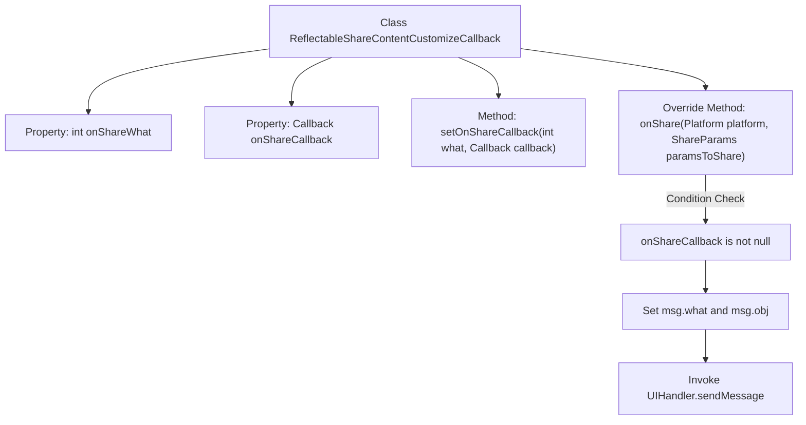

# Basic Information

|      |      |
|------|------|
| Name | ReflectableShareContentCustomizeCallback |
| Language | .java |
| Code Path | happycat/src/cn/sharesdk/onekeyshare/ReflectableShareContentCustomizeCallback.java |
| Package Name | cn.sharesdk.onekeyshare |
| Dependencies | ['android.os.Handler.Callback', 'android.os.Message', 'cn.sharesdk.framework.Platform', 'cn.sharesdk.framework.Platform.ShareParams', 'com.mob.tools.utils.UIHandler'] |
| Brief Description | The ReflectableShareContentCustomizeCallback class implements the ShareContentCustomizeCallback interface. It sets up a callback via setOnShareCallback and sends a message containing the platform and sharing parameters to the UIHandler for processing during onShare. |

# Description

This is a class named ReflectableShareContentCustomizeCallback, which implements the ShareContentCustomizeCallback interface. It contains two private member variables: onShareWhat (integer type) and onShareCallback (Callback type). It provides the setOnShareCallback method for setting callback parameters, accepting an integer what value and a Callback callback object. The onShare method is overridden; when onShareCallback is not null, it creates a Message object containing platform information and sharing parameters, then triggers the callback by sending the message via UIHandler. This class is primarily used to handle callback logic when processing shared content.

# Class Summary

| Name   | Type  | Description |
|-------|------|-------------|
| ReflectableShareContentCustomizeCallback | class | The ReflectableShareContentCustomizeCallback class implements the ShareContentCustomizeCallback interface. It sets the callback via setOnShareCallback and triggers the callback by sending a message through UIHandler during onShare. |


## Class ReflectableShareContentCustomizeCallback

|      |      |
|------|------|
| Access Modifier | public |
| Type | class |
| Name | ReflectableShareContentCustomizeCallback |
| Description | The ReflectableShareContentCustomizeCallback class implements the ShareContentCustomizeCallback interface. It sets the callback via setOnShareCallback and triggers the callback by sending a message through UIHandler during onShare. |


### UML Class Diagram

```mermaid
classDiagram
    class ReflectableShareContentCustomizeCallback {
        -int onShareWhat
        -Callback onShareCallback
        +setOnShareCallback(int what, Callback callback) void
        +onShare(Platform platform, ShareParams paramsToShare) void
    }

    <<Interface>> ShareContentCustomizeCallback {
        <<interface>>
        +onShare(Platform platform, ShareParams paramsToShare) void
    }

    ReflectableShareContentCustomizeCallback ..|> ShareContentCustomizeCallback : implements
    ReflectableShareContentCustomizeCallback --> Callback : depends
    ReflectableShareContentCustomizeCallback --> Platform : depends
    ReflectableShareContentCustomizeCallback --> ShareParams : depends
    ReflectableShareContentCustomizeCallback --> Message : depends
    ReflectableShareContentCustomizeCallback --> UIHandler : depends
```

This code defines a `ReflectableShareContentCustomizeCallback` class that implements the `ShareContentCustomizeCallback` interface for handling share content callback logic. The class contains two private fields: `onShareWhat` identifies the share type, and `onShareCallback` stores the callback function. The `setOnShareCallback` method sets callback parameters. When the `onShare` method is triggered, it constructs a `Message` object containing the platform and share parameters, which is then sent to the callback processor via `UIHandler`. This design decouples share events from the UI layer by transmitting data through a messaging mechanism.


### Internal Method Call Graph



This flowchart illustrates the structure and core logic of the ReflectableShareContentCustomizeCallback class. The class contains two properties and two methods, where the onShare method implements the share content callback functionality. When onShareCallback is valid, it creates a message object and populates it with platform and share parameter data, finally sending the message via UIHandler. The entire process demonstrates conditional checks and message passing mechanisms for implementing customizable share callback handling.

### Field List

| Name  | Type  | Description |
|-------|-------|------|
| onShareWhat | int | Private integer variable onShareWhat |
| onShareCallback | Callback | The private callback function `onShareCallback` is used to handle sharing operations. |

### Method List

| Name  | Type  | Description |
|-------|-------|------|
| setOnShareCallback | void | Set the share callback function with parameters as event type and callback method. |
| onShare | void | Rewrite the sharing method. If a callback exists, send the platform and parameter messages to the UI handler. |


