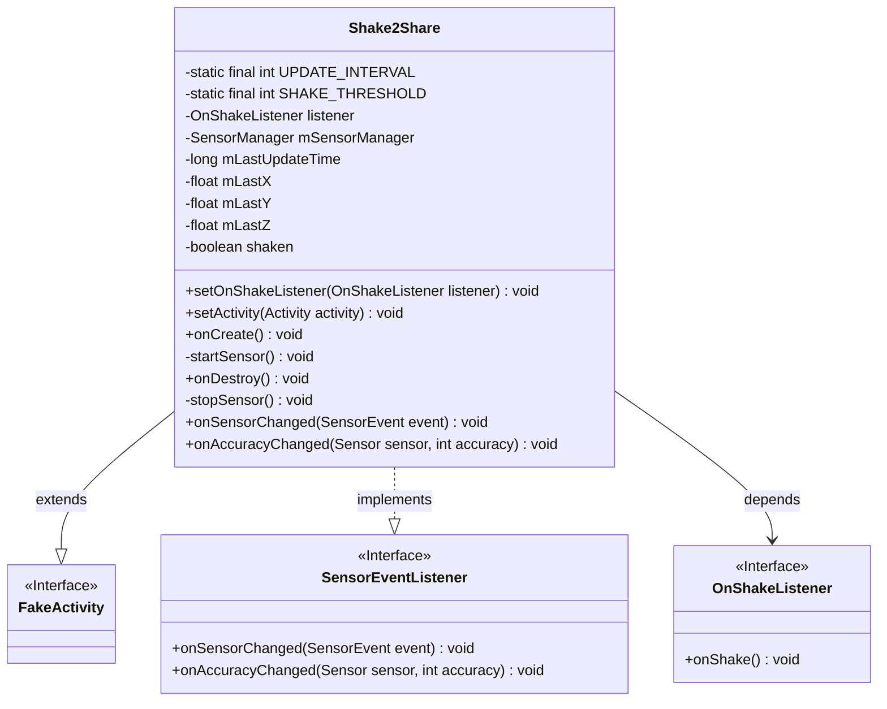
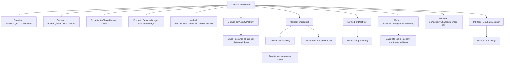
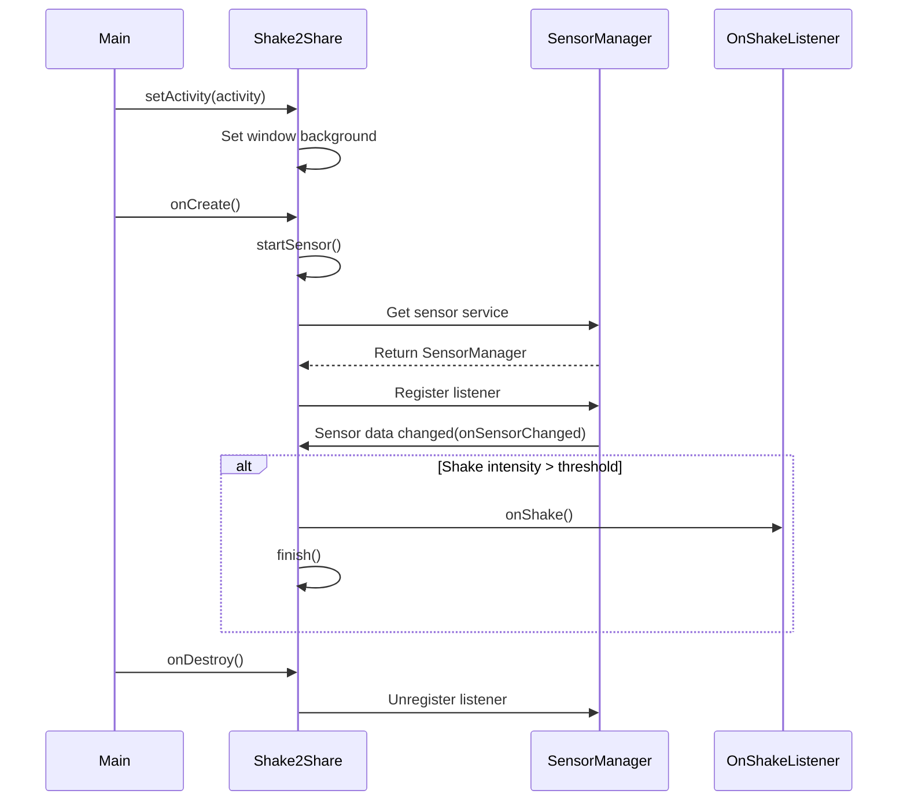

# Basic Information

|      |      |
|------|------|
| Name | Shake2Share |
| Language | .java |
| Code Path | happycat/src/cn/sharesdk/onekeyshare/Shake2Share.java |
| Package Name | cn.sharesdk.onekeyshare |
| Dependencies | ['com.mob.tools.utils.R', 'android.app.Activity', 'android.content.Context', 'android.hardware.Sensor', 'android.hardware.SensorEvent', 'android.hardware.SensorEventListener', 'android.hardware.SensorManager', 'android.util.FloatMath', 'android.view.Window', 'android.widget.ImageView', 'android.widget.Toast', 'android.widget.ImageView.ScaleType', 'com.mob.tools.FakeActivity'] |
| Brief Description | The Shake2Share class implements the shake-to-share functionality by detecting shaking motions through an accelerometer sensor and triggering callback events, including interface setup and sensor management. |

# Description

The Shake2Share class inherits from FakeActivity and implements the SensorEventListener interface, designed to detect phone shaking motions. Its main functionalities include: setting a 100-millisecond detection interval and a shaking sensitivity threshold of 1500; registering an accelerometer listener via the sensor manager; initializing the sensor and configuring the shake-to-share interface during onCreate; triggering the OnShakeListener callback and terminating the activity when a shaking motion exceeding the threshold is detected; and featuring complete lifecycle management by unregistering the sensor listener upon destruction. For the interface, it sets a dialog-style background with a shake icon and displays prompt text.

# Class Summary

| Name   | Type  | Description |
|-------|------|-------------|
| Shake2Share | class | The Shake2Share class implements the shake detection feature by monitoring the phone's shaking motion through the accelerometer sensor, triggering the OnShakeListener callback. It sets the interface theme and background, with a detection interval of 100ms and a threshold of 1500 determining sensitivity. |

## Class Shake2Share

|      |      |
|------|------|
| Access Modifier | public |
| Type | class |
| Name | Shake2Share |
| Description | The Shake2Share class implements the shake detection feature by monitoring the phone's shaking motion through the accelerometer sensor, triggering the OnShakeListener callback. It sets the interface theme and background, with a detection interval of 100ms and a threshold of 1500 determining sensitivity. |

### UML Class Diagram

This code defines a `Shake2Share` class that extends `FakeActivity` and implements the `SensorEventListener` interface, designed to detect device shake events. The class includes private constants for sensor management and shake detection thresholds, along with private variables to record sensor data. It utilizes the `OnShakeListener` interface to callback shake events and triggers corresponding actions when a shake is detected. The code also handles Activity lifecycle methods such as `onCreate` and `onDestroy` for initializing and releasing sensor resources. The overall design achieves decoupling between shake detection and UI interaction, providing extensibility through the listener pattern.

### Internal Method Call Graph

This code implements a shake detection feature based on accelerometer sensors, primarily used for "Shake to Share" interaction scenarios. The flowchart illustrates class structure relationships, including constant definitions, property declarations, main method call chains, and internal interfaces. The sequence diagram depicts the complete process from initialization to shake detection, covering sensor registration, data monitoring, and callback triggering mechanisms. The code calculates three-axis acceleration variations to determine shake actions, triggering callbacks and terminating the activity when exceeding the set threshold.

### Field List

| Name  | Type  | Description |
|-------|-------|------|
| UPDATE_INTERVAL = 100 | int | Define a private static constant UPDATE_INTERVAL with a value of 100 milliseconds as the update interval. |
| listener | OnShakeListener | Private shake event listener object. |
| mSensorManager | SensorManager | Private sensor manager variable mSensorManager. |
| mLastY | float | Private floating-point variable, recording the previous Y-coordinate value. |
| mLastUpdateTime | long | Private long integer variable, recording the last update time. |
| SHAKE_THRESHOLD = 1500 | int | Define a static constant SHAKE_THRESHOLD with a value of 1500, which serves as the threshold for detecting a shake action. |
| mLastX | float | Private floating-point variable, recording the previous X-coordinate value. |
| mLastZ | float | Private floating-point variable, recording the previous Z value. |
| shaken | boolean | Boolean variable indicating whether it has been shaken. |

### Method List

| Name  | Type  | Description |
|-------|-------|------|
| startSensor | void | This method is used to start the sensor, obtain the accelerometer, and register a listener, throwing an exception if it fails. |
| onCreate | void | The method onCreate starts the sensor, loads the specified image and sets it as the view content. If string resources exist, it displays a brief prompt. |
| setActivity | void | This method sets up the activity, inherits parent class settings, retrieves the resource ID, and if valid, sets the dialog theme, hides the title bar, and configures the window background with the specified resource. |
| stopSensor | void | Stop sensor: If the sensor manager exists, unregister the listener and nullify the manager. |
| onSensorChanged | void | Calculate the time difference and displacement difference when sensor data changes. If the threshold is exceeded, trigger a shake event and call the listener. Update the last recorded data and time. |
| onAccuracyChanged | void | Callback method when sensor accuracy changes, with parameters being the sensor object and the accuracy value. |
| onDestroy | void | The method onDestroy calls stopSensor to stop the sensor. |
| setOnShakeListener | void | Set up a listener for the phone shake event, which triggers a callback when shaken. |

