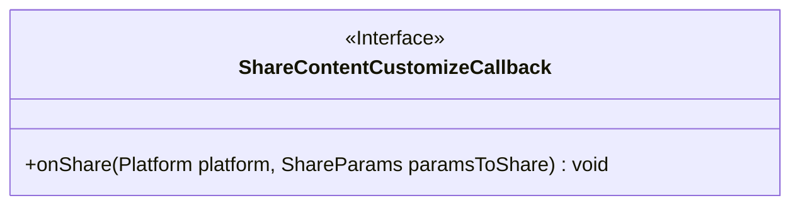
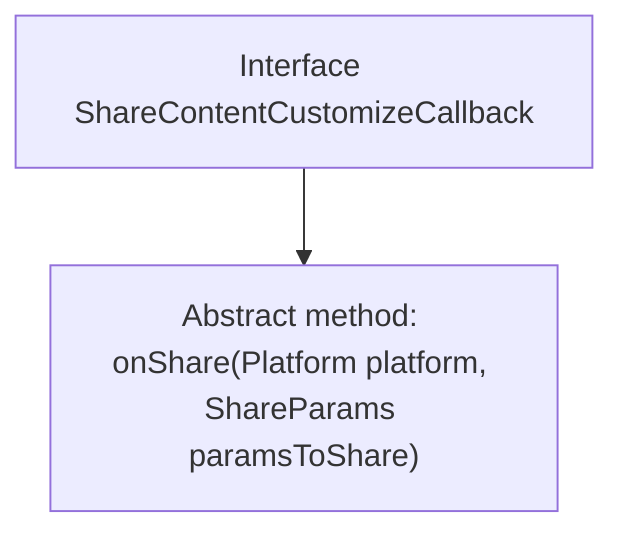

# Basic Information

|      |      |
|------|------|
| Name | ShareContentCustomizeCallback |
| Language | .java |
| Code Path | happycat/src/cn/sharesdk/onekeyshare/ShareContentCustomizeCallback.java |
| Package Name | cn.sharesdk.onekeyshare |
| Dependencies | ['cn.sharesdk.framework.Platform', 'cn.sharesdk.framework.Platform.ShareParams'] |
| Brief Description | The interface ShareContentCustomizeCallback defines the onShare callback method for sharing content, which receives the platform and sharing parameters. |

# Description

This is a Java interface named ShareContentCustomizeCallback, which defines a callback method called onShare. The method takes two parameters: a Platform-type platform object and a ShareParams-type paramsToShare object. The primary function of this interface is to provide a customizable callback mechanism for content sharing, allowing developers to execute specific logic when a sharing operation occurs. The interface is designed concisely, containing only a single method declaration, reflecting the principle of single responsibility.

# Class Summary

| Name   | Type  | Description |
|-------|------|-------------|
| ShareContentCustomizeCallback | interface | Custom callback interface for sharing content, defining the `onShare` method to receive the platform and sharing parameters. |

## Class ShareContentCustomizeCallback

|      |      |
|------|------|
| Access Modifier | public |
| Type | interface |
| Name | ShareContentCustomizeCallback |
| Description | Custom callback interface for sharing content, defining the `onShare` method to receive the platform and sharing parameters. |

### UML Class Diagram

This code defines an interface named `ShareContentCustomizeCallback`, which contains an abstract method `onShare` that takes two parameters, `Platform` and `ShareParams`, and returns void. The interface is designed to implement custom callback logic for sharing content, allowing different platforms to define specific sharing behaviors by implementing this interface. The interface is concise and clear, adhering to the Single Responsibility Principle, making it easy to extend and implement multi-platform sharing functionality.

### Internal Method Call Graph

This code defines an interface named ShareContentCustomizeCallback, which contains an abstract method onShare. The interface is used to implement custom callback functionality for sharing content. When a share operation is invoked, the onShare method is triggered, accepting the platform type (Platform) and sharing parameters (ShareParams) as input arguments. This design allows external implementations of specific sharing logic, embodying the concept of interface-oriented programming.

### Field List

| Name  | Type  | Description |
|-------|-------|------|

### Method List

| Name  | Type  | Description |
|-------|-------|------|
| onShare | void | The method `onShare` is used for sharing content, accepting platform parameters and sharing parameters. |

