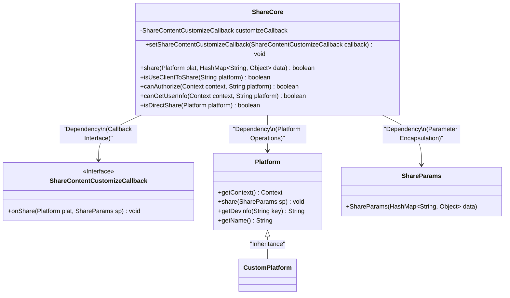
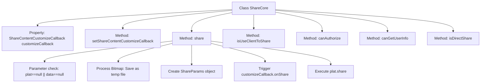

# Basic Information

|      |      |
|------|------|
| Name | ShareCore |
| Language | .java |
| Code Path | happycat/src/cn/sharesdk/onekeyshare/ShareCore.java |
| Package Name | cn.sharesdk.onekeyshare |
| Dependencies | ['java.io.File', 'java.io.FileOutputStream', 'java.util.HashMap', 'android.content.Context', 'android.content.Intent', 'android.content.pm.ResolveInfo', 'android.graphics.Bitmap', 'android.graphics.Bitmap.CompressFormat', 'android.text.TextUtils', 'cn.sharesdk.framework.CustomPlatform', 'cn.sharesdk.framework.Platform', 'cn.sharesdk.framework.Platform.ShareParams', 'cn.sharesdk.framework.ShareSDK', 'com.mob.tools.utils.R'] |
| Brief Description | The ShareCore class provides sharing functionality, supports custom callbacks, handles image path conversion, and determines whether the platform supports client sharing, authorization, and user information retrieval. |

# Description

The ShareCore class provides the core implementation for social platform sharing functionality. Its main features include: 1. Setting a share content customization callback via setShareContentCustomizeCallback; 2. The share method handles sharing logic, supporting the conversion of Bitmap to an image file before sharing and invoking the customization callback; 3. Offering multiple static methods to determine platform characteristics: isUseClientToShare checks whether to use client-based sharing, canAuthorize determines if a platform supports authorization, canGetUserInfo checks whether user information can be retrieved, and isDirectShare determines if direct sharing is possible. The class incorporates judgment logic for over 20 mainstream social platforms, including WeChat and QQ, and handles special cases for platforms like Sina Weibo.

# Class Summary

| Name   | Type  | Description |
|-------|------|-------------|
| ShareCore | class | The ShareCore class provides core logic for sharing functionality, including setting callbacks, processing shared content, platform determination, and capability checks for authorization and user information retrieval. It supports multiple platforms, handles image path conversion, and contains various static methods for platform-specific feature determination. |

## Class ShareCore

|      |      |
|------|------|
| Access Modifier | public |
| Type | class |
| Name | ShareCore |
| Description | The ShareCore class provides core logic for sharing functionality, including setting callbacks, processing shared content, platform determination, and capability checks for authorization and user information retrieval. It supports multiple platforms, handles image path conversion, and contains various static methods for platform-specific feature determination. |

### UML Class Diagram

This code implements a social sharing core class ShareCore, whose main functionalities include: customizing share content through callback interfaces, handling sharing logic across different platforms (including image caching), and determining whether platforms support client-side sharing/authorization/user info retrieval. The class diagram clearly illustrates ShareCore's dependency relationships with Platform and ShareParams, as well as the extension point design achieved through the ShareContentCustomizeCallback interface. The Platform base class can be inherited and extended by CustomPlatform, demonstrating good adherence to the Open/Closed Principle.

### Internal Method Call Graph

Flowchart description: This flowchart illustrates the structure of the ShareCore class and its key method invocation relationships. The core method share() first performs parameter validation, then processes Bitmap image saving as a temporary file, creates a ShareParams object and triggers a customization callback, finally executing platform sharing. Other static methods include determining whether the platform uses client-side sharing, authorization capability, and user information retrieval capability. The class supports customized content processing through callback interfaces.

### Field List

| Name  | Type  | Description |
|-------|-------|------|
| customizeCallback | ShareContentCustomizeCallback | Private member variable: customizeCallback of type ShareContentCustomizeCallback, used for customizing share content. |

### Method List

| Name  | Type  | Description |
|-------|-------|------|
| isUseClientToShare | boolean | This method determines whether the specified platform uses client-side sharing. It returns true directly for common social apps like WeChat; for Evernote and Weibo, it checks whether the configuration or client exists; for other cases, it returns false. |
| setShareContentCustomizeCallback | void | Set the custom callback function for sharing content, assign the passed callback to customizeCallback. |
| canAuthorize | boolean | Method determines whether the specified platform does not support authorization, returns a boolean value. |
| share | boolean | Check the platform and data validity, return false if invalid. Process the image path and bitmap, save the unrecycled bitmap as a screenshot file and update the path. Create sharing parameters, execute the custom callback, then invoke the platform sharing method, return true on success and false on exception. |
| canGetUserInfo | boolean | Check whether the platform supports retrieving user information, excluding 16 types of platforms such as WeChat Moments. |
| isDirectShare | boolean | Static method checks whether the platform supports direct sharing: The condition is that the platform is a CustomPlatform instance or returns true when calling isUseClientToShare by name. |

