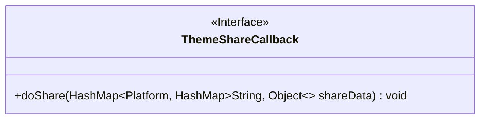
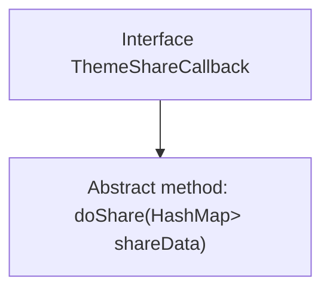

# Basic Information

|      |      |
|------|------|
| Name | ThemeShareCallback |
| Language | .java |
| Code Path | happycat/src/cn/sharesdk/onekeyshare/ThemeShareCallback.java |
| Package Name | cn.sharesdk.onekeyshare |
| Dependencies | ['java.util.HashMap', 'cn.sharesdk.framework.Platform'] |
| Brief Description | The interface ThemeShareCallback defines the sharing method doShare, with parameters being a mapping of platforms to sharing data. |

# Description

This is a Java interface named ThemeShareCallback, which defines a method called doShare. The method accepts a HashMap parameter where the key is of type Platform and the value is another HashMap with keys of type String and values of type Object. This interface is used to implement theme sharing functionality, handling sharing data for different platforms through a callback mechanism.

# Class Summary

| Name   | Type  | Description |
|-------|------|-------------|
| ThemeShareCallback | interface | The interface ThemeShareCallback defines the sharing method doShare, with parameters being a mapping of platforms to sharing data. |

## Class ThemeShareCallback

|      |      |
|------|------|
| Access Modifier | public |
| Type | interface |
| Name | ThemeShareCallback |
| Description | The interface ThemeShareCallback defines the sharing method doShare, with parameters being a mapping of platforms to sharing data. |

### UML Class Diagram

This code defines an interface named `ThemeShareCallback`, which includes a `doShare` method. The method accepts a generic parameter `HashMap<Platform, HashMap<String, Object>>` as input, used to handle theme sharing data. The interface is explicitly marked as such with the `<<Interface>>` notation, and the method is denoted with a `+` to indicate public access. The generic parameters are annotated with the `~` symbol, clearly illustrating the structure of the type parameters. This interface may be used to implement callback functionality for theme sharing across different platforms.

### Internal Method Call Graph

This code defines an interface named ThemeShareCallback, which contains an abstract method doShare. The method accepts a complex parameter: a HashMap with Platform as the key and a nested HashMap as the value, used for handling multi-platform sharing data. As the core of the callback mechanism, the interface enforces implementing classes to process the sharing logic, making it suitable for scenarios requiring support for sharing functionalities across multiple platforms like WeChat and Weibo. The parameter structure design allows flexible passing of differentiated sharing parameters required by different platforms.

### Field List

| Name  | Type  | Description |
|-------|-------|------|

### Method List

| Name  | Type  | Description |
|-------|-------|------|
| doShare | void | The method `doShare` takes a nested `HashMap` parameter `shareData`, where the key is of type `Platform` and the value is a `HashMap` containing string keys and object values, used for platform sharing data. |

