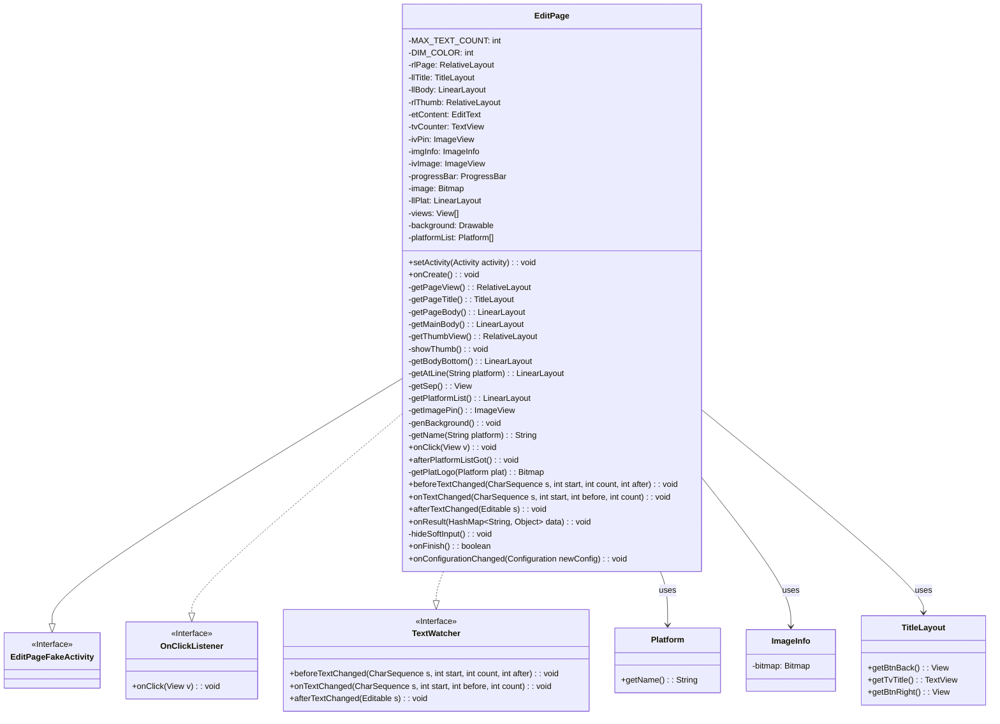
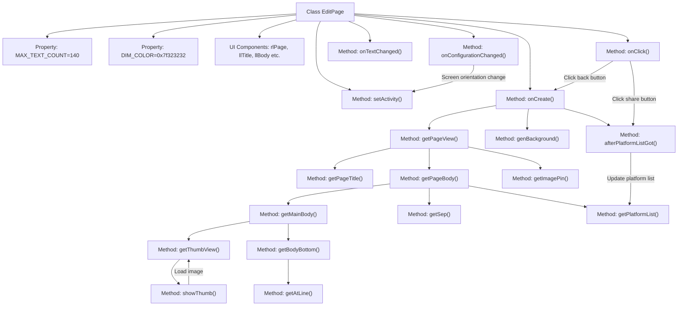

# Basic Information

|      |      |
|------|------|
| Name | EditPage |
| Language | .java |
| Code Path | happycat/src/cn/sharesdk/onekeyshare/theme/classic/EditPage.java |
| Package Name | cn.sharesdk.onekeyshare.theme.classic |
| Dependencies | ['com.mob.tools.utils.BitmapHelper.blur', 'com.mob.tools.utils.BitmapHelper.captureView', 'com.mob.tools.utils.R.dipToPx', 'com.mob.tools.utils.R.getBitmapRes', 'com.mob.tools.utils.R.getScreenWidth', 'com.mob.tools.utils.R.getStringRes', 'java.util.ArrayList', 'java.util.HashMap', 'android.app.Activity', 'android.content.Context', 'android.content.res.Configuration', 'android.graphics.Bitmap', 'android.graphics.BitmapFactory', 'android.graphics.Typeface', 'android.graphics.drawable.BitmapDrawable', 'android.graphics.drawable.ColorDrawable', 'android.graphics.drawable.Drawable', 'android.graphics.drawable.LayerDrawable', 'android.os.Handler.Callback', 'android.os.Message', 'android.text.Editable', 'android.text.TextWatcher', 'android.util.TypedValue', 'android.view.Gravity', 'android.view.View', 'android.view.View.OnClickListener', 'android.view.Window', 'android.view.WindowManager', 'android.view.inputmethod.InputMethodManager', 'android.widget.Button', 'android.widget.EditText', 'android.widget.FrameLayout', 'android.widget.HorizontalScrollView', 'android.widget.ImageView', 'android.widget.ImageView.ScaleType', 'android.widget.LinearLayout', 'android.widget.LinearLayout.LayoutParams', 'android.widget.ProgressBar', 'android.widget.RelativeLayout', 'android.widget.TextView', 'android.widget.Toast', 'cn.sharesdk.framework.CustomPlatform', 'cn.sharesdk.framework.Platform', 'cn.sharesdk.framework.ShareSDK', 'cn.sharesdk.framework.TitleLayout', 'com.mob.tools.utils.UIHandler', 'cn.sharesdk.onekeyshare.EditPageFakeActivity', 'cn.sharesdk.onekeyshare.PicViewer', 'cn.sharesdk.onekeyshare.ShareCore'] |
| Brief Description | The EditPage class is an Android sharing and editing page that includes a title bar, content editing area, image thumbnails, character count, and platform selection features. It supports multi-platform sharing, provides image previews and the ability to @mention friends, with a maximum input limit of 140 characters. |

# Description

The EditPage class is an editing page designed for multi-platform sharing, inheriting from EditPageFakeActivity and implementing click and text listener interfaces. Its main features include: 1) Providing a text editing box with a 140-character limit and character count display; 2) Supporting image preview and deletion functions; 3) Adjusting soft keyboard display mode based on screen orientation; 4) Dynamically loading sharing platform lists and handling platform selection logic; 5) Implementing @mention functionality (supporting platforms like Weibo); 6) Including share cancellation and submission buttons. The page layout combines RelativeLayout and LinearLayout, consisting of a title bar, editing area, platform selection area, and image thumbnail area, supporting both dialog mode and full-screen display modes.

# Class Summary

| Name   | Type  | Description |
|-------|------|-------------|
| EditPage | class | The EditPage class is an Android sharing and editing interface that includes a title bar, content editor, image thumbnails, character count display, and platform selection features, supporting multi-platform sharing and both portrait/landscape screen adaptation. |

## Class EditPage

|      |      |
|------|------|
| Access Modifier | public |
| Type | class |
| Name | EditPage |
| Description | The EditPage class is an Android sharing and editing interface that includes a title bar, content editor, image thumbnails, character count display, and platform selection features, supporting multi-platform sharing and both portrait/landscape screen adaptation. |

### UML Class Diagram

This class diagram illustrates the structure of the EditPage class and its relationships with relevant interfaces and classes. EditPage is a content editing and sharing page that inherits from EditPageFakeActivity and implements the OnClickListener and TextWatcher interfaces. It contains multiple UI components (such as EditText, TextView, ImageView, etc.) and platform-related logic for handling user input, character counting, image display, and platform selection. The diagram clearly presents EditPage's member variables, methods, and its interactions with external components, reflecting the class's complexity and multifunctionality.

### Internal Method Call Graph

This code implements a social media post editing page, with core functionalities including: initializing UI components (title bar, content editor, thumbnail area, platform selector), handling user input (text counting and @mention feature), managing sharing platform lists, and responding to screen orientation changes. The core flow starts from onCreate(), sequentially building the page layout where getPageView() serves as the main entry point calling subcomponent construction methods, ultimately processing user interactions via onClick(). The code asynchronously fetches platform data and employs observer pattern for handling text changes and configuration updates.

### Field List

| Name  | Type  | Description |
|-------|-------|------|
| llPlat | LinearLayout | Private linear layout component llPlat. |
| background | Drawable | Private background drawable |
| rlThumb | RelativeLayout | Private relative layout control rlThumb. |
| progressBar | ProgressBar | Progress bar control example. |
| llBody | LinearLayout | Private linear layout variable llBody |
| MAX_TEXT_COUNT = 140 | int | Define a constant MAX_TEXT_COUNT with a value of 140, representing the maximum text length limit. |
| etContent | EditText | Private EditText control variable etContent |
| imgInfo | ImageInfo | Private Image Information Object |
| ivPin | ImageView | Private image view control ivPin. |
| ivImage | ImageView | Private ImageView control ivImage. |
| image | Bitmap | Private bitmap image variable. |
| rlPage | RelativeLayout | Private relative layout control rlPage. |
| tvCounter | TextView | Private text view control tvCounter |
| DIM_COLOR = 0x7f323232 | int | Define a private static constant DIM_COLOR with the hexadecimal color code value 0x7f323232. |
| llTitle | TitleLayout | Private Title Layout Control llTitle |
| platformList | Platform[] | Private platform array variable platformList. |
| views | View[] | Private view array variable `views`. |

### Method List

| Name  | Type  | Description |
|-------|-------|------|
| getImagePin | ImageView | Create an ImageView control, set the image resource to "pin", dimensions 80x36dp, top margin 6dp, right-aligned and top-aligned to llBody, with an initial state of hidden. |
| onResult | void | The method `onResult` receives a `HashMap` parameter `data`, calls `getJoinSelectedUser` to obtain `atText`, and appends it to `etContent` when it is not null. |
| onTextChanged | void | Update the remaining character count display when text changes, turning red when exceeding the limit. |
| afterTextChanged | void | The method `afterTextChanged` is executed after the text changes, with the parameter `s` representing the edited text content. |
| hideSoftInput | void | Method to hide the soft keyboard: Retrieve the input method manager and hide the soft keyboard for the current window, capturing exceptions and printing logs. |
| onFinish | boolean | The method `onFinish` hides the soft keyboard and returns the result of the parent class's method of the same name. |
| onConfigurationChanged | void | The method executes when the screen orientation changes: hide the soft keyboard and set the background in landscape mode, show the soft keyboard and set the background in portrait mode, both with a 1-second delay for background updates. |
| onCreate | void | The method `onCreate` initializes the interface after checking parameters, while a background thread fetches the platform list and filters it, notifying the UI to update upon completion. |
| showThumb | void | The method `showThumb` initializes the image list, processes the callback for the first retrieved image, displays the thumbnail, and hides the progress bar. |
| beforeTextChanged | void | The method `beforeTextChanged` is triggered before the text changes, with parameters including the character sequence `s`, the starting position `start`, the number of characters to be replaced `count`, and the number of new characters `after`. |
| afterPlatformListGot | void | The method `afterPlatformListGot` initializes the view list, sets layout parameters and margins, iteratively creates platform icons and mask views, handles click events, and finally delays scrolling to the selected platform position. |
| onClick | void | Click Event Handling: The back button triggers cancellation of sharing statistics and exits; the right button validates input and shares non-visible platform content, prompting if no selection is made; FrameLayout triggers child item clicks; other cases toggle visibility. |
| getSep | View | Create a divider view with a black background, 1dp height, and width matching the parent layout. |
| getAtLine | LinearLayout | Create a linear layout containing click events and two text views for displaying user and platform information. |
| getName | String | This method retrieves the corresponding name string based on platform parameters. If the platform is empty, it returns an empty string; otherwise, it obtains the localized string through the resource ID and returns it. |
| getBodyBottom | LinearLayout | Create a bottom layout containing the platform name line and a character counter, which displays the maximum text count and applies styling. |
| getPlatformList | LinearLayout | Create a horizontal layout containing share text and a horizontal scrolling view, then return the layout after setting margins and styles. |
| getPageTitle | TitleLayout | Create a title layout, set the click event for the back button, title text, and the share button on the right, and define the layout parameters. |
| getPageView | RelativeLayout | Create a RelativeLayout page view, set the background and child view layout based on dialogMode, including title, body, and fixed image. |
| genBackground | void | The method genBackground generates a blurred background: creates a dark background, captures the view of backgroundView if it exists, applies blur processing, and overlays it with the dark background, printing an error if an exception occurs. |
| getThumbView | RelativeLayout | Create a thumbnail view that includes an image, a progress bar, and a delete button, supporting click-to-view the full-size image and remove image functionality. |
| getPageBody | LinearLayout | Create a vertical layout llBody, set the background, align the title layout, and add margins and subviews. |
| setActivity | void | The method `setActivity` sets the associated Activity and adjusts the soft keyboard mode based on screen orientation: hides in landscape mode and shows in portrait mode, both using the PAN adjustment mode. |
| getMainBody | LinearLayout | Create a vertical LinearLayout, set margins and weight, containing an edit box and a bottom view. |
| getPlatLogo | Bitmap | This method retrieves the corresponding logo bitmap based on the platform name. If the platform or name is empty, it returns null; otherwise, it concatenates the resource name and performs a lookup. If found, it decodes and returns the bitmap; otherwise, it returns null. |

