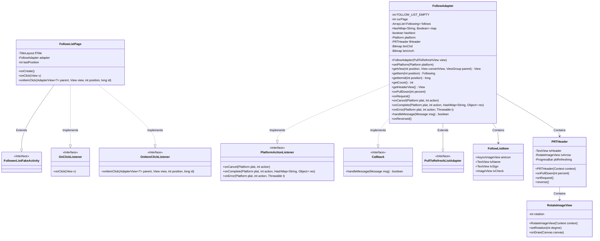

# Basic Information

|      |      |
|------|------|
| Name | FollowListPage |
| Language | .java |
| Code Path | happycat/src/cn/sharesdk/onekeyshare/theme/classic/FollowListPage.java |
| Package Name | cn.sharesdk.onekeyshare.theme.classic |
| Dependencies | ['android.app.Activity', 'android.content.Context', 'android.graphics.Bitmap', 'android.graphics.BitmapFactory', 'android.graphics.Canvas', 'android.os.Handler.Callback', 'android.os.Message', 'android.util.TypedValue', 'android.view.Gravity', 'android.view.View', 'android.view.View.OnClickListener', 'android.view.ViewGroup', 'android.widget.AdapterView', 'android.widget.AdapterView.OnItemClickListener', 'android.widget.FrameLayout', 'android.widget.ImageView', 'android.widget.LinearLayout', 'android.widget.LinearLayout.LayoutParams', 'android.widget.ProgressBar', 'android.widget.TextView', 'java.util.ArrayList', 'java.util.HashMap', 'cn.sharesdk.framework.Platform', 'cn.sharesdk.framework.PlatformActionListener', 'cn.sharesdk.framework.TitleLayout', 'com.mob.tools.gui.AsyncImageView', 'com.mob.tools.gui.BitmapProcessor', 'com.mob.tools.gui.PullToRefreshListAdapter', 'com.mob.tools.gui.PullToRefreshView', 'com.mob.tools.utils.UIHandler', 'cn.sharesdk.onekeyshare.FollowerListFakeActivity', 'com.mob.tools.utils.R.dipToPx', 'com.mob.tools.utils.R.getBitmapRes', 'com.mob.tools.utils.R.getStringRes'] |
| Brief Description | The FollowListPage class implements the follow list page, including a title bar, pull-down refresh list, and checkbox functionality, supporting single and multiple selection modes, and adapting to display styles across different platforms. |

# Description

The code defines a social platform's follow list page class `FollowListPage`, which inherits from `FollowerListFakeActivity` and implements the click listener interface. The page includes a title bar, a pull-to-refresh list, and a shadow effect. The title bar features a back button and a done button, while the list uses a custom adapter `FollowAdapter` to load follow user data, supporting single/multiple selection modes. The adapter handles pagination loading, asynchronous image display, and status updates, with list items containing avatars, usernames, bios, and checkboxes. The pull-to-refresh functionality is implemented by `PRTHeader`, featuring arrow animations and a progress bar. `RotateImageView` provides rotation animation effects. Overall, it implements the display, selection, and refresh functionalities of the follow list.

# Class Summary

| Name   | Type  | Description |
|-------|------|-------------|
| FollowListPage | class | The FollowListPage class implements the follow list page, including the title bar, pull-to-refresh list, and adapter logic, supporting single/multiple selection functionality. The adapter handles data loading, list item rendering, and user interaction. |

## Class FollowListPage

|      |      |
|------|------|
| Access Modifier | public |
| Type | class |
| Name | FollowListPage |
| Description | The FollowListPage class implements the follow list page, including the title bar, pull-to-refresh list, and adapter logic, supporting single/multiple selection functionality. The adapter handles data loading, list item rendering, and user interaction. |

### UML Class Diagram

This code demonstrates the implementation of a follow list page in a social application. The FollowListPage serves as the main class, inheriting from FollowerListFakeActivity and implementing click listener interfaces, responsible for page layout and user interaction. The core component FollowAdapter inherits from PullToRefreshListAdapter, implementing pull-to-refresh functionality, and handles the retrieval and display of follow list data. PRTHeader and RotateImageView work together to achieve the animation effects during pull-to-refresh. The overall design adopts a composition pattern, where multiple nested classes collaborate to deliver the complete functionality of the follow list, including data loading, list display, selection operations, and pull-to-refresh features.

### Internal Method Call Graph

```mermaid
graph TD
    A["Class FollowListPage"]
    B["Property: TitleLayout llTitle"]
    C["Property: FollowAdapter adapter"]
    D["Property: int lastPosition"]
    E["Method: void onCreate()"]
    F["Method: void onClick(View v)"]
    G["Method: void onItemClick(AdapterView<?>, View, int, long)"]
    H["Inner Class: FollowAdapter"]
    I["Inner Class: FollowListItem"]
    J["Inner Class: PRTHeader"]
    K["Inner Class: RotateImageView"]

    A --> B
    A --> C
    A --> D
    A --> E
    A --> F
    A --> G
    A --> H
    H --> I
    H --> J
    J --> K

    E --> E1["Create LinearLayout page container"]
    E --> E2["Set title bar layout and events"]
    E --> E3["Add pull-to-refresh list view"]
    E --> E4["Initialize FollowAdapter and bind data"]
    E --> E5["Trigger initial data loading"]

    F --> F1["Handle right button click event"]
    F --> F2["Collect selected items and return results"]
    F --> F3["Close current Activity"]

    G --> G1["Handle list item click selection state"]
    G --> G2["Update adapter data changes"]

    H --> H1["Implement pagination loading logic"]
    H --> H2["Handle platform callback events"]
    H --> H3["Manage list item view recycling"]
```

This code implements a social follow list page, primarily including core functionalities such as page layout construction, pull-to-refresh feature, list item selection interaction, and data pagination loading. The flowchart illustrates the class structure relationships, where FollowListPage serves as the main class, with the inner class FollowAdapter handling complex data binding and pagination logic. PRTHeader implements a custom pull-to-refresh header, while RotateImageView provides arrow rotation animations. The entire process starts from page initialization, manages data loading and view updates through the adapter, and ultimately achieves complete follow list interaction functionality.

### Field List

| Name  | Type  | Description |
|-------|-------|------|
| lastPosition = -1 | int | The variable lastPosition is initialized to -1 and used to record the last position. |
| llTitle | TitleLayout | Private title layout variable llTitle |
| adapter | FollowAdapter | The private member variable `adapter`, of type `FollowAdapter`. |

### Method List

| Name  | Type  | Description |
|-------|-------|------|
| onClick | void | When the right button is clicked, collect the names of the selected items and return the result, then close the interface. |
| onCreate | void | Create a vertical layout page, set up a title bar and back button, add a refreshable list view, and load data. |
| onItemClick | void | When clicking on a list item, if it is in single-selection mode, deselect the previously selected item and record the current position; toggle the selection state of the current item and refresh the list. |

