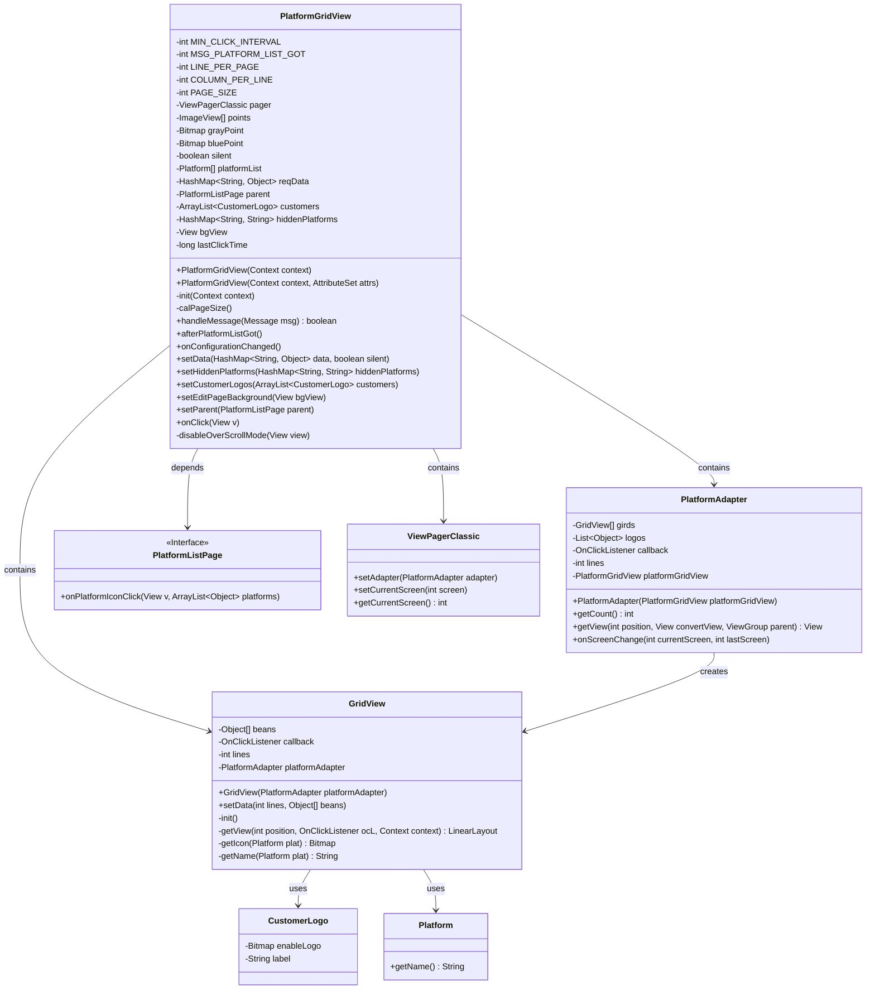
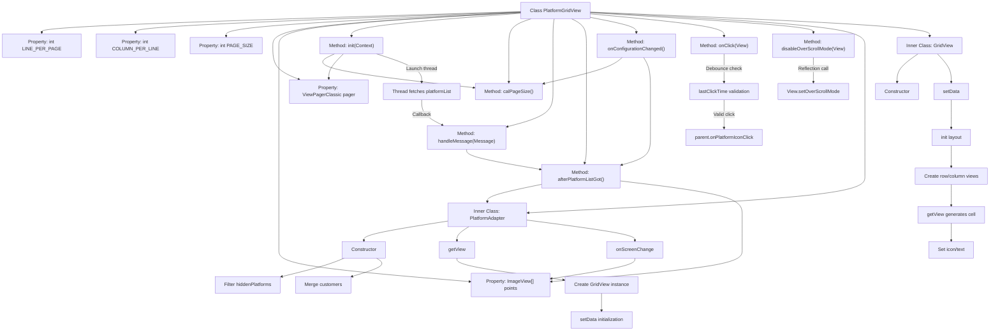

# Basic Information

|      |      |
|------|------|
| Name | PlatformGridView |
| Language | .java |
| Code Path | happycat/src/cn/sharesdk/onekeyshare/theme/classic/PlatformGridView.java |
| Package Name | cn.sharesdk.onekeyshare.theme.classic |
| Dependencies | ['com.mob.tools.utils.R.getBitmapRes', 'java.lang.reflect.Method', 'java.util.ArrayList', 'java.util.Arrays', 'java.util.HashMap', 'java.util.List', 'android.content.Context', 'android.graphics.Bitmap', 'android.graphics.BitmapFactory', 'android.os.Build', 'android.os.Handler.Callback', 'android.os.Message', 'android.util.AttributeSet', 'android.util.TypedValue', 'android.view.Gravity', 'android.view.View', 'android.view.View.OnClickListener', 'android.view.ViewGroup', 'android.widget.ImageView', 'android.widget.ImageView.ScaleType', 'android.widget.LinearLayout', 'android.widget.TextView', 'cn.sharesdk.framework.Platform', 'cn.sharesdk.framework.ShareSDK', 'com.mob.tools.gui.ViewPagerAdapter', 'com.mob.tools.gui.ViewPagerClassic', 'com.mob.tools.utils.UIHandler', 'cn.sharesdk.onekeyshare.CustomerLogo'] |
| Brief Description | PlatformGridView is a custom grid view designed to display sharing platform icons. It supports pagination, custom layouts, click events, and platform hiding functionality, adapting to different screen sizes. |

# Description

PlatformGridView is a custom grid view component designed for displaying social platform icons and custom icons. Inheriting from LinearLayout and implementing a click callback interface, its primary functionalities include: dynamically calculating the number of rows and columns per page (such as 3x3 or 3x2 layouts) based on the screen aspect ratio; enabling paginated sliding via ViewPagerClassic; using gray/blue dots as pagination indicators; supporting the hiding of specific platforms and the addition of custom icons; asynchronously fetching platform list data through a background thread; incorporating a duplicate click prevention mechanism (with a 1000ms interval); and providing layout recalculation after screen rotation. The inner class PlatformAdapter handles paginated data, while the GridView class is responsible for rendering individual grid items' icons and labels.

# Class Summary

| Name   | Type  | Description |
|-------|------|-------------|
| PlatformGridView | class | PlatformGridView is a custom grid view component designed for displaying social platform icons. It supports pagination display, screen rotation adaptation, click event debouncing, and includes indicator and custom icon functionalities. By asynchronously loading platform lists and dynamically calculating page layouts, it adapts to different screen sizes. |

## Class PlatformGridView

|      |      |
|------|------|
| Access Modifier | @SuppressWarnings("deprecation");public |
| Type | class |
| Name | PlatformGridView |
| Description | PlatformGridView is a custom grid view component designed for displaying social platform icons. It supports pagination display, screen rotation adaptation, click event debouncing, and includes indicator and custom icon functionalities. By asynchronously loading platform lists and dynamically calculating page layouts, it adapts to different screen sizes. |

### UML Class Diagram

Class diagram description: This diagram illustrates the structural relationships of PlatformGridView and its associated classes. PlatformGridView is a custom grid view control that inherits from LinearLayout and implements OnClickListener and Callback interfaces, primarily used for displaying social platform icons. It contains PlatformAdapter as the ViewPager's adapter, which in turn creates GridView to display specific content. GridView handles the rendering of platform icons (CustomerLogo/Platform) and click events, with click events being callback through the PlatformListPage interface. ViewPagerClassic is used for paginated display of multiple GridViews. Together, they form a configurable, paginated social platform selection interface.

### Internal Method Call Graph

Flowchart Description:
This flowchart illustrates the core structure and interaction logic of the PlatformGridView class. PlatformGridView is a grid view component for displaying social platform icons, with main functionalities including: asynchronously fetching platform lists, calculating page layout parameters, handling platform click events, and managing page indicators. Key processes include page size calculation during initialization, UI updates after asynchronous platform list retrieval, configuration change handling during screen rotation, and the collaboration mechanism between inner classes PlatformAdapter and GridView. A debounce mechanism ensures click event validity, while reflection calls disable ViewPager edge effects. The overall design adopts a layered architecture, coordinating asynchronous operations and UI updates through a messaging mechanism.

### Field List

| Name  | Type  | Description |
|-------|-------|------|
| reqData | HashMap<String, Object> | Private hash map with string keys and object values, storing request data. |
| platformList | Platform[] | Private platform array variable `platformList`. |
| lastClickTime | long | Private long integer variable, recording the last click time. |
| points | ImageView[] | Define the image view array points. |
| pager | ViewPagerClassic | Private view pager control |
| LINE_PER_PAGE | int | Lines per page configuration variable |
| customers | ArrayList<CustomerLogo> | List of Private Client Flag Objects. |
| grayPoint | Bitmap | Private bitmap variable grayPoint |
| bgView | View | The private view variable bgView. |
| PAGE_SIZE | int | Private integer variable indicating the page size. |
| bluePoint | Bitmap | The private bitmap variable `bluePoint` is used to store the image data of the blue dot. |
| parent | PlatformListPage | Parent platform list page object. |
| MSG_PLATFORM_LIST_GOT = 1 | int | Defined a private static constant MSG_PLATFORM_LIST_GOT with a value of 1, used to identify the platform list retrieval message. |
| MIN_CLICK_INTERVAL = 1000 | int | Define the minimum click interval as 1000 milliseconds to prevent rapid repeated clicks. |
| hiddenPlatforms | HashMap<String, String> | Private hash map with string-type keys and values, storing hidden platform information. |
| silent | boolean | Boolean private variable indicating silent state. |
| COLUMN_PER_LINE | int | Private integer variable indicating the number of columns per row. |

### Method List

| Name  | Type  | Description |
|-------|-------|------|
| setHiddenPlatforms | void | Method to set hidden platforms, which takes a HashMap parameter and assigns it to the member variable hiddenPlatforms. |
| handleMessage | boolean | The method for processing messages, when the MSG_PLATFORM_LIST_GOT message is received, the afterPlatformListGot() is called, with a default return of false. |
| init | void | Initialization method: Set vertical orientation, create ViewPager and disable scroll overflow. Start a thread to asynchronously fetch the platform list; set to null if failed, then notify via UIHandler message. |
| afterPlatformListGot | void | The method `afterPlatformListGot` initializes the platform adapter, calculates the number of pages, and creates corresponding indicator dots. If the number of pages is greater than 1, it displays the indicator dot layout, sets the gray and blue dot icons, with the current page indicated by a blue dot. |
| setData | void | The method `setData` accepts parameters `data` of type `HashMap` and `silent` of boolean type, assigning them to the class variables `reqData` and `silent` respectively. |
| onClick | void | Method for handling click events: record the current time, ignore if the interval from the last click is too short; otherwise, update the click time, create a list containing tags, and trigger the parent-level click callback. |
| disableOverScrollMode | void | Disable the over-scroll effect of the view, applicable to Android 9 and above, by reflectively invoking the setOverScrollMode method with a value of 2, and print logs in case of exceptions. |
| setEditPageBackground | void | Method to set the background view of the edit page, assign the input view to the class variable bgView. |
| setParent | void | Set the parent of the current object to the specified PlatformListPage instance. |
| calPageSize | void | Calculate the total page size by setting the number of columns per row and rows per page based on the screen aspect ratio. When the aspect ratio is less than 0.63, use 3x3; when it is between 0.63 and 0.75, use 3x2; and when it is greater than 0.75, use 1 row. The number of columns is set to 4/5/6 based on the aspect ratios 1.3/1.5/1.75, respectively. |
| setCustomerLogos | void | The method `setCustomerLogos` is used to set the list of customer logos, which accepts an `ArrayList` parameter of type `CustomerLogo` and assigns it to the member variable `customers`. |
| onConfigurationChanged | void | Method for handling configuration changes: Calculate the current position of the first item on the page, adjust the pagination size, determine the new page number, refresh the list after removing the view, and finally set the new page number. |

