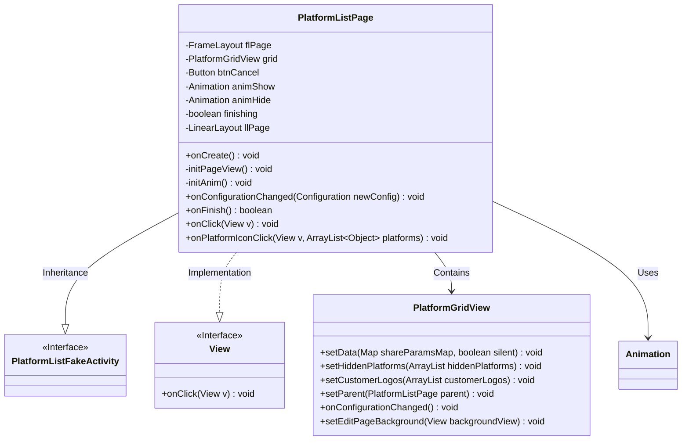

# Basic Information

|      |      |
|------|------|
| Name | PlatformListPage |
| Language | .java |
| Code Path | happycat/src/cn/sharesdk/onekeyshare/theme/classic/PlatformListPage.java |
| Package Name | cn.sharesdk.onekeyshare.theme.classic |
| Dependencies | ['com.mob.tools.utils.R.getStringRes', 'com.mob.tools.utils.R.getBitmapRes', 'java.util.ArrayList', 'android.content.res.Configuration', 'android.graphics.drawable.ColorDrawable', 'android.util.TypedValue', 'android.view.Gravity', 'android.view.MotionEvent', 'android.view.View', 'android.view.animation.Animation', 'android.view.animation.TranslateAnimation', 'android.widget.Button', 'android.widget.FrameLayout', 'android.widget.LinearLayout', 'cn.sharesdk.onekeyshare.PlatformListFakeActivity'] |
| Brief Description | The PlatformListPage class implements a platform list page, including a grid view, a cancel button, and a swipe animation. During initialization, it sets up the view and animations. The grid view displays platform data, and clicking the cancel button or page background closes the page, triggering a downward swipe animation upon closure. |

# Description

PlatformListPage is a class that inherits from PlatformListFakeActivity and implements the View.OnClickListener interface. It contains a page container FrameLayout, a platform list grid view PlatformGridView, a cancel button Button, and slide animations animShow and animHide. In the onCreate method, it initializes the page view and animations, sets the grid view data, and binds click events. The initPageView method creates the page layout, including a semi-transparent background, a vertically arranged LinearLayout, the grid view, and the cancel button. The initAnim method defines the slide-up and slide-down animations. The onFinish method handles the page closing logic, triggering the slide-down animation and hiding the page. Click events handle the closing operation for the page or cancel button, and the onPlatformIconClick method processes platform icon click events.

# Class Summary

| Name   | Type  | Description |
|-------|------|-------------|
| PlatformListPage | class | The PlatformListPage class implements the platform list page, including grid view, cancel button, and swipe animations, handling click events and sharing functionality. |


## Class PlatformListPage

|      |      |
|------|------|
| Access Modifier | public |
| Type | class |
| Name | PlatformListPage |
| Description | The PlatformListPage class implements the platform list page, including grid view, cancel button, and swipe animations, handling click events and sharing functionality. |


### UML Class Diagram



Class Diagram Description:
The PlatformListPage class inherits from PlatformListFakeActivity and implements the View.OnClickListener interface, primarily responsible for displaying and handling interactions on the platform list page. It includes core components such as PlatformGridView for displaying the platform grid, along with layout containers like FrameLayout, LinearLayout, and Button controls. Slide animations are implemented via Animation, providing lifecycle methods like onCreate for initialization and onFinish for closing the page, while also handling click events and platform icon click callbacks. The PlatformGridView class manages the data display and configuration change processing for the specific grid view.


### Internal Method Call Graph

```mermaid
graph TD
    A["Class PlatformListPage"]
    B["Property: FrameLayout flPage"]
    C["Property: PlatformGridView grid"]
    D["Property: Button btnCancel"]
    E["Property: Animation animShow"]
    F["Property: Animation animHide"]
    G["Property: boolean finishing"]
    H["Property: LinearLayout llPage"]
    I["Method: onCreate()"]
    J["Method: initPageView()"]
    K["Method: initAnim()"]
    L["Method: onConfigurationChanged()"]
    M["Method: onFinish()"]
    N["Method: onClick()"]
    O["Method: onPlatformIconClick()"]
    P["Internal call: grid.setData()"]
    Q["Internal call: grid.setHiddenPlatforms()"]
    R["Internal call: grid.setCustomerLogos()"]
    S["Internal call: grid.setParent()"]
    T["Internal call: btnCancel.setOnClickListener()"]
    U["Internal call: llPage.clearAnimation()"]
    V["Internal call: llPage.startAnimation()"]

    A --> B
    A --> C
    A --> D
    A --> E
    A --> F
    A --> G
    A --> H
    A --> I
    I --> J
    I --> K
    I --> P
    I --> Q
    I --> R
    I --> S
    I --> T
    I --> U
    I --> V
    A --> L
    A --> M
    A --> N
    A --> O
    J -->|Create| B
    J -->|Create| H
    J -->|Create| C
    J -->|Create| D
    K -->|Create| E
    K -->|Create| F
    M -->|Use| F
    N -->|Trigger| M
```



This code describes implementation details of an Android platform list page class PlatformListPage. The flowchart illustrates relationships between class properties and main method call chains. Core processes include page initialization (onCreate), view construction (initPageView), animation initialization (initAnim), and page closing handling (onFinish). Special attention should be paid to animation control logic and the dispatch mechanism of click events (onClick) versus platform icon clicks (onPlatformIconClick), which constitute the core interactive functionality of this component.

### Field List

| Name  | Type  | Description |
|-------|-------|------|
| btnCancel | Button | Private declaration of the cancel button. |
| llPage | LinearLayout | Private linear layout control llPage |
| animHide | Animation | The private animation variable animHide is used for hiding animation effects. |
| animShow | Animation | Private animation variable animShow |
| finishing | boolean | The private boolean variable `finishing` indicates the completion status. |
| flPage | FrameLayout | ```textPrivate FrameLayout control flPage``` |
| grid | PlatformGridView | Private grid view object grid. |

### Method List

| Name  | Type  | Description |
|-------|-------|------|
| onPlatformIconClick | void | The method `onPlatformIconClick` receives the view and platform list parameters, and calls the `onShareButtonClick` method to handle the click event. |
| onConfigurationChanged | void | The method is called when the configuration changes. If the grid is not empty, it triggers the grid's configuration change handling. |
| onCreate | void | Code execution flow: Initialize page view and animation, set platform grid data, bind cancel button click event, display grid view and start animation. |
| onFinish | boolean | The method `onFinish` handles the completion logic: if `finishing` is true, it calls the parent class method; if there is no `animHide` animation, it marks `finishing` and returns `false`; otherwise, it sets an animation listener, hides the view and completes when the animation ends, returning `true` to interrupt the completion operation. |
| initPageView | void | Initialize page view: Create a semi-transparent background frame, add a vertical layout container and platform grid view, set a cancel button at the bottom and configure styles and margins. |
| onClick | void | Android click event handling: Cancel and close the current activity when clicking flPage or btnCancel. |
| initAnim | void | Initialize two translation animations: animShow slides in from the bottom, and animHide slides out from the top, both with a duration of 300 milliseconds. |


