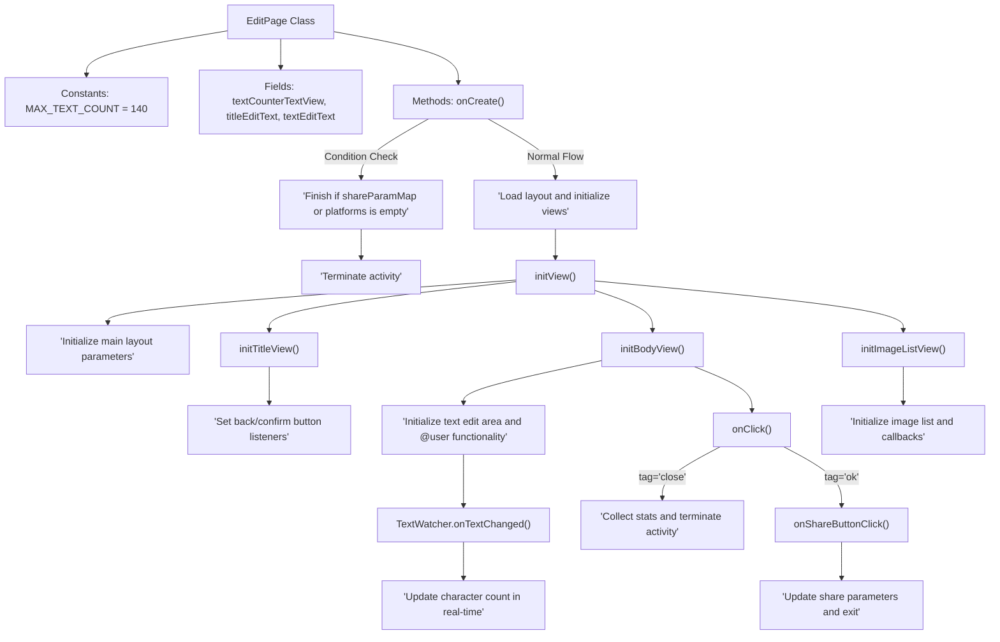

# Basic Information

|      |      |
|------|------|
| Name | EditPage |
| Language | .java |
| Code Path | happycat/src/cn/sharesdk/onekeyshare/theme/skyblue/EditPage.java |
| Package Name | cn.sharesdk.onekeyshare.theme.skyblue |
| Dependencies | ['android.text.Editable', 'android.text.TextWatcher', 'android.view.LayoutInflater', 'android.view.View', 'android.view.View.OnClickListener', 'android.widget.EditText', 'android.widget.HorizontalScrollView', 'android.widget.ImageView', 'android.widget.LinearLayout', 'android.widget.RelativeLayout', 'android.widget.TextView', 'java.util.ArrayList', 'java.util.HashMap', 'cn.sharesdk.framework.Platform', 'cn.sharesdk.framework.ShareSDK', 'cn.sharesdk.onekeyshare.EditPageFakeActivity', 'cn.sharesdk.onekeyshare.PicViewer', 'com.mob.tools.utils.R.getIdRes', 'com.mob.tools.utils.R.getLayoutRes', 'com.mob.tools.utils.R.getStringRes'] |
| Brief Description | The EditPage class implements the editing page functionality, including a title, body text editing box, character count (limit of 140 characters), image list display, and user @mention feature, supporting cancel and share actions. |

# Description

The EditPage class is an editing page that inherits from EditPageFakeActivity and implements click listener and text change listener interfaces. The page includes a title edit box, a body edit box, and a character count display, with a maximum input limit of 140 characters. During initialization, it checks sharing parameters and platform data, loads the layout, and initializes view components, including a back button, confirm button, close button, and image list. It supports the @user function, allowing users to jump to a friend list for selection when clicked. The image list is displayed in a horizontal scrolling manner, and clicking on an image allows viewing it in full size or deleting it. When the confirm button is clicked, the title and body content are saved to the sharing parameters, while clicking the close button ends the page. The remaining character count is updated in real-time during text changes, turning red when the limit is exceeded. Resources are released when the page is closed.

# Class Summary

| Name   | Type  | Description |
|-------|------|-------------|
| EditPage | class | The EditPage class implements the editing page functionality, including a title, a body text editing box, a character count (with a limit of 140 characters), an image list display and deletion feature, support for share and cancel actions, and handling of user @ mentions. |


## Class EditPage

|      |      |
|------|------|
| Access Modifier | public |
| Type | class |
| Name | EditPage |
| Description | The EditPage class implements the editing page functionality, including a title, a body text editing box, a character count (with a limit of 140 characters), an image list display and deletion feature, support for share and cancel actions, and handling of user @ mentions. |


### UML Class Diagram

```mermaid
classDiagram
    class EditPage {
        -int MAX_TEXT_COUNT
        -TextView textCounterTextView
        -EditText titleEditText
        -EditText textEditText
        +void onCreate()
        -void initView()
        -void initTitleView()
        -void initBodyView()
        -void initAtUserView()
        -void initImageListView()
        -View makeImageItemView(ImageInfo imageInfo)
        +void onClick(View v)
        -void onShareButtonClick(View v)
        +void beforeTextChanged(CharSequence s, int start, int count, int after)
        +void onTextChanged(CharSequence s, int start, int before, int count)
        +void afterTextChanged(Editable s)
        +void onResult(HashMap~String, Object~ data)
        +boolean onFinish()
    }

    <<Interface>> EditPage {
        <<OnClickListener>>
        <<TextWatcher>>
    }

    class EditPageFakeActivity {
        // Parent class methods not fully displayed
    }

    class Platform {
        // Platform-related attributes and methods
    }

    class ImageInfo {
        +Bitmap bitmap
    }

    class ImageListResultsCallback {
        <<Interface>>
        +void onFinish(ArrayList~ImageInfo~ results)
    }

    class FollowListPage {
        +void setPlatform(Platform platform)
        +void showForResult(Activity activity, Object param, EditPage callback)
    }

    class PicViewer {
        +void setImageBitmap(Bitmap bitmap)
        +void show(Activity activity, Object param)
    }

    EditPage --|> EditPageFakeActivity : extends
    EditPage ..|> OnClickListener : implements
    EditPage ..|> TextWatcher : implements
    EditPage --> Platform : uses
    EditPage --> ImageInfo : uses
    EditPage --> ImageListResultsCallback : depends
    EditPage --> FollowListPage : calls
    EditPage --> PicViewer : calls
```

Class diagram description:  
This diagram illustrates the inheritance relationships and key dependencies of the EditPage class. EditPage extends EditPageFakeActivity and implements the OnClickListener and TextWatcher interfaces, primarily responsible for implementing editing page functionalities. The class contains core features such as text editing, character counting, and image list management, interacting with Platform, ImageInfo, and other classes. It processes image loading results through the callback interface ImageListResultsCallback, while relying on FollowListPage and PicViewer for user selection and image viewing functionalities. The overall design reflects a typical architecture for Android editing pages.


### Internal Method Call Graph



This code implements an edit page class with core functionalities including: initializing the edit interface layout, handling title and body input, implementing character count tracking, @user functionality, image list display, and share operations. It uses the TextWatcher interface for real-time text change monitoring, OnClickListener for button event handling, and includes image browsing and deletion features. The flowchart illustrates the complete workflow from page creation to component initialization, along with logical branches for event processing.

### Field List

| Name  | Type  | Description |
|-------|-------|------|
| MAX_TEXT_COUNT = 140 | int | Define the constant MAX_TEXT_COUNT to limit the maximum text length to 140 characters. |
| titleEditText | EditText | Private text box control for editing titles. |
| textEditText | EditText | Private Text Editor Control |
| textCounterTextView | TextView | Declare a private TextView variable named textCounterTextView. |

### Method List

| Name  | Type  | Description |
|-------|-------|------|
| initBodyView | void | Initializing view: Set the close button label and click event; if there is a title, populate the title text box; set the initial value of the counter; populate the text content and monitor text changes; initialize the user view. |
| onCreate | void | The method onCreate checks whether shareParamMap and platforms are empty; if they are, it terminates; otherwise, it loads the layout and initializes the views. |
| onTextChanged | void | Update the remaining character count when text changes, turning red when exceeding the limit. |
| onShareButtonClick | void | When clicking the share button, check and update the title and text content, then return the result and exit. |
| initTitleView | void | Initialize the title view, set the labels and click events for the back and confirm buttons. |
| beforeTextChanged | void | The method `beforeTextChanged` is triggered before the text changes, with parameters including the character sequence `s`, the starting position `start`, the number of characters to be replaced `count`, and the number of characters after replacement `after`. |
| initAtUserView | void | Initialize user@view: Traverse the platform, load the layout if display is required, set the text and click event (redirect to the follow list page), and finally add it to the linear layout. |
| onClick | void | Click event handling: Return if the tag is empty; when the tag is "close", count the canceled sharing and terminate; trigger sharing when the tag is "ok". |
| initImageListView | void | Initialize the image list view: Create a horizontal scrolling view, set a callback to load image data, and hide the scrolling view if no data is available. |
| onResult | void | The method `onResult` takes a HashMap parameter, extracts the selected user information, and appends it to the text edit box. |
| onFinish | boolean | The method onFinish() clears the references to the three UI components and invokes the parent class method. |
| initView | void | Initialization view method: In non-dialog mode, set the main layout parameters to full screen, then sequentially initialize the title, main body, and image list views. |
| makeImageItemView | View | Create an image item view, including image display and click-to-view functionality, along with a delete button for removing the image. |
| afterTextChanged | void | The method `afterTextChanged` is called after the text changes, with the parameter `s` representing the edited text content. |


