# Basic Information

|      |      |
|------|------|
| Name | FollowListPage |
| Language | .java |
| Code Path | happycat/src/cn/sharesdk/onekeyshare/theme/skyblue/FollowListPage.java |
| Package Name | cn.sharesdk.onekeyshare.theme.skyblue |
| Dependencies | ['android.app.Activity', 'android.content.Context', 'android.graphics.Bitmap', 'android.graphics.BitmapFactory', 'android.graphics.Canvas', 'android.os.Handler.Callback', 'android.os.Message', 'android.util.TypedValue', 'android.view.Gravity', 'android.view.View', 'android.view.View.OnClickListener', 'android.view.ViewGroup', 'android.widget.AdapterView', 'android.widget.AdapterView.OnItemClickListener', 'android.widget.FrameLayout', 'android.widget.ImageView', 'android.widget.LinearLayout', 'android.widget.LinearLayout.LayoutParams', 'android.widget.ProgressBar', 'android.widget.TextView', 'java.util.ArrayList', 'java.util.HashMap', 'cn.sharesdk.framework.Platform', 'cn.sharesdk.framework.PlatformActionListener', 'cn.sharesdk.framework.TitleLayout', 'com.mob.tools.gui.AsyncImageView', 'com.mob.tools.gui.BitmapProcessor', 'com.mob.tools.gui.PullToRefreshListAdapter', 'com.mob.tools.gui.PullToRefreshView', 'com.mob.tools.utils.UIHandler', 'cn.sharesdk.onekeyshare.FollowerListFakeActivity', 'com.mob.tools.utils.R.dipToPx', 'com.mob.tools.utils.R.getBitmapRes', 'com.mob.tools.utils.R.getStringRes'] |
| Brief Description | This is a social app's follow list page class, which includes a title bar, pull-to-refresh list, and follow item click handling functionality. The list adapter manages follower data, supports single/multiple selection modes, and handles network requests and UI updates. |

# Description

This code describes the implementation of a follow list page in a social app. The page inherits from FollowerListFakeActivity and includes a title bar, a pull-to-refresh list, and shadow effects. The list uses PullToRefreshView to implement the pull-to-refresh functionality, while the adapter FollowAdapter is responsible for data loading and display, supporting both single and multiple selection modes. The title bar contains a back button and a done button; clicking the done button returns the selected user list. List items display the user's avatar, name, bio, and check status, with the adapter handling platform data requests and callbacks. The PRTHeader class implements the pull-to-refresh animation effect, including arrow rotation and progress bar display. Overall, it achieves the display, selection, and refresh functionalities of the follow list.

# Class Summary

| Name   | Type  | Description |
|-------|------|-------------|
| FollowListPage | class | Following list page class, includes a title bar, pull-to-refresh list, and adapter, supporting click selection and multi-selection functionality, with the adapter handling data loading and display. |


## Class FollowListPage

|      |      |
|------|------|
| Access Modifier | public |
| Type | class |
| Name | FollowListPage |
| Description | Following list page class, includes a title bar, pull-to-refresh list, and adapter, supporting click selection and multi-selection functionality, with the adapter handling data loading and display. |


### UML Class Diagram

```mermaid
classDiagram
    class FollowListPage {
        -TitleLayout llTitle
        -FollowAdapter adapter
        -int lastPosition
        +onCreate()
        +onClick(View v)
        +onItemClick(AdapterView~?~ parent, View view, int position, long id)
    }

    class FollowAdapter {
        -int FOLLOW_LIST_EMPTY
        -int curPage
        -ArrayList~Following~ follows
        -HashMap~String, Boolean~ map
        -boolean hasNext
        -Platform platform
        -PRTHeader llHeader
        -Bitmap bmChd
        -Bitmap bmUnch
        +FollowAdapter(PullToRefreshView view)
        +setPlatform(Platform platform)
        +getView(int position, View convertView, ViewGroup parent) View
        +getItem(int position) Following
        +getItemId(int position) long
        +getCount() int
        +getHeaderView() View
        +onPullDown(int percent)
        +onRequest()
        +onCancel(Platform plat, int action)
        +onComplete(Platform plat, int action, HashMap~String, Object~ res)
        +onError(Platform plat, int action, Throwable t)
        +handleMessage(Message msg) boolean
        +onReversed()
    }

    class FollowListItem {
        +AsyncImageView aivIcon
        +TextView tvName
        +TextView tvSign
        +ImageView ivCheck
    }

    class PRTHeader {
        -TextView tvHeader
        -RotateImageView ivArrow
        -ProgressBar pbRefreshing
        +PRTHeader(Context context)
        +onPullDown(int percent)
        +onRequest()
        +reverse()
    }

    class RotateImageView {
        -int rotation
        +RotateImageView(Context context)
        +setRotation(int degree)
        #onDraw(Canvas canvas)
    }

    class Following {
        +String screenName
        +String description
        +String icon
        +String atName
        +boolean checked
    }

    class TitleLayout {
        +Button btnBack
        +TextView tvTitle
        +Button btnRight
        +getBtnBack() Button
        +getTvTitle() TextView
        +getBtnRight() Button
    }

    interface OnClickListener {
        <<Interface>>
        +onClick(View v)
    }

    interface OnItemClickListener {
        <<Interface>>
        +onItemClick(AdapterView~?~ parent, View view, int position, long id)
    }

    interface PlatformActionListener {
        <<Interface>>
        +onCancel(Platform plat, int action)
        +onComplete(Platform plat, int action, HashMap~String, Object~ res)
        +onError(Platform plat, int action, Throwable t)
    }

    interface Callback {
        <<Interface>>
        +handleMessage(Message msg) boolean
    }

    FollowListPage --|> FollowerListFakeActivity
    FollowListPage ..|> OnClickListener
    FollowListPage ..|> OnItemClickListener
    FollowAdapter --* FollowListPage
    FollowAdapter ..|> PlatformActionListener
    FollowAdapter ..|> Callback
    FollowListItem --* FollowAdapter
    PRTHeader --* FollowAdapter
    RotateImageView --|> ImageView
    PRTHeader --* RotateImageView
    Following --* FollowAdapter
    TitleLayout --* FollowListPage
```

This code implements a social platform's follow list page, primarily consisting of the FollowListPage class and its internal components. The class diagram illustrates relationships between core classes: FollowListPage inherits from FollowerListFakeActivity and implements click listener interfaces, containing UI components like title bar and pull-to-refresh list; FollowAdapter handles list data display, implementing platform action listener and callback interfaces; PRTHeader provides pull-down refresh header animation, while RotateImageView enables image rotation functionality. The architecture adopts a composite pattern, achieving complex list interaction features through multi-layer nesting.


### Internal Method Call Graph

```mermaid
graph TD
    A["Class FollowListPage"]
    B["Property: TitleLayout llTitle"]
    C["Property: FollowAdapter adapter"]
    D["Property: int lastPosition"]
    E["Method: onCreate()"]
    F["Method: onClick(View v)"]
    G["Method: onItemClick()"]
    H["Inner Class: FollowAdapter"]
    I["Inner Class: FollowListItem"]
    J["Inner Class: PRTHeader"]
    K["Inner Class: RotateImageView"]

    A --> B
    A --> C
    A --> D
    A --> E
    A --> F
    A --> G
    A --> H
    A --> J
    A --> K
    H --> I
    J --> K

    E --> E1["Create LinearLayout page container"]
    E --> E2["Set title bar layout and events"]
    E --> E3["Create list container and PullToRefreshView"]
    E --> E4["Initialize FollowAdapter and set listeners"]
    E --> E5["Execute data request followList.performPulling"]

    F --> F1["Handle right button click event"]
    F --> F2["Collect selected items and return results"]
    F --> F3["Call finish() to close page"]

    G --> G1["Handle single-selection mode logic"]
    G --> G2["Toggle selection state and refresh list"]
```



This code implements a social follow list page containing a title bar, pull-to-refresh list, and friend selection functionality. The core class FollowListPage inherits from FollowerListFakeActivity, with the inner class FollowAdapter handling list data and PRTHeader implementing pull-to-refresh animation effects. Key processes include: initializing UI components, handling user click events, and managing list item selection states. The code uses a composite pattern to build complex interfaces, employs callback mechanisms for platform data requests, and supports single/multi-selection modes with asynchronous image loading.

### Field List

| Name  | Type  | Description |
|-------|-------|------|
| lastPosition = -1 | int | Declare a private integer variable lastPosition with an initial value of -1. |
| llTitle | TitleLayout | Private title layout control llTitle. |
| adapter | FollowAdapter | The private member variable `adapter`, of type `FollowAdapter`. |

### Method List

| Name  | Type  | Description |
|-------|-------|------|
| onClick | void | When the right button is clicked, collect the names of the selected items and return the result, then close the current interface. |
| onCreate | void | Create a vertical layout page, set up the title bar and back button, add a follow list with pull-to-refresh functionality, and finally request data. |
| onItemClick | void | When clicking on a list item, determine whether it is in single-selection mode based on the name. If so, deselect the previously selected item and record the current position; toggle the selection state of the current item and refresh the adapter. |


