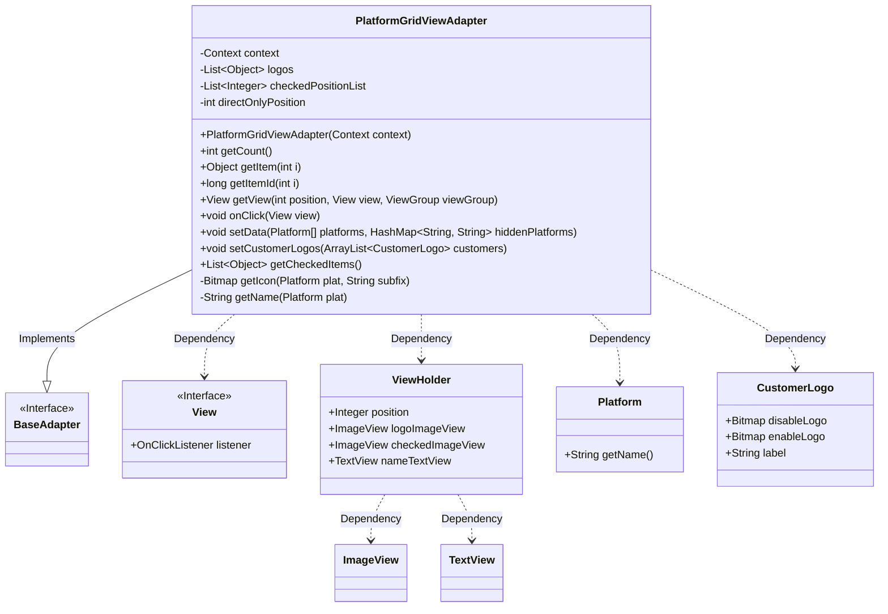

# Basic Information

|      |      |
|------|------|
| Name | PlatformGridViewAdapter |
| Language | .java |
| Code Path | happycat/src/cn/sharesdk/onekeyshare/theme/skyblue/PlatformGridViewAdapter.java |
| Package Name | cn.sharesdk.onekeyshare.theme.skyblue |
| Dependencies | ['android.content.Context', 'android.graphics.Bitmap', 'android.graphics.BitmapFactory', 'android.view.LayoutInflater', 'android.view.View', 'android.view.ViewGroup', 'android.widget.BaseAdapter', 'android.widget.ImageView', 'android.widget.TextView', 'java.util.ArrayList', 'java.util.Arrays', 'java.util.HashMap', 'java.util.List', 'cn.sharesdk.framework.Platform', 'cn.sharesdk.onekeyshare.CustomerLogo', 'cn.sharesdk.onekeyshare.ShareCore', 'com.mob.tools.utils.R.getBitmapRes', 'com.mob.tools.utils.R.getIdRes', 'com.mob.tools.utils.R.getLayoutRes'] |
| Brief Description | The PlatformGridViewAdapter is an adapter designed for displaying platform icons, supporting selected states and direct sharing functionality, with customizable icons and the ability to hide specific platforms. |

# Description

The `PlatformGridViewAdapter` is a custom adapter that inherits from `BaseAdapter`, designed to manage the display and interaction of platform icon grid views. It contains two data lists: `logos` stores platform or custom icon objects, while `checkedPositionList` records the positions of selected items. The adapter optimizes view performance through `ViewHolder`, dynamically loads icons and text, and handles click events. The click logic supports single-selection/multi-selection modes, with special handling for the exclusive selection case of direct-sharing platforms. It provides methods for setting platform data, custom icons, and retrieving selected items, along with resource-loading logic for icons and names. Overall, it implements a configurable, high-performance grid view adapter functionality.

# Class Summary

| Name   | Type  | Description |
|-------|------|-------------|
| PlatformGridViewAdapter | class | The PlatformGridViewAdapter is a custom adapter designed for displaying platform icon lists, supporting selected state management and direct sharing functionality. It includes data setup, view binding, and click handling logic, while accommodating both platform and custom icon types. |

## Class PlatformGridViewAdapter

|      |      |
|------|------|
| Access Modifier | public |
| Type | class |
| Name | PlatformGridViewAdapter |
| Description | The PlatformGridViewAdapter is a custom adapter designed for displaying platform icon lists, supporting selected state management and direct sharing functionality. It includes data setup, view binding, and click handling logic, while accommodating both platform and custom icon types. |

### UML Class Diagram

This code describes a custom `PlatformGridViewAdapter` class that extends `BaseAdapter` and implements the `View.OnClickListener` interface. It is primarily used to manage data and interaction logic for a grid view of platform icons, supporting mixed display of platform icons and custom logos. It includes features such as selected state management, direct sharing mode control, and optimizes view performance through the ViewHolder pattern. The adapter handles different types of platform data (Platform and CustomerLogo) and provides methods for setting data and retrieving selected items.

### Internal Method Call Graph

```mermaid
graph TD
    A["Class PlatformGridViewAdapter"]
    B["Property: Context context"]
    C["Property: List<Object> logos"]
    D["Property: List<Integer> checkedPositionList"]
    E["Property: int directOnlyPosition"]
    F["Static Inner Class: ViewHolder"]
    G["Constructor: PlatformGridViewAdapter(Context)"]
    H["Override Method: int getCount()"]
    I["Override Method: Object getItem(int)"]
    J["Override Method: long getItemId(int)"]
    K["Override Method: View getView(int, View, ViewGroup)"]
    L["Override Method: void onClick(View)"]
    M["Method: setData(Platform[], HashMap<String,String>)"]
    N["Method: setCustomerLogos(ArrayList<CustomerLogo>)"]
    O["Method: List<Object> getCheckedItems()"]
    P["Private Method: Bitmap getIcon(Platform, String)"]
    Q["Private Method: String getName(Platform)"]

    A --> B
    A --> C
    A --> D
    A --> E
    A --> F
    A --> G
    A --> H
    A --> I
    A --> J
    A --> K
    A --> L
    A --> M
    A --> N
    A --> O
    A --> P
    A --> Q

    K -->|"view==null"| K1["Create new view"]
    K -->|"view!=null"| K2["Reuse existing view"]
    K1 --> K3["Initialize ViewHolder"]
    K --> K4["Set view data"]
    K4 --> K5["Handle Platform type"]
    K4 --> K6["Handle CustomerLogo type"]
    L --> L1["Check directOnlyPosition"]
    L --> L2["Update selection state"]
    L2 --> L3["notifyDataSetChanged"]
```

This code implements PlatformGridViewAdapter, primarily used for managing data adaptation and click event handling in grid views. It extends BaseAdapter and implements the OnClickListener interface, containing core functionalities such as view creation (getView), data binding, click handling (onClick), and data management methods (setData/setCustomerLogos). The flowchart illustrates the class structure, key method invocation relationships, and critical processing logic of getView and onClick methods, particularly the view reuse mechanism and branch processing for different data types (Platform/CustomerLogo). The adapter manages selection states through checkedPositionList and directOnlyPosition, supporting single/multiple selection mode switching.

### Field List

| Name  | Type  | Description |
|-------|-------|------|
| directOnlyPosition = -1 | int | The private integer variable `directOnlyPosition` has an initial value of -1. |
| logos = new ArrayList<Object>() | List<Object> | Declare a private list variable named logos, initialized as an empty ArrayList, storing elements of type Object. |
| context | Context | Private immutable context object. |
| checkedPositionList = new ArrayList<Integer>() | List<Integer> | Declare a private integer list variable checkedPositionList, initialized as an empty ArrayList. |

### Method List

| Name  | Type  | Description |
|-------|-------|------|
| setData | void | The method `setData` takes a platform array and a hidden platform map, filters out the hidden platforms, updates the logos list, clears the selected items, and notifies the data update. |
| getItemId | long | Method override, returns the input parameter i as the item ID. |
| onClick | void | Click event handling logic: Get view position, check direct sharing restrictions, handle platform or custom icon selection state, update selection list, and refresh the interface. |
| getView | View | Customize the list adapter's getView method to achieve view reuse and dynamic data binding, handling the display logic for platform and customer logos, including selected state, disabled state, and click events. |
| setCustomerLogos | void | The method `setCustomerLogos` accepts a list of customer logos and adds them to the existing collection when non-empty. |
| getIcon | Bitmap | This method generates a resource name based on the platform name and suffix, retrieves the corresponding bitmap resource ID, and decodes it to return the bitmap object. |
| getCount | int | The method getCount returns the size of the logos collection. |
| getItem | Object | Java method: Returns the element at index i in the list logos. |
| getCheckedItems | List<Object> | Get the list of selected items: if no specific position is specified, return all checked items; otherwise, only return the item at the specified position. |
| getName | String | Methods to obtain the platform name: If the platform or name is empty, return an empty string; otherwise, attempt to retrieve the resource ID and return the corresponding string. If no resource is found, return null. |

