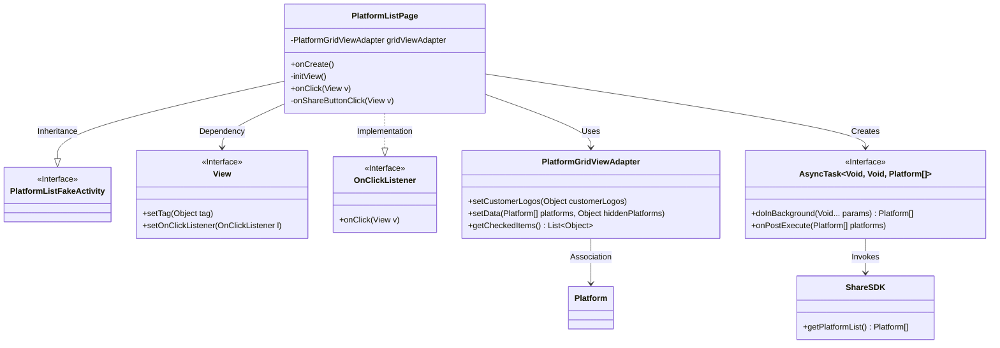
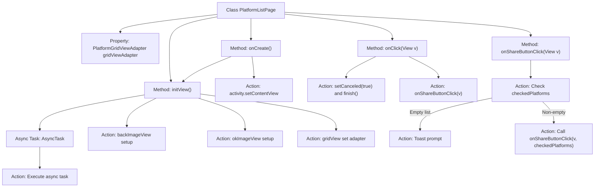

# Basic Information

|      |      |
|------|------|
| Name | PlatformListPage |
| Language | .java |
| Code Path | happycat/src/cn/sharesdk/onekeyshare/theme/skyblue/PlatformListPage.java |
| Package Name | cn.sharesdk.onekeyshare.theme.skyblue |
| Dependencies | ['android.os.AsyncTask', 'android.view.View', 'android.widget.GridView', 'android.widget.Toast', 'java.util.List', 'cn.sharesdk.framework.Platform', 'cn.sharesdk.framework.ShareSDK', 'cn.sharesdk.onekeyshare.PlatformListFakeActivity', 'com.mob.tools.utils.R.getLayoutRes', 'com.mob.tools.utils.R.getStringRes'] |
| Brief Description | The PlatformListPage class inherits from PlatformListFakeActivity and implements click event handling. View initialization includes back and confirm buttons, setting up the GridView adapter, and asynchronously loading platform data. Button clicks handle cancel and share logic, with share operations checking selected platforms and locking the button to prevent repeated clicks. |

# Description

The `PlatformListPage` class inherits from `PlatformListFakeActivity` and implements the `View.OnClickListener` interface, serving to display a list of sharing platforms. In the `onCreate` method, the layout is set and views are initialized. The `initView` method initializes the back and confirm buttons, sets click listeners, creates and configures a `GridView` adapter, and updates the adapter with platform list data fetched via an asynchronous task. The `onClick` method handles button click events, either canceling the operation or triggering sharing. The `onShareButtonClick` method validates the selected platform before executing the sharing logic and prompts the user if no platform is selected.

# Class Summary

| Name   | Type  | Description |
|-------|------|-------------|
| PlatformListPage | class | The PlatformListPage class inherits from PlatformListFakeActivity and implements click event handling. View initialization includes back and confirm buttons, with the GridView adapter asynchronously loading platform data. Button clicks handle cancel and share operations, verifying at least one platform is selected before sharing. |

## Class PlatformListPage

|      |      |
|------|------|
| Access Modifier | public |
| Type | class |
| Name | PlatformListPage |
| Description | The PlatformListPage class inherits from PlatformListFakeActivity and implements click event handling. View initialization includes back and confirm buttons, with the GridView adapter asynchronously loading platform data. Button clicks handle cancel and share operations, verifying at least one platform is selected before sharing. |

### UML Class Diagram

This code illustrates the implementation of a social sharing platform list page, primarily including platform list display, button click handling, and asynchronous loading of platform data. The PlatformListPage inherits from PlatformListFakeActivity and implements the OnClickListener interface, managing platform data display via PlatformGridViewAdapter and loading platform data asynchronously using AsyncTask. The class diagram clearly depicts inheritance, implementation, and dependency relationships between classes, including interactions with Android foundational components such as View and OnClickListener.

### Internal Method Call Graph

This code illustrates the implementation flow of a platform list page class PlatformListPage. Key functionalities include view initialization, user click event handling, asynchronous loading of platform data, and share button click logic. By extending PlatformListFakeActivity and implementing the OnClickListener interface, this class manages grid view adapters, handles back and confirm button click events, and executes sharing operations after user platform selection. The async task retrieves platform list data, while the share button ensures operational correctness through state locking and input validation.

### Field List

| Name  | Type  | Description |
|-------|-------|------|
| gridViewAdapter | PlatformGridViewAdapter | Private platform grid view adapter instance. |

### Method List

| Name  | Type  | Description |
|-------|-------|------|
| onCreate | void | The method onCreate executes: calls the parent class's onCreate, sets the layout file skyblue_share_platform_list, and initializes the view initView. |
| onClick | void | Click Event Handling: Perform cancel or share operations based on view tags. Exit if the tag is invalid. Mark and terminate when canceling; call the share method when confirming. |
| initView | void | Initializing the view: Set click events and labels for the back and confirm buttons; configure the grid view adapter and load customer icons; asynchronously fetch the platform list and update the adapter data. |
| onShareButtonClick | void | The method `onShareButtonClick` handles the click of the share button: it checks if the adapter is not null and the button is not locked. If no platform is selected, it prompts a message, then locks the button and calls the reload method. |

