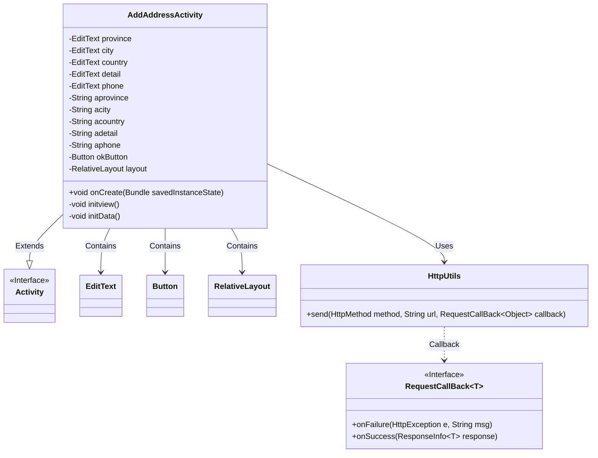
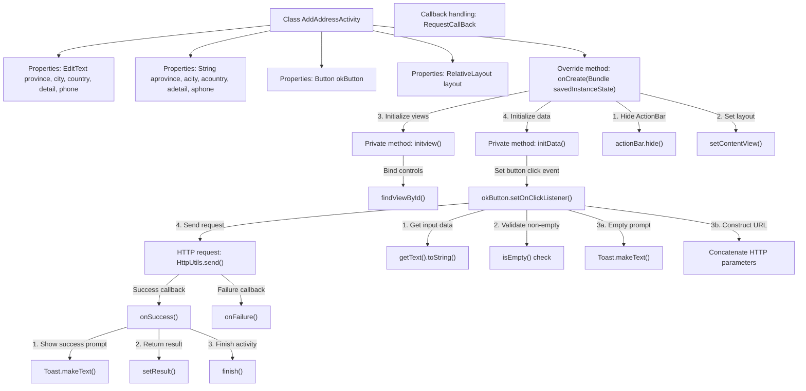

# Basic Information

|      |      |
|------|------|
| Name | AddAddressActivity |
| Language | .java |
| Code Path | happycat/src/com/happycat/AddAddressActivity.java |
| Package Name | com.happycat |
| Dependencies | ['com.example.happucat.R', 'com.happycat.util.MyApplication', 'com.lidroid.xutils.HttpUtils', 'com.lidroid.xutils.exception.HttpException', 'com.lidroid.xutils.http.RequestParams', 'com.lidroid.xutils.http.ResponseInfo', 'com.lidroid.xutils.http.callback.RequestCallBack', 'com.lidroid.xutils.http.client.HttpRequest.HttpMethod', 'android.app.ActionBar', 'android.app.Activity', 'android.content.Intent', 'android.os.Bundle', 'android.util.Log', 'android.view.View', 'android.view.View.OnClickListener', 'android.widget.Button', 'android.widget.EditText', 'android.widget.ImageButton', 'android.widget.RelativeLayout', 'android.widget.Toast'] |
| Brief Description | The Android activity class AddAddressActivity is used for adding address information. It includes input fields for province, city, district/county, detailed address, and phone number. After clicking the confirm button, it validates non-empty fields and submits the data to the server, returning the result upon successful submission. |

# Description

The code defines an Android activity class named AddAddressActivity, which is used for adding address information. The activity includes input fields for province, city, district, detailed address, and phone number, along with a confirmation button. During initialization, the title bar is hidden, and the layout view is set. The click event of the confirmation button validates whether the input content is empty. If empty, it prompts the user; otherwise, it sends the address data to a specified URL via an HTTP GET request. Upon successful request, it displays a success prompt and returns to the previous page, while no action is taken upon failure. The code also includes commented-out code related to image buttons.

# Class Summary

| Name   | Type  | Description |
|-------|------|-------------|
| AddAddressActivity | class | The Android activity class AddAddressActivity is used for adding address information, including input fields for province, city, district/county, detailed address, and phone number. After clicking the confirm button, it validates non-empty fields and submits the data via an HTTP GET request. Upon successfully receiving the response, the page is closed. |

## Class AddAddressActivity

|      |      |
|------|------|
| Access Modifier | public |
| Type | class |
| Name | AddAddressActivity |
| Description | The Android activity class AddAddressActivity is used for adding address information, including input fields for province, city, district/county, detailed address, and phone number. After clicking the confirm button, it validates non-empty fields and submits the data via an HTTP GET request. Upon successfully receiving the response, the page is closed. |

### UML Class Diagram

This code demonstrates an Android AddAddressActivity class for adding address information. The class inherits from Activity and contains multiple EditText fields for inputting province, city, district, detailed address, and phone number, along with a confirmation button. When the user clicks the button, it validates whether the inputs are empty and sends a GET request to the server via HttpUtils. If successful, it displays a success message and returns to AddressActivity. The class diagram clearly illustrates the relationships between classes, including inheritance, containment, usage dependencies, and the use of callback interfaces.

### Internal Method Call Graph

Flowchart description: This flowchart illustrates the core logic flow of AddAddressActivity, starting from initializing UI elements to triggering data validation and network requests via button clicks. It first hides the title bar and loads the layout, then initializes view controls and data listeners. Upon user submission, it validates non-empty input data, constructs a URL for HTTP GET requests upon validation, and handles success (display prompt, return result, close page) or failure scenarios based on the request outcome. The entire process clearly demonstrates the interaction between Android activity lifecycle and asynchronous network requests.

### Field List

| Name  | Type  | Description |
|-------|-------|------|
| aphone | String | Five string variables are defined: province, city, country, detailed address, and phone number. |
| phone | EditText | Define five input box variables: Province, City, County, Detailed Address, and Phone. |
| okButton | Button | Interface button component okButton. |
| layout | RelativeLayout | RelativeLayout is an Android layout that allows child views to be positioned relative to each other or to the parent view. |

### Method List

| Name  | Type  | Description |
|-------|-------|------|
| initview | void | Initialize interface controls: Obtain instances of the province, city, district, detailed address, phone input fields, and the confirm button. The commented section represents the disabled image button click event. |
| onCreate | void | The onCreate method of Android Activity: Hide the title bar, set the layout, initialize views and data. |
| initData | void | The method initData sets the click event for the okButton, retrieves the input box content, and validates it for non-emptiness. If empty, it prompts a warning; otherwise, it concatenates the URL and sends a GET request. Upon successful return, it prompts that the addition was successful and redirects. |

