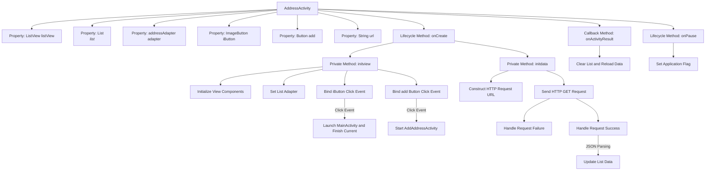

# Basic Information

|      |      |
|------|------|
| Name | AddressActivity |
| Language | .java |
| Code Path | happycat/src/com/happycat/AddressActivity.java |
| Package Name | com.happycat |
| Dependencies | ['java.lang.reflect.Type', 'java.util.ArrayList', 'java.util.List', 'com.example.happucat.R', 'com.google.gson.Gson', 'com.google.gson.reflect.TypeToken', 'com.happycat.Bean.address', 'com.happycat.adapter.addressAdapter', 'com.happycat.util.ActivitiyUtils', 'com.happycat.util.MyApplication', 'com.lidroid.xutils.HttpUtils', 'com.lidroid.xutils.exception.HttpException', 'com.lidroid.xutils.http.ResponseInfo', 'com.lidroid.xutils.http.callback.RequestCallBack', 'com.lidroid.xutils.http.client.HttpRequest.HttpMethod', 'android.app.Activity', 'android.content.Intent', 'android.os.Bundle', 'android.util.Log', 'android.view.View', 'android.view.View.OnClickListener', 'android.view.Window', 'android.widget.Button', 'android.widget.ImageButton', 'android.widget.ListView'] |
| Brief Description | AddressActivity is an Android Activity class that includes a list view, an adapter, and buttons. It initializes views and data, handles click events and network requests, uses Gson to parse JSON data, and updates the list. |

# Description

AddressActivity is an Android Activity class designed to manage the address list interface. It includes a ListView to display the address list, utilizing a custom adapter to fit the data. The interface features a back button and an add address button. Clicking the back button navigates to MainActivity, while the add button redirects to AddAddressActivity. Address data is retrieved from the server via HTTP requests, with JSON responses parsed using Gson to update the list. The data is reloaded in onActivityResult, and a global flag is set during onPause.

# Class Summary

| Name   | Type  | Description |
|-------|------|-------------|
| AddressActivity | class | AddressActivity is an Android activity class that includes a list view and buttons. It loads address data during initialization, and clicking a button navigates to another activity. It uses HTTP requests to fetch data and parses it with Gson, refreshing the list upon return. |


## Class AddressActivity

|      |      |
|------|------|
| Access Modifier | public |
| Type | class |
| Name | AddressActivity |
| Description | AddressActivity is an Android activity class that includes a list view and buttons. It loads address data during initialization, and clicking a button navigates to another activity. It uses HTTP requests to fetch data and parses it with Gson, refreshing the list upon return. |


### UML Class Diagram

```mermaid
classDiagram
    class AddressActivity {
        -ListView listView
        -List~address~ list
        -addressAdapter adapter
        -ImageButton iButton
        -Button add
        -String url
        +onCreate(Bundle savedInstanceState) void
        -initview() void
        -initdata() void
        +onActivityResult(int requestCode, int resultCode, Intent data) void
        +onPause() void
    }

    class addressAdapter {
        -List~address~ list
        -Context context
        +setList(List~address~ list) void
        +notifyDataSetChanged() void
    }

    class HttpUtils {
        +configCurrentHttpCacheExpiry(long expiry) void
        +send(HttpMethod method, String url, RequestCallBack~String~ callBack) void
    }

    class RequestCallBack~T~ {
        <<Interface>>
        +onFailure(HttpException e, String msg) void
        +onSuccess(ResponseInfo~T~ responseInfo) void
    }

    class Gson {
        +fromJson(String json, Type typeOfT) Object
    }

    class TypeToken~T~ {
        +getType() Type
    }

    AddressActivity --> addressAdapter : uses
    AddressActivity --> HttpUtils : uses
    HttpUtils --> RequestCallBack~String~ : depends
    AddressActivity --> Gson : uses
    AddressActivity --> TypeToken~List~address~~ : uses
```

This code illustrates the class structure of an Android address management interface (AddressActivity), with core functionalities including: initializing view components (ListView, buttons, etc.), fetching address data via HTTP requests, parsing JSON responses using Gson, and handling Activity lifecycle events. The class diagram features key components such as the custom adapter addressAdapter, network utility HttpUtils, JSON parser Gson, and callback interface RequestCallBack, clearly demonstrating the collaborative relationships between modules.


### Internal Method Call Graph



This flowchart illustrates the core structure and execution flow of AddressActivity. During Activity initialization, the onCreate, initview, and initdata methods are sequentially invoked to handle UI initialization, event binding, and data loading respectively. It includes two primary button events: iButton navigates to MainActivity, while the add button launches AddAddressActivity and awaits return results. Upon successful network request, JSON data is parsed via Gson to refresh the list, with onActivityResult triggering data reload. Finally, the application flag is set during onPause. The entire process demonstrates typical Android Activity lifecycle management and asynchronous data handling mechanisms.

### Field List

| Name  | Type  | Description |
|-------|-------|------|
| list=new ArrayList<address>() | List<address> | Create an ArrayList to store address objects. |
| add | Button | The button "add" is used for the add function. |
| listView | ListView | Declare a ListView control variable named listView. |
| iButton | ImageButton | Defined an ImageButton control named iButton. |
| adapter | addressAdapter | addressAdapter adapter instance. |
| url | String | The private string variable `url` is used to store a web address. |

### Method List

| Name  | Type  | Description |
|-------|-------|------|
| initview | void | Initialization view method: Set up the list view and adapter, configure the image button to navigate to the main activity upon click, and set the add button to redirect to the add address activity when clicked. |
| initdata | void | Initialization data method, retrieves the address list via an HTTP GET request, parses the JSON data, and updates the adapter. No action is taken upon failure, while the list is refreshed upon success. |
| onCreate | void | The onCreate method of Android Activity: Initializes a titleless window, sets the layout, and initializes views and data. |
| onActivityResult | void | Rewrite the onActivityResult method, clear the list, and reinitialize the data. |
| onPause | void | Set the global variable myflag to 1 in the Android lifecycle method onPause. |


