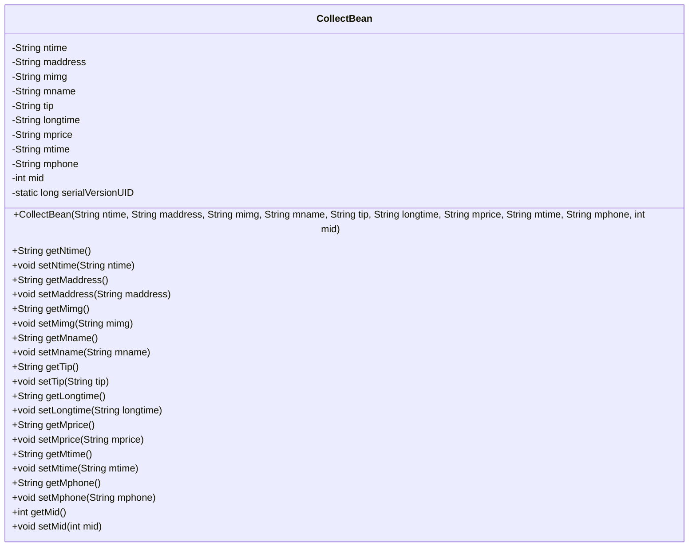
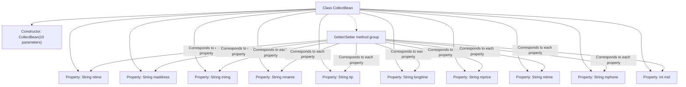

# Basic Information

|      |      |
|------|------|
| Name | CollectBean |
| Language | .java |
| Code Path | happycat/src/com/happycat/Bean/CollectBean.java |
| Package Name | com.happycat.Bean |
| Dependencies | ['java.io.Serializable', 'android.R.integer'] |
| Brief Description | CollectBean is a serializable class that includes attributes such as time, address, image, name, hint, duration, price, phone, and ID, providing getter and setter methods. |

# Description

CollectBean is a Java class that implements the Serializable interface, designed to store collection information. It includes the following fields: ntime (time), maddress (address), mimg (image), mname (name), tip (hint), longtime (duration), mprice (price), mtime (time), mphone (phone), and mid (ID). It provides a parameterized constructor along with getter and setter methods for each field, supporting serialization operations.

# Class Summary

| Name   | Type  | Description |
|-------|------|-------------|
| CollectBean | class | The CollectBean class implements the Serializable interface and includes properties such as ntime, maddress, mimg, mname, tip, longtime, mprice, mtime, mphone, and mid, providing constructors and getter/setter methods. |

## Class CollectBean

|      |      |
|------|------|
| Access Modifier | public |
| Type | class |
| Name | CollectBean |
| Description | The CollectBean class implements the Serializable interface and includes properties such as ntime, maddress, mimg, mname, tip, longtime, mprice, mtime, mphone, and mid, providing constructors and getter/setter methods. |

### UML Class Diagram

This code defines a Java class named `CollectBean` that implements the `Serializable` interface, indicating its instances can be serialized. The class contains 10 private fields (e.g., ntime, maddress, etc.) and their corresponding getter/setter methods for storing and manipulating information related to collected items (such as name, address, image URL, price, etc.). The constructor allows initialization of all fields, and serialVersionUID is used for version control. This is a typical data encapsulation class commonly used to transfer structured data between different layers of an application.

### Internal Method Call Graph

This flowchart illustrates the complete structure of the CollectBean class, which includes 10 private properties of String/int type, a full-parameter constructor, and corresponding Getter/Setter method groups. All properties are initialized via the constructor and accessed/modified through individual method pairs, complying with JavaBean design specifications. The class implements the Serializable interface to support serialization operations, with serialVersionUID used for version control.

### Field List

| Name  | Type  | Description |
|-------|-------|------|
| tip | String | Private string variable tip |
| longtime | String | Long string variable |
| mphone | String | The private string variable mphone is used to store mobile phone number information. |
| mid | int | private int variable mid |
| mimg | String | The private string variable `mimg` is used to store image-related data. |
| mprice | String | The private string variable mprice is used to store price information. |
| serialVersionUID = 1L | long | Declare a private static final serial version ID with a value of 1L. |
| mname | String | Private string variable mname. |
| mtime | String | Declare a private string variable mtime. |
| maddress | String | The private string variable `maddress` is used to store address information. |
| ntime | String | The private string variable `ntime` is used to store time information. |

### Method List

| Name  | Type  | Description |
|-------|-------|------|
| getLongtime | String | Methods to obtain the longtime string. |
| setLongtime | void | This is a Java method used to set the value of the longtime string variable. The method is named setLongtime, which takes a String parameter named longtime and assigns it to the longtime property of the current object. |
| setMname | void | Java Method: Set the value of the member variable mname. |
| getNtime | String | Methods to obtain the ntime string value. |
| setMprice | void | This is a Java method used to set the value of the class member variable mprice. The method accepts a string parameter mprice and assigns it to the mprice property of the current object. |
| getMphone | String | This is a Java method that returns the value of the string variable mphone. |
| setMphone | void | The method to set the mobile phone number is to assign the parameter mphone to the member variable mphone of the class. |
| getMid | int | The method returns the value of the integer variable mid. |
| setMid | void | Set the value of the member variable mid. |
| setMaddress | void | Java method: Set the value of member variable maddress. |
| setMtime | void | Java Method: Set the mtime string attribute value. |
| getMimg | String | This is a Java method that returns the value of the string variable mimg. |
| getTip | String | Methods to obtain the tip string. |
| getMaddress | String | The method getMaddress returns the value of the member variable maddress. |
| getMtime | String | String method to obtain the mtime value. |
| setTip | void | The method `setTip` accepts a string parameter `tip` and assigns it to the `tip` property of the current object. |
| getMname | String | This is a Java method that returns the value of the member variable mname of type String. |
| setNtime | void | Methods for setting the ntime string attribute. |
| getMprice | String | This is a Java method that returns the value of the member variable `mprice` of type String. |
| setMimg | void | The method to set the member variable mimg, with the parameter being the string mimg. |

