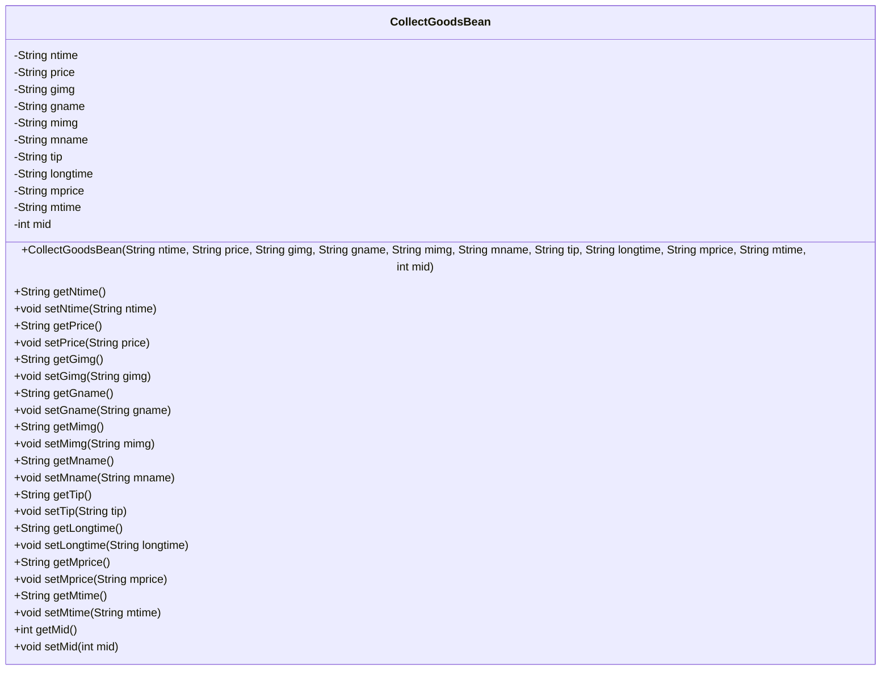
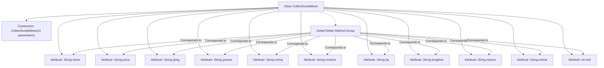

# Basic Information

|      |      |
|------|------|
| Name | CollectGoodsBean |
| Language | .java |
| Code Path | happycat/src/com/happycat/Bean/CollectGoodsBean.java |
| Package Name | com.happycat.Bean |
| Dependencies | ['java.io.Serializable'] |
| Brief Description | CollectGoodsBean is a serializable Java class that contains product and merchant information, including fields such as name, image, price, time, etc., and provides getter and setter methods. |

# Description

CollectGoodsBean is a Java class that implements the Serializable interface, designed to store product collection information. The class includes multiple private fields: ntime, price, gimg, gname, mimg, mname, tip, longtime, mprice, mtime, and mid, which represent the collection time, price, product image, product name, merchant image, merchant name, prompt message, long-term time, merchant price, merchant time, and merchant ID, respectively. The class provides a parameterized constructor for initializing all fields and offers corresponding getter and setter methods for each field to access and modify these properties.

# Class Summary

| Name   | Type  | Description |
|-------|------|-------------|
| CollectGoodsBean | class | CollectGoodsBean is a serializable Java class that contains product and merchant information, including fields such as name, image, price, time, etc., and provides getter and setter methods. |

## Class CollectGoodsBean

|      |      |
|------|------|
| Access Modifier | public |
| Type | class |
| Name | CollectGoodsBean |
| Description | CollectGoodsBean is a serializable Java class that contains product and merchant information, including fields such as name, image, price, time, etc., and provides getter and setter methods. |

### UML Class Diagram

This code defines a JavaBean class named CollectGoodsBean, which implements the Serializable interface for serialization. The class contains 11 private fields representing various attributes related to product collection (such as time, price, images, names, etc.), and provides corresponding getter and setter methods for each field. The constructor allows initializing all fields at once. This class is primarily used to encapsulate product collection information, facilitating data transfer and processing within the system.

### Internal Method Call Graph

This flowchart illustrates the complete structure of the CollectGoodsBean class, containing 11 String/int-type attribute fields, 1 full-parameter constructor, and corresponding 12 sets of Getter/Setter methods. The class implements the Serializable interface and supports serialization through serialVersionUID. All attributes are initialized via the constructor and provide read/write access through independent methods, forming a standard data encapsulation pattern. This structure is commonly used for DTO or VO objects, suitable for storing multi-dimensional information related to product collections.

### Field List

| Name  | Type  | Description |
|-------|-------|------|
| longtime | String | Private string variable longtime |
| gname | String | Private string variable gname. |
| mtime | String | The private string variable mtime is used to store time information. |
| mprice | String | The private string variable mprice is used to store price information. |
| mid | int | private int variable mid |
| tip | String | Private string variable tip. |
| mname | String | private string variable mname |
| gimg | String | The private string variable gimg is used to store image data. |
| price | String | The private string-type variable price is used to store price information. |
| mimg | String | The private string variable mimg. |
| ntime | String | The private string variable ntime is used to store time information. |
| serialVersionUID = 1L | long | Declare a private static final long serialVersionUID with an initial value of 1L. |

### Method List

| Name  | Type  | Description |
|-------|-------|------|
| setGimg | void | This is a Java method used to set the gimg property value of an object. The method accepts a string parameter gimg and assigns it to the property of the same name in the current object. |
| getLongtime | String | Methods to obtain the "longtime" string. |
| getTip | String | Methods to obtain the prompt string. |
| setMimg | void | The method for setting a member's image involves assigning the parameter `mimg` to the object's `mimg` property. |
| getGname | String | Methods to obtain gname, returns the gname value of string type. |
| getMimg | String | This is a Java method that returns the value of the string variable mimg. |
| getPrice | String | Public method to retrieve the price, returns the price value as a string type. |
| getNtime | String | Methods to obtain the ntime string value. |
| setNtime | void | Methods for setting the ntime string value. |
| setGname | void | This is a Java method used to set the value of the class member variable gname. The method takes a string parameter gname and assigns it to the gname property of the current object. |
| setTip | void | Methods for setting prompt information: assign the passed string to the class's tip variable. |
| getGimg | String | The method getGimg returns the value of the string gimg. |
| setMname | void | Java Method: Set the value of member variable mname. |
| setPrice | void | The method to set the price assigns the input string to the class variable price. |
| getMname | String | The method getMname returns the value of the member variable mname. |
| setLongtime | void | The method setLongtime is used to set the value of the longtime attribute, with the parameter being of string type. |
| getMprice | String | The method getMprice returns the value of the member variable mprice, which is of type string. |
| setMprice | void | Java Method: Set the string property value of mprice. |
| getMtime | String | Public methods for obtaining mtime values. |
| setMtime | void | Java Method: Set the mtime string attribute. |
| getMid | int | The method returns the value of the integer variable mid. |
| setMid | void | Java Method: Set the value of member variable mid. |

