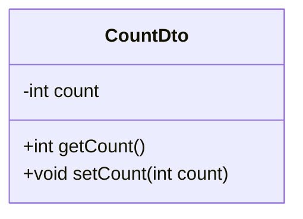
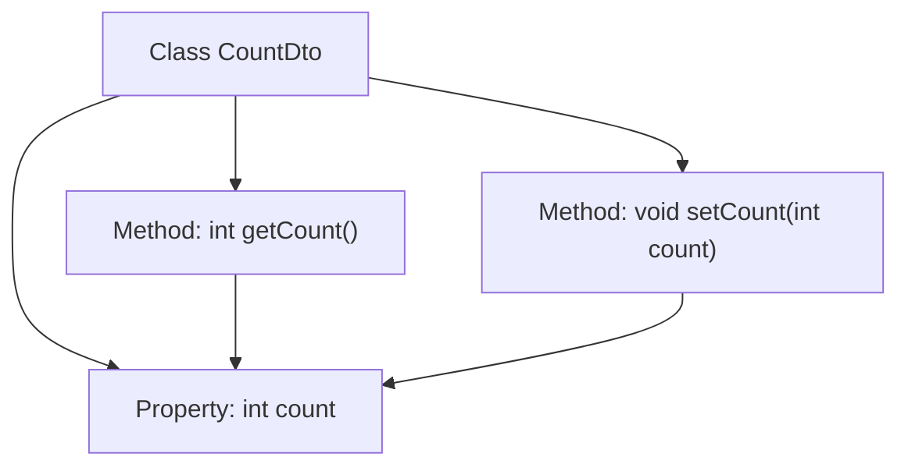

# Basic Information

|      |      |
|------|------|
| Name | CountDto |
| Language | .java |
| Code Path | happycat/src/com/happycat/Bean/CountDto.java |
| Package Name | com.happycat.Bean |
| Dependencies | [] |
| Brief Description | The CountDto class includes an integer variable count along with its getter and setter methods. |

# Description

This is a simple Java class named CountDto, designed to encapsulate counting data. The class contains an integer variable called count, along with corresponding getter and setter methods. The getCount method retrieves the current count value, while the setCount method assigns a new count value. Following the JavaBean design pattern, this class achieves data encapsulation through private fields and public accessor methods.

# Class Summary

| Name   | Type  | Description |
|-------|------|-------------|
| CountDto | class | The CountDto class contains an integer variable count along with its getter and setter methods. |

## Class CountDto

|      |      |
|------|------|
| Access Modifier | public |
| Type | class |
| Name | CountDto |
| Description | The CountDto class contains an integer variable count along with its getter and setter methods. |

### UML Class Diagram

This code defines a simple Data Transfer Object (DTO) class CountDto, primarily used to encapsulate an integer counter. The class contains a private field count along with corresponding public getter and setter methods, adhering to Java Bean coding conventions. This design pattern is commonly employed for transferring data between different layers, particularly when separating models and views in MVC architecture. The class diagram clearly illustrates the structure of the class, including private attributes and public methods, demonstrating good encapsulation practices.

### Internal Method Call Graph

This flowchart illustrates the structure of the CountDto class, which contains a private integer property "count" and two public methods: getCount() for retrieving the current count value and setCount() for updating it. The arrows indicate the access relationships between methods and the property, where getCount() reads the count value and setCount() modifies it. This represents a typical Data Transfer Object (DTO) design, encapsulating a single integer data field with standardized access interfaces.

### Field List

| Name  | Type  | Description |
|-------|-------|------|
| count | int | Declare an integer variable count. |

### Method List

| Name  | Type  | Description |
|-------|-------|------|
| getCount | int | This is a Java method that returns the current value of the private variable count. |
| setCount | void | Methods for setting the counter value, assigning the parameter count to the class's count member variable. |

