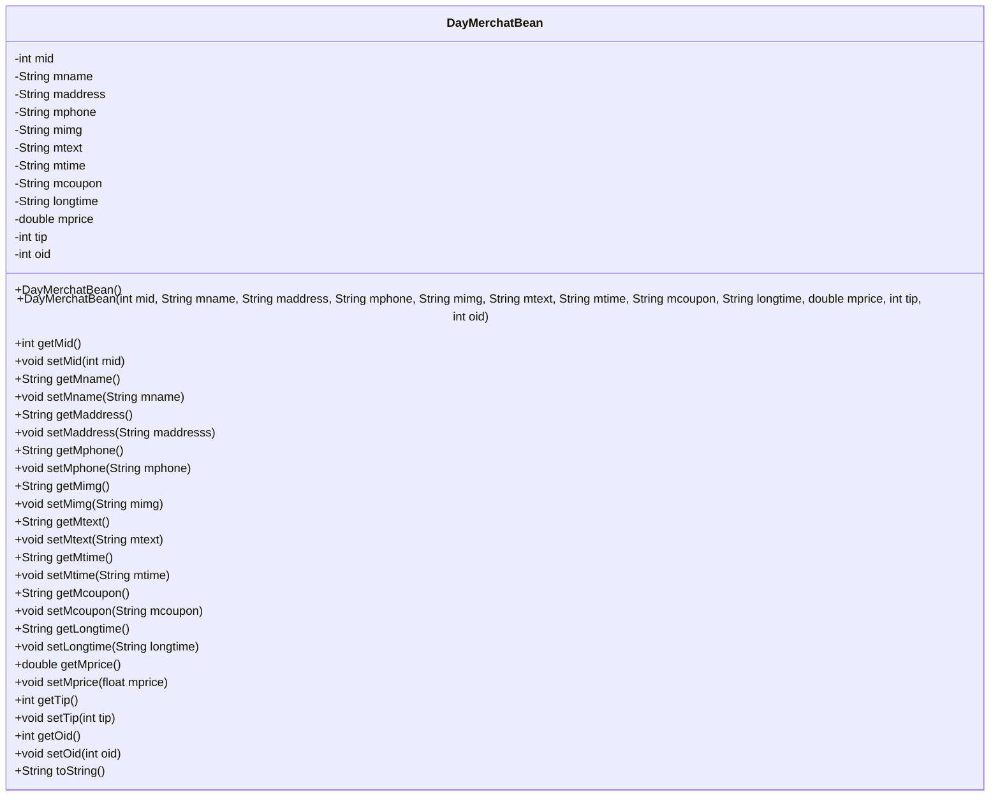

# Basic Information

|      |      |
|------|------|
| Name | DayMerchatBean |
| Language | .java |
| Code Path | happycat/src/com/happycat/Bean/DayMerchatBean.java |
| Package Name | com.happycat.Bean |
| Dependencies | ['java.io.Serializable'] |
| Brief Description | DayMerchatBean is a serializable Java class that includes attributes such as merchant ID, name, address, phone number, image, description, business hours, coupons, price, tips, order ID, etc. It provides constructor methods and getter/setter methods. |

# Description

This is a Java class named DayMerchatBean, which implements the Serializable interface and is used to represent merchant information. The class contains 12 private fields: mid (merchant ID), mname (merchant name), maddress (address), mphone (phone), mimg (image), mtext (text description), mtime (time), mcoupon (coupon), longtime (long time), mprice (price), tip (tip), and oid (order ID). Getter and setter methods are provided for each field. The class includes two constructors: a no-argument constructor and a full-parameter constructor. The toString method is overridden to return a string representation containing all field values. This class is designed for storing and transmitting merchant-related data.

# Class Summary

| Name   | Type  | Description |
|-------|------|-------------|
| DayMerchatBean | class | DayMerchatBean is a serializable Java class that includes attributes such as merchant ID, name, address, phone number, image, description, business hours, coupons, operating duration, price, tips, and order ID, providing getter/setter methods and constructors. |

## Class DayMerchatBean

|      |      |
|------|------|
| Access Modifier | public |
| Type | class |
| Name | DayMerchatBean |
| Description | DayMerchatBean is a serializable Java class that includes attributes such as merchant ID, name, address, phone number, image, description, business hours, coupons, operating duration, price, tips, and order ID, providing getter/setter methods and constructors. |

### UML Class Diagram

This code defines a Java class named DayMerchatBean that implements the Serializable interface, primarily used for storing merchant-related information. The class contains 12 private fields such as merchant ID (mid), name (mname), address (maddress), etc., each with corresponding getter and setter methods. It provides two constructors (default constructor and full-parameter constructor) as well as an overridden toString method. This is a typical Data Transfer Object (DTO) used to pass merchant data between different layers, suitable for serialization operations.

### Internal Method Call Graph

```mermaid
graph TD
    A["Class DayMerchatBean"]
    B["Field: int mid"]
    C["Field: String mname"]
    D["Field: String maddress"]
    E["Field: String mphone"]
    F["Field: String mimg"]
    G["Field: String mtext"]
    H["Field: String mtime"]
    I["Field: String mcoupon"]
    J["Field: String longtime"]
    K["Field: double mprice"]
    L["Field: int tip"]
    M["Field: int oid"]
    N["Constructor: DayMerchatBean()"]
    O["Constructor: DayMerchatBean(12 params)"]
    P["Method: toString()"]
    Q["Getter/Setter methods"]

    A --> B
    A --> C
    A --> D
    A --> E
    A --> F
    A --> G
    A --> H
    A --> I
    A --> J
    A --> K
    A --> L
    A --> M
    A --> N
    A --> O
    A --> P
    A --> Q
```

This flowchart illustrates the complete structure of the DayMerchatBean class, containing 12 private fields, two constructors (no-arg and full-parameter), an overridden toString() method, and getter/setter methods for all attributes. The class implements the Serializable interface, indicating its instances are serializable. Field names are prefixed with 'm', encompassing merchant basic information (name, address, phone), business details (price, coupon), and associated IDs. The flowchart clearly presents a standard Java Bean design pattern, making it suitable as a data transfer object.

### Field List

| Name  | Type  | Description |
|-------|-------|------|
| mid | int | private int mid |
| longtime | String | Private string variable longtime |
| tip | int | Private integer variable tip. |
| oid | int | Private integer variable oid |
| mcoupon | String | private string variable mcoupon |
| mimg | String | The private string variable `mimg` is used to store image information. |
| mtext | String | private string variable mtext |
| mprice | double | private double mprice |
| maddress | String | Private string variable used to store address information. |
| mname | String | The private string variable mname. |
| mtime | String | The private string variable `mtime` is used to store time information. |
| mphone | String | The private string variable mphone is used to store mobile phone number information. |

### Method List

| Name  | Type  | Description |
|-------|-------|------|
| toString | String | The toString method of MerchatBean returns a string containing fields such as mid, mname, and maddress. |
| setMphone | void | The method to set the mobile phone number assigns the parameter mphone to the mphone property of the current object. |
| setTip | void | The method to set the tip amount, where the parameter is an integer type `tip`, assigns the value to the `tip` property of the current object. |
| getMname | String | This is a Java method that returns the value of the member variable mname of type String. |
| getMid | int | The method returns the value of the integer variable mid. |
| getMcoupon | String | Methods to obtain the mcoupon string value. |
| getMaddress | String | This is a Java method that returns the string value of the member variable `maddress`. The method is named `getMaddress`, takes no parameters, and directly returns the private variable `maddress`. |
| getMimg | String | This is a Java method that returns the value of the member variable `mimg` of type String. |
| setMaddress | void | This is a Java method used to set the value of the member variable maddress. The method takes a string parameter maddresss and assigns it to the maddress property of the current object. |
| setMid | void | Set the value of the member variable mid. |
| getMtime | String | String method to obtain the mtime value. |
| setMcoupon | void | Set the value of the member variable mcoupon. |
| getLongtime | String | Methods to obtain the value of the longtime string. |
| setMimg | void | This is a Java method used to set the value of the member variable mimg. The method takes a string parameter mimg and assigns it to the mimg property of the current object. |
| getMtext | String | This is a Java method that returns the member variable mtext of type String. |
| setMprice | void | Methods for setting product prices, with the parameter being a floating-point number mprice. |
| setLongtime | void | This is a Java method used to set the value of a String-type longtime variable. The method is named setLongtime, which accepts a String parameter longtime and assigns it to the member variable of the same name in the current object. |
| setMname | void | This is a Java method used to set the value of the class member variable mname. The method takes a string parameter mname and assigns it to the mname attribute of the current object. |
| setMtext | void | This is a Java method used to set the value of the class member variable `mtext`. The method takes a string parameter `mtext` and assigns it to the `mtext` property of the current object. |
| getOid | int | Methods to obtain object identifiers, returning an integer oid value. |
| setOid | void | This is a Java method used to set the oid property of an object. The method accepts an integer parameter oid and assigns it to the oid member variable of the current object. |
| getMphone | String | The method getMphone returns the string value of the member variable mphone. |
| setMtime | void | Define the method `setMtime` to set the value of the member variable `mtime`. The parameter is a string `mtime`. |
| getMprice | double | Public method to get the mprice value, returns a double type. |
| getTip | int | The method returns the integer value of the tip variable. |

