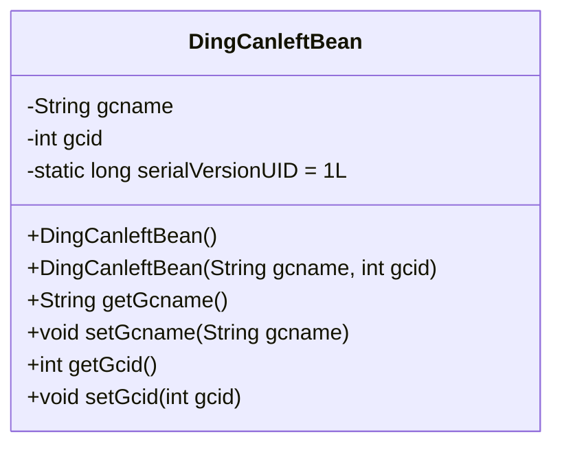
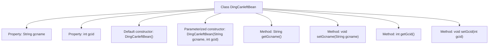

# Basic Information

|      |      |
|------|------|
| Name | DingCanleftBean |
| Language | .java |
| Code Path | happycat/src/com/happycat/Bean/DingCanleftBean.java |
| Package Name | com.happycat.Bean |
| Dependencies | ['java.io.Serializable'] |
| Brief Description | The Java class DingCanleftBean implements Serializable, containing the properties gcname and gcid along with their corresponding getter and setter methods. |

# Description

DingCanleftBean is a Java class that implements the Serializable interface for serialization operations. The class contains two private member variables: a String-type `gcname` and an integer-type `gcid`. It provides a no-argument constructor and a parameterized constructor for initializing and setting the member variables. Corresponding getter and setter methods are also provided for each member variable to retrieve and modify their values. The `serialVersionUID` is used for version control to ensure serialization compatibility.

# Class Summary

| Name   | Type  | Description |
|-------|------|-------------|
| DingCanleftBean | class | The Java class DingCanleftBean implements the Serializable interface, containing the gcname and gcid properties along with their corresponding getter/setter methods, supporting serialization. |

## Class DingCanleftBean

|      |      |
|------|------|
| Access Modifier | public |
| Type | class |
| Name | DingCanleftBean |
| Description | The Java class DingCanleftBean implements the Serializable interface, containing the gcname and gcid properties along with their corresponding getter/setter methods, supporting serialization. |

### UML Class Diagram

This code defines a serializable Java class named DingCanleftBean, primarily used for encapsulating meal ordering-related data. The class contains two private attributes: gcname (String type) and gcid (integer type), along with corresponding getter and setter methods. The class implements the Serializable interface (indicated by the <<Interface>> marker), signifying that its instances can be serialized, and includes a default constructor and a parameterized constructor. The serialVersionUID field is used to control serialization version compatibility. This class is typically employed in the Data Transfer Object (DTO) pattern to transmit dish category information within a meal ordering system.

### Internal Method Call Graph

This flowchart illustrates the complete structure of the DingCanleftBean class, which includes two private properties (gcname and gcid), a default constructor, a parameterized constructor, and four accessor methods (getter/setter). The class implements the Serializable interface and defines a serialVersionUID field, indicating it is a serializable JavaBean. All methods revolve around property operations, with the parameterized constructor directly initializing property values while the default constructor allows for subsequent initialization. This structure exemplifies a typical Data Transfer Object (DTO) design pattern.

### Field List

| Name  | Type  | Description |
|-------|-------|------|
| serialVersionUID = 1L | long | Declare a private static final serial version ID with an initial value of 1L. |
| gcid | int | Private integer variable gcid. |
| gcname | String | Private string variable gcname. |

### Method List

| Name  | Type  | Description |
|-------|-------|------|
| getGcname | String | The method returns the value of the string-type variable gcname. |
| setGcname | void | Java Method: Set the value of the string-type member variable gcname. |
| getGcid | int | The method returns the value of the integer variable gcid. |
| setGcid | void | Java method: Set the gcid value, with an integer gcid as the parameter. |

