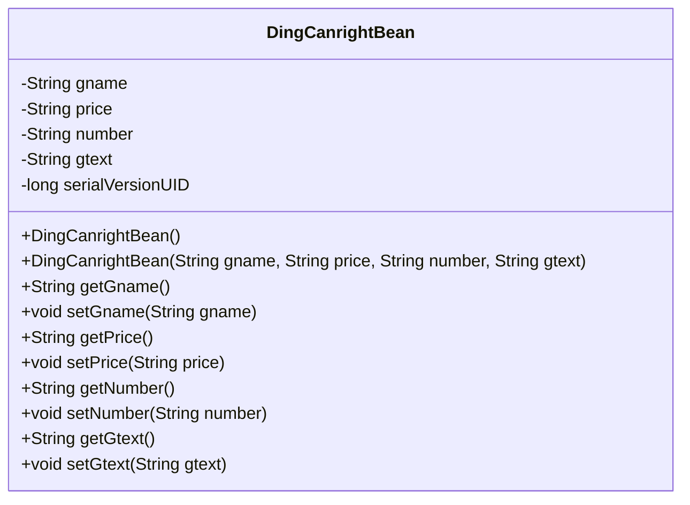

# Basic Information

|      |      |
|------|------|
| Name | DingCanrightBean |
| Language | .java |
| Code Path | happycat/src/com/happycat/Bean/DingCanrightBean.java |
| Package Name | com.happycat.Bean |
| Dependencies | ['java.io.Serializable'] |
| Brief Description | DingCanrightBean is a serializable class that includes the attributes gname, price, number, gtext, and their corresponding getter/setter methods. |

# Description

DingCanrightBean is a Java class that implements the Serializable interface, used to store order-related information. This class contains four private string attributes: gname (product name), price (price), number (quantity), and gtext (product description). It provides a no-argument constructor and a parameterized constructor, as well as getter and setter methods for each attribute. The serialVersionUID is set to 1L to ensure serialization compatibility.

# Class Summary

| Name   | Type  | Description |
|-------|------|-------------|
| DingCanrightBean | class | DingCanrightBean is a serializable class that includes the attributes gname, price, number, gtext, and their corresponding getter/setter methods. |

## Class DingCanrightBean

|      |      |
|------|------|
| Access Modifier | public |
| Type | class |
| Name | DingCanrightBean |
| Description | DingCanrightBean is a serializable class that includes the attributes gname, price, number, gtext, and their corresponding getter/setter methods. |

### UML Class Diagram

This code defines a Java class named DingCanrightBean that implements the Serializable interface, indicating its instances can be serialized. The class contains four private String attributes (gname, price, number, gtext) and a serial version UID. It provides both a no-argument constructor and a full-argument constructor, along with corresponding getter and setter methods for each attribute. This is a typical Data Transfer Object (DTO) used to encapsulate dish information related to food ordering, including name, price, quantity, and remark text.

### Internal Method Call Graph

```mermaid
graph TD
    A["Class DingCanrightBean"]
    B["Property: String gname"]
    C["Property: String price"]
    D["Property: String number"]
    E["Property: String gtext"]
    F["No-arg constructor: DingCanrightBean()"]
    G["Parameterized constructor: DingCanrightBean(gname,price,number,gtext)"]
    H["Method: getGname()"]
    I["Method: setGname(gname)"]
    J["Method: getPrice()"]
    K["Method: setPrice(price)"]
    L["Method: getNumber()"]
    M["Method: setNumber(number)"]
    N["Method: getGtext()"]
    O["Method: setGtext(gtext)"]

    A --> B
    A --> C
    A --> D
    A --> E
    A --> F
    A --> G
    A --> H
    A --> I
    A --> J
    A --> K
    A --> L
    A --> M
    A --> N
    A --> O
```

This code defines a Java class named DingCanrightBean that implements the Serializable interface for serialization. The class contains four private String properties (gname, price, number, gtext), a no-argument constructor and a parameterized constructor, as well as getter and setter methods for each property. The flowchart clearly illustrates the class structure and the hierarchical relationships between properties and methods, where constructors are used for object initialization and getter/setter methods for property access and modification. The class design complies with JavaBean specifications, making it suitable as a data transfer object.

### Field List

| Name  | Type  | Description |
|-------|-------|------|
| gtext | String | Define four private string variables: product name, price, quantity, description. |
| serialVersionUID = 1L | long | Declare a private static final serial version ID with an initial value of 1L. |

### Method List

| Name  | Type  | Description |
|-------|-------|------|
| getNumber | String | Methods to obtain a number string. |
| setPrice | void | The method to set the price assigns the input string to the class variable price. |
| getGtext | String | This is a Java method that returns the value of the string variable gtext. |
| getPrice | String | Methods to obtain the price, returning a string-type price value. |
| setGname | void | This is a Java method used to set the value of the class member variable gname. The method takes a string parameter gname and assigns it to the gname property of the current object. |
| getGname | String | The method getGname returns the value of the string gname. |
| setNumber | void | Set the value of the number property as a string type. |
| setGtext | void | Java Method: Set the value of the gtext string variable. |

