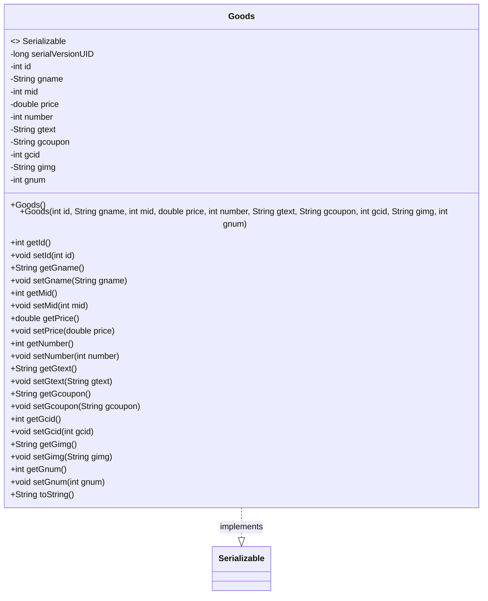

# Basic Information

|      |      |
|------|------|
| Name | Goods |
| Language | .java |
| Code Path | happycat/src/com/happycat/Bean/Goods.java |
| Package Name | com.happycat.Bean |
| Dependencies | ['java.io.Serializable'] |
| Brief Description | The Goods class implements serialization and includes attributes such as ID, name, price, quantity, description, image, along with their corresponding getter and setter methods. |

# Description

This is a Java class named Goods, which implements the Serializable interface for serialization. The class contains multiple private attributes: id (integer), gname (string), mid (integer), price (double), number (integer), gtext (string), gcoupon (string), gcid (integer), gimg (string), and gnum (integer). It provides a no-argument constructor and a full-argument constructor, as well as getter and setter methods for all attributes. The class also overrides the toString method to return a string representation containing all attribute values. The serialVersionUID is set to 1L for version control.

# Class Summary

| Name   | Type  | Description |
|-------|------|-------------|
| Goods | class | The Goods class includes attributes such as ID, name, merchant ID, price, quantity, description, coupon, category ID, image, sales volume, and corresponding get/set methods. |

## Class Goods

|      |      |
|------|------|
| Access Modifier | public |
| Type | class |
| Name | Goods |
| Description | The Goods class includes attributes such as ID, name, merchant ID, price, quantity, description, coupon, category ID, image, sales volume, and corresponding get/set methods. |

### UML Class Diagram

This code defines a class named Goods, which implements the Serializable interface, indicating that its instances can be serialized. The Goods class includes multiple private fields such as id, gname, price, etc., representing attributes like the unique identifier, name, and price of a product. The class provides two constructors (a no-argument constructor and a full-argument constructor) as well as getter and setter methods for each field to access and modify these private attributes. Additionally, it overrides the toString method to output all attributes of the product in string format. This class is primarily used to represent product information and supports serialization operations.

### Internal Method Call Graph

```mermaid
graph TD
    A["Class Goods"]
    B["Implements Interface: Serializable"]
    C["Property: int id"]
    D["Property: String gname"]
    E["Property: int mid"]
    F["Property: double price"]
    G["Property: int number"]
    H["Property: String gtext"]
    I["Property: String gcoupon"]
    J["Property: int gcid"]
    K["Property: String gimg"]
    L["Property: int gnum"]
    M["Constructor: Goods()"]
    N["Constructor: Goods(int id, String gname, int mid, double price, int number, String gtext, String gcoupon, int gcid, String gimg, int gnum)"]
    O["Method: int getId()"]
    P["Method: void setId(int id)"]
    Q["Method: String getGname()"]
    R["Method: void setGname(String gname)"]
    S["Method: int getMid()"]
    T["Method: void setMid(int mid)"]
    U["Method: double getPrice()"]
    V["Method: void setPrice(double price)"]
    W["Method: int getNumber()"]
    X["Method: void setNumber(int number)"]
    Y["Method: String getGtext()"]
    Z["Method: void setGtext(String gtext)"]
    AA["Method: String getGcoupon()"]
    AB["Method: void setGcoupon(String gcoupon)"]
    AC["Method: int getGcid()"]
    AD["Method: void setGcid(int gcid)"]
    AE["Method: String getGimg()"]
    AF["Method: void setGimg(String gimg)"]
    AG["Method: int getGnum()"]
    AH["Method: void setGnum(int gnum)"]
    AI["Overridden Method: String toString()"]

    A --> B
    A --> C
    A --> D
    A --> E
    A --> F
    A --> G
    A --> H
    A --> I
    A --> J
    A --> K
    A --> L
    A --> M
    A --> N
    A --> O
    A --> P
    A --> Q
    A --> R
    A --> S
    A --> T
    A --> U
    A --> V
    A --> W
    A --> X
    A --> Y
    A --> Z
    A --> AA
    A --> AB
    A --> AC
    A --> AD
    A --> AE
    A --> AF
    A --> AG
    A --> AH
    A --> AI
```

This code defines a class named Goods that implements the Serializable interface, representing product information. The class contains 10 private properties (id, gname, mid, etc.) with corresponding getter/setter methods, two constructors (no-argument and full-argument), and an overridden toString method. The flowchart clearly illustrates the hierarchical relationships between the class structure, properties, constructors, and member methods. All methods are directly associated with the Goods class, conforming to the basic organizational structure of a Java class.

### Field List

| Name  | Type  | Description |
|-------|-------|------|
| price | double | private double price |
| number | int | Private integer variable number. |
| gname | String | private string variable gname |
| gtext | String | The private string variable gtext. |
| gimg | String | Declare the string variable gimg. |
| gcoupon | String | Private string variable gcoupon. |
| id | int | private int variable id |
| serialVersionUID = 1L | long | Define a private static constant serialVersionUID with a value of 1L for serial version control. |
| mid | int | private int variable mid |
| gnum | int | private integer variable gnum |
| gcid | int | Private integer variable gcid |

### Method List

| Name  | Type  | Description |
|-------|-------|------|
| setGcoupon | void | Java Method: Set the gcoupon string value. |
| setId | void | Methods for setting object ID, with the parameter being an integer id, assigning the input value to the id attribute of the current object. |
| setGtext | void | Java Method: Set the gtext variable value to the input parameter. |
| getGtext | String | Methods to obtain the gtext string value. |
| getNumber | int | This is a Java method that returns the value of the private variable number. |
| getGcoupon | String | Methods to obtain the gcoupon string value. |
| setGname | void | Java method: Set the value of the gname variable to the input parameter gname. |
| setNumber | void | Methods for setting integer values, assigning the parameter number to the number property of the current object. |
| getGimg | String | The method getGimg returns the value of the string variable gimg. |
| setGimg | void | Java Method: Set the value of the gimg string variable. |
| getGnum | int | This is a Java method that returns the value of the private integer variable gnum. The method name is getGnum, with no parameters. |
| setGnum | void | This is a Java method used to set the value of the class member variable gnum. The method accepts an integer parameter gnum and assigns it to the gnum attribute of the current object. |
| toString | String | Override the toString method to return a string containing the product ID, name, merchant ID, price, quantity, description, coupons, category ID, images, and stock. |
| setGcid | void | Method to set gcid, the parameter is an integer gcid, assigned to the gcid property of the current object. |
| getId | int | Methods to obtain the object ID, returning the value of the private member variable id. |
| getGname | String | The method getGname returns the value of the string variable gname. |
| getPrice | double | Public method to get the price, returns the value of the double-type variable price. |
| setMid | void | This is a Java method used to set the value of the member variable mid. The method accepts an integer parameter mid and assigns it to the mid property of the current object. |
| setPrice | void | The method to set the price, with a parameter of type double, assigns the input value to the class's price variable. |
| getMid | int | Public method to obtain the mid value, returns an integer type. |
| getGcid | int | The method returns a gcid integer value. |

