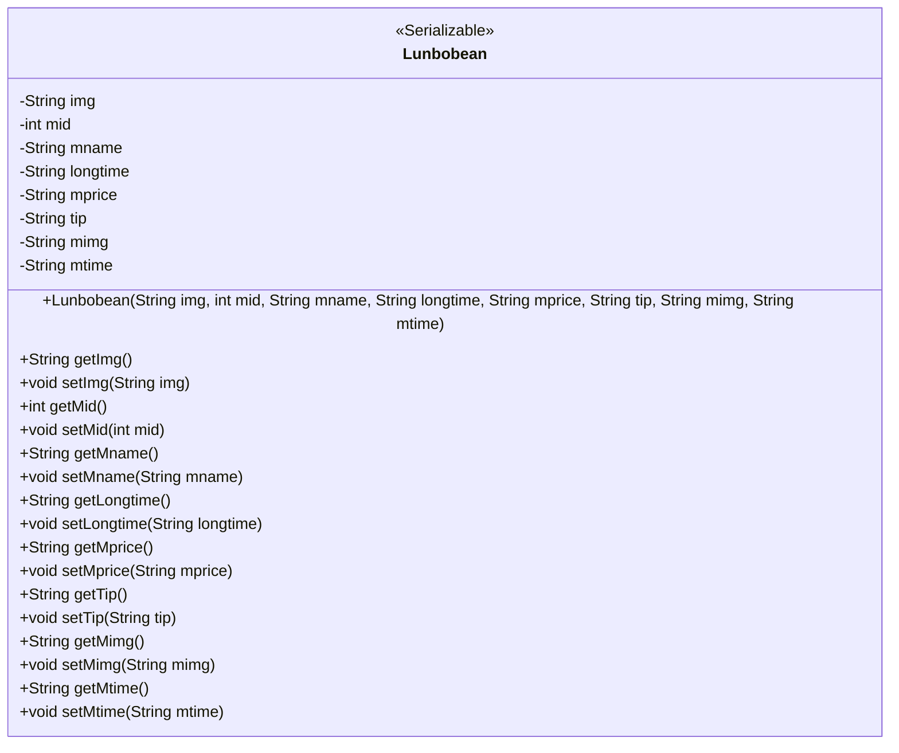
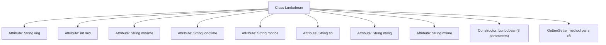

# Basic Information

|      |      |
|------|------|
| Name | Lunbobean |
| Language | .java |
| Code Path | happycat/src/com/happycat/Bean/Lunbobean.java |
| Package Name | com.happycat.Bean |
| Dependencies | ['java.io.Serializable'] |
| Brief Description | Lunbobean is a serializable Java class that includes attributes such as image, ID, name, duration, price, prompt, image, and time, providing getter and setter methods. |

# Description

Lunbobean is a Java class that implements the Serializable interface, designed to store carousel-related data. The class contains eight private attributes: img (image path), mid (ID), mname (name), longtime (duration), mprice (price), tip (hint message), mimg (image path), and mtime (time). It provides getter and setter methods for all attributes, as well as a constructor that includes all attributes. The class supports serialization via serialVersionUID.

# Class Summary

| Name   | Type  | Description |
|-------|------|-------------|
| Lunbobean | class | Lunbobean is a serializable Java class that includes attributes such as image, ID, name, duration, price, prompt, image, and time, along with their corresponding getter and setter methods. |

## Class Lunbobean

|      |      |
|------|------|
| Access Modifier | public |
| Type | class |
| Name | Lunbobean |
| Description | Lunbobean is a serializable Java class that includes attributes such as image, ID, name, duration, price, prompt, image, and time, along with their corresponding getter and setter methods. |

### UML Class Diagram

Class Diagram Description:
Lunbobean is a Java class that implements the Serializable interface, primarily used to encapsulate carousel-related data. The class contains 8 private fields representing image URL (img), ID (mid), name (mname), duration (longtime), price (mprice), tooltip (tip), main image URL (mimg), and time (mtime). It provides a complete constructor and getter/setter methods to ensure data encapsulation and accessibility. By implementing the Serializable interface, the class supports serialization operations, facilitating network transmission or persistent storage.

### Internal Method Call Graph

This flowchart illustrates the complete structure of the Lunbobean class, a Java Bean class implementing the Serializable interface. The class contains 8 private attribute fields, each with corresponding getter and setter methods, along with a full-parameter constructor. All attributes are of String type except for mid which is integer. The class design complies with standard Java Bean specifications, primarily used for data encapsulation and serialized transmission, suitable for storing multimedia information related to carousel images such as picture URL (img), movie ID (mid), name (mname), and other metadata.

### Field List

| Name  | Type  | Description |
|-------|-------|------|
| serialVersionUID = 1L | long | Declare a private static final serial version ID with an initial value of 1L. |
| mprice | String | The private string variable mprice is used to store price information. |
| mname | String | Private string variable mname. |
| mtime | String | The private string variable mtime is used to store time information. |
| tip | String | Private string variable tip. |
| longtime | String | Private string variable longtime. |
| mid | int | private int variable mid |
| mimg | String | The private string variable `mimg` is used to store image data. |
| img | String | Declare a private string variable img. |

### Method List

| Name  | Type  | Description |
|-------|-------|------|
| getTip | String | Methods to obtain the tip string. |
| getLongtime | String | Methods to obtain the value of the longtime string. |
| getMimg | String | This is a Java method that returns the member variable mimg of type String. |
| setMimg | void | Java Method: Set the value of the member variable mimg. The parameter is a string mimg. |
| getMtime | String | The method getMtime returns the member variable mtime of type string. |
| setMtime | void | Methods to set the mtime attribute, with parameters of string type. |
| setImg | void | This is a Java method used to set the img property value of an object. The method takes a string parameter img and assigns it to the img member variable of the current object. |
| setMid | void | Set the value of the member variable mid. |
| setLongtime | void | Java Method: Set the value of the longtime string variable. |
| setMname | void | Java Method: Set the value of member variable mname. |
| getMprice | String | Public method to obtain the mprice value. |
| getMid | int | The method returns the value of the integer variable mid. |
| setMprice | void | This is a Java method used to set the value of the class member variable mprice. The method takes a string parameter mprice and assigns it to the mprice attribute of the current object. |
| getImg | String | Methods to obtain image paths. |
| getMname | String | This is a Java method that returns the value of the member variable `mname` of type String. |
| setTip | void | The method `setTip` takes a string parameter `tip` and assigns it to the `tip` property of the current object. |

