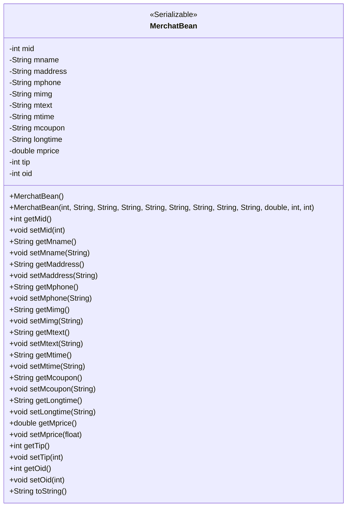

# Basic Information

|      |      |
|------|------|
| Name | MerchatBean |
| Language | .java |
| Code Path | happycat/src/com/happycat/Bean/MerchatBean.java |
| Package Name | com.happycat.Bean |
| Dependencies | ['java.io.Serializable'] |
| Brief Description | The MerchatBean class implements the Serializable interface and includes attributes such as merchant ID, name, address, phone, image, description, time, discount, duration, price, tip, order ID, and their corresponding getter/setter methods. It provides both parameterized and no-argument constructors. |

# Description

MerchatBean is a Java class that implements the Serializable interface, used to represent merchant information. The class contains multiple private fields: mid (merchant ID), mname (merchant name), maddress (address), mphone (phone), mimg (image), mtext (description), mtime (time), mcoupon (coupon), longtime (long-term time), mprice (price), tip (tip), and oid (order ID). Each field has corresponding getter and setter methods. The class provides two constructors: a no-argument constructor and a full-argument constructor for initializing all fields. Additionally, the class overrides the toString method, returning a string representation that includes all field values.

# Class Summary

| Name   | Type  | Description |
|-------|------|-------------|
| MerchatBean | class | The MerchatBean class contains merchant information such as ID, name, address, phone number, image, description, time, discounts, price, etc., and provides getter/setter methods and constructors. |

## Class MerchatBean

|      |      |
|------|------|
| Access Modifier | public |
| Type | class |
| Name | MerchatBean |
| Description | The MerchatBean class contains merchant information such as ID, name, address, phone number, image, description, time, discounts, price, etc., and provides getter/setter methods and constructors. |

### UML Class Diagram

MerchatBean is a Java class implementing the Serializable interface, serving as a data model for merchant information. It contains 12 private fields representing merchant ID, name, address, phone number, image, description, business hours, coupon information, long-term operation flag, price, tip percentage, and order ID. The class provides complete getter/setter methods, two constructors (default and full-parameter), and a toString() method. This design complies with JavaBean specifications and supports serialization, making it suitable for scenarios requiring persistent storage or network transmission of merchant information.

### Internal Method Call Graph

```mermaid
graph TD
    A["Class MerchatBean"]
    B["Attribute: int mid"]
    C["Attribute: String mname"]
    D["Attribute: String maddress"]
    E["Attribute: String mphone"]
    F["Attribute: String mimg"]
    G["Attribute: String mtext"]
    H["Attribute: String mtime"]
    I["Attribute: String mcoupon"]
    J["Attribute: String longtime"]
    K["Attribute: double mprice"]
    L["Attribute: int tip"]
    M["Attribute: int oid"]
    N["Constructor: MerchatBean()"]
    O["Constructor: MerchatBean(all parameters)"]
    P["Method: getter/setter groups"]
    Q["Overridden method: toString()"]

    A --> B
    A --> C
    A --> D
    A --> E
    A --> F
    A --> G
    A --> H
    A --> I
    A --> J
    A --> K
    A --> L
    A --> M
    A --> N
    A --> O
    A --> P
    A --> Q
```

This flowchart illustrates the complete structure of the MerchatBean class, containing 12 private attributes, 2 constructors (no-argument and all-parameters), 12 groups of getter/setter methods, and an overridden toString method. The class implements the Serializable interface, primarily used for encapsulating and serializing merchant data. Each attribute corresponds to different merchant characteristics such as ID, name, address, etc. The all-parameters constructor supports complete value assignment during object initialization, and the toString method provides a standardized string representation of the object.

### Field List

| Name  | Type  | Description |
|-------|-------|------|
| mphone | String | The private string variable mphone is used to store mobile phone number information. |
| mname | String | Private string variable mname |
| tip | int | Private integer variable tip |
| maddress | String | The private string variable maddress is used to store address information. |
| mtime | String | Declare a private string variable mtime. |
| mprice | double | The private double-precision floating-point variable mprice is used to store price data. |
| mcoupon | String | private String variable mcoupon |
| mid | int | private int mid |
| mimg | String | The private string variable `mimg` is used to store image data. |
| longtime | String | Long string variable |
| oid | int | Private integer variable oid. |
| mtext | String | private String variable mtext |

### Method List

| Name  | Type  | Description |
|-------|-------|------|
| setMid | void | This is a Java method used to set the value of the member variable mid. The method takes an integer parameter mid and assigns it to the mid property of the current object. |
| getMphone | String | Method to obtain the phone number, returns the value of the member variable mphone. |
| getTip | int | The method returns the integer value of the tip variable. |
| setTip | void | This is a Java method used to set the value of the tip property. The method takes an int parameter tip and assigns it to the tip member variable of the current object. |
| setMcoupon | void | Public method for setting the mcoupon value. |
| getMtime | String | Public method to get the mtime value, returns a string type. |
| setMname | void | This is a Java method used to set the value of the class member variable mname. The method takes a string parameter mname and assigns it to the mname property of the current object. |
| setMtext | void | Java Method: Set the value of the mtext string variable. |
| getLongtime | String | Methods to obtain the value of the longtime string. |
| setMphone | void | The method for setting the mobile phone number, with the parameter as mphone, assigns the value to the mphone property of the current object. |
| getMtext | String | This is a Java method that returns the member variable mtext of type String. |
| getMaddress | String | Methods for obtaining the maddress string value. |
| getOid | int | The method returns the integer value of the object identifier oid. |
| setMprice | void | This is a Java method used to set the value of the class member variable mprice, with the parameter being a floating-point number mprice. |
| getMprice | double | Public method to get the mprice value, returns a double type. |
| getMcoupon | String | The method returns the value of the member variable mcoupon of type string. |
| setOid | void | This is a Java method used to set the oid property value of an object. The method takes an integer parameter oid and assigns it to the oid member variable of the current object. |
| toString | String | The toString method of MerchatBean returns a string containing attributes such as mid, mname, and maddress. |
| setMaddress | void | This is a Java method used to set the value of the member variable maddress. The method takes a string parameter maddresss and assigns it to the maddress property of the current object. |
| setLongtime | void | This is a Java method used to set the value of the longtime property. The method takes a string parameter named longtime and assigns it to the longtime member variable of the current object. |
| setMtime | void | Java Method: Set the mtime string attribute value. |
| setMimg | void | Java Method: Set the mimg string attribute value. |
| getMimg | String | This is a Java method that returns the value of the member variable `mimg` of type String. |
| getMname | String | This is a Java method that returns the value of the member variable mname of type String. |
| getMid | int | Public method to obtain the mid value, returns an integer type. |

