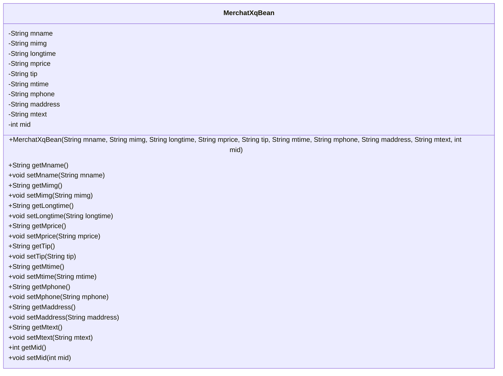

# Basic Information

|      |      |
|------|------|
| Name | MerchatXqBean |
| Language | .java |
| Code Path | happycat/src/com/happycat/Bean/MerchatXqBean.java |
| Package Name | com.happycat.Bean |
| Dependencies | ['java.io.Serializable'] |
| Brief Description | The MerchatXqBean class stores merchant information, including fields for name, image, duration, price, hint, time, phone, address, description, and ID, and provides getter and setter methods. |

# Description

The MerchatXqBean is a Java class that implements the Serializable interface, designed to store detailed merchant information. It includes attributes such as merchant name (mname), image (mimg), business duration (longtime), price (mprice), tip (tip), business hours (mtime), phone number (mphone), address (maddress), description (mtext), and merchant ID (mid). The class provides getter and setter methods for all attributes, along with a constructor that includes all properties. This class supports serialization with a serial version UID of 1L.

# Class Summary

| Name   | Type  | Description |
|-------|------|-------------|
| MerchatXqBean | class | MerchatXqBean is a serializable Java class that includes attributes such as merchant name, image, duration, price, hint, time, phone number, address, text, and ID, providing getter and setter methods. |

## Class MerchatXqBean

|      |      |
|------|------|
| Access Modifier | public |
| Type | class |
| Name | MerchatXqBean |
| Description | MerchatXqBean is a serializable Java class that includes attributes such as merchant name, image, duration, price, hint, time, phone number, address, text, and ID, providing getter and setter methods. |

### UML Class Diagram

This class diagram illustrates a Java class named MerchatXqBean, which implements the Serializable interface and is primarily used for storing and manipulating merchant details. The class contains 10 private fields representing merchant name, image, business hours, price, tips, operating hours, contact phone, address, description text, and unique identifier. Corresponding getter and setter methods are provided for each field, along with a constructor that includes all fields. The class design adheres to the JavaBean specification, facilitating serialization and deserialization operations.

### Internal Method Call Graph

```mermaid
graph TD
    A["Class MerchatXqBean"]
    B["Property: String mname"]
    C["Property: String mimg"]
    D["Property: String longtime"]
    E["Property: String mprice"]
    F["Property: String tip"]
    G["Property: String mtime"]
    H["Property: String mphone"]
    I["Property: String maddress"]
    J["Property: String mtext"]
    K["Property: int mid"]
    L["Constructor: MerchatXqBean(10 parameters)"]
    M["Getter/Setter method pairs: mname/mimg/longtime/mprice/tip/mtime/mphone/maddress/mtext/mid"]

    A --> B
    A --> C
    A --> D
    A --> E
    A --> F
    A --> G
    A --> H
    A --> I
    A --> J
    A --> K
    A --> L
    A -.-> M
```

This flowchart illustrates the complete structure of the MerchatXqBean class, containing 10 private properties of String/int type, 1 full-parameter constructor, and 10 corresponding getter/setter method pairs. It represents a typical JavaBean design pattern implementation for encapsulating merchant detail data, where all properties are accessed via getter/setter methods in compliance with object encapsulation principles. The class implements the Serializable interface to support serialization operations.

### Field List

| Name  | Type  | Description |
|-------|-------|------|
| maddress | String | The private string variable `maddress` is used to store address information. |
| mtime | String | The private string variable mtime is used to store time information. |
| mtext | String | The private string variable mtext. |
| mimg | String | private string variable mimg |
| longtime | String | Private string variable longtime |
| tip | String | Private string variable tip |
| mname | String | Private string variable mname. |
| serialVersionUID = 1L | long | Declare a private static final serial version ID with the value of 1L. |
| mid | int | private int variable mid |
| mphone | String | The private string variable `mphone` is used to store mobile phone number information. |
| mprice | String | The private string variable mprice is used to store price information. |

### Method List

| Name  | Type  | Description |
|-------|-------|------|
| setLongtime | void | Method for setting long-time attribute value, with the parameter being the string longtime. |
| setMaddress | void | The method to set the member variable maddress, with the parameter being the string maddress. |
| setMprice | void | This is a Java method used to set the value of the mprice variable. The method takes a string parameter mprice and assigns it to the member variable this.mprice of the class. |
| setTip | void | This is a Java method used to set the tip property value of a class. The method takes a string parameter tip and assigns it to the member variable tip of the class. |
| getMprice | String | Methods to obtain the string value of mprice. |
| getTip | String | Methods to obtain the tip string. |
| getMimg | String | The method getMimg returns the value of the member variable mimg of type string. |
| getMaddress | String | Methods to obtain the maddress string value. |
| setMimg | void | This is a Java method used to set the value of the class member variable mimg. The method accepts a string parameter mimg and assigns it to the mimg property of the current object. |
| getMphone | String | The method returns the value of the string-type variable mphone. |
| setMtime | void | Java Method: Set the mtime string attribute. |
| getMtime | String | The method returns the value of the string-type variable mtime. |
| getMname | String | This is a Java method that returns the member variable mname of type String. |
| setMname | void | Java method: Set the value of member variable mname. |
| setMphone | void | The method to set the mobile phone number, with the parameter as a string mphone, assigns it to the mphone property of the current object. |
| getLongtime | String | Methods to obtain the value of the longtime string. |
| getMtext | String | Methods to obtain the mtext string value. |
| setMtext | void | Java Method: Set the value of the mtext string variable. |
| getMid | int | The method returns the value of the integer variable mid. |
| setMid | void | Method to set the member variable mid, with mid as the parameter. |

