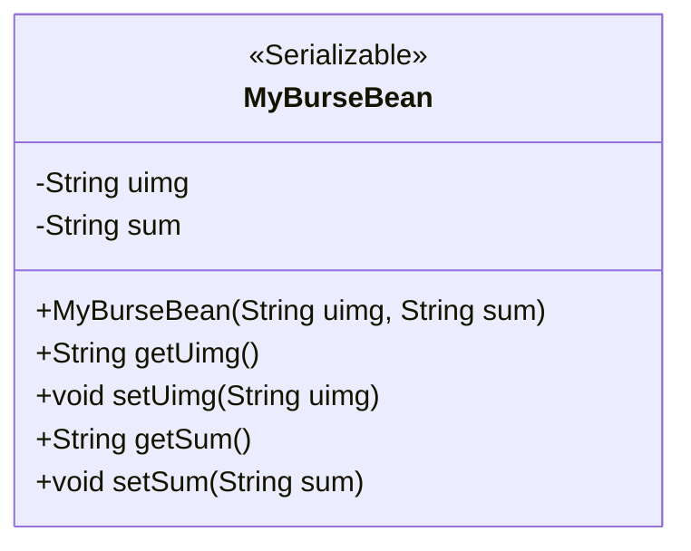
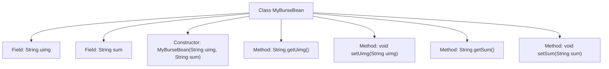

# Basic Information

|      |      |
|------|------|
| Name | MyBurseBean |
| Language | .java |
| Code Path | happycat/src/com/happycat/Bean/MyBurseBean.java |
| Package Name | com.happycat.Bean |
| Dependencies | ['java.io.Serializable'] |
| Brief Description | Serializable class MyBurseBean, containing attributes uimg and sum with corresponding getter/setter methods, and providing a parameterized constructor. |

# Description

This is a Java class named MyBurseBean, which implements the Serializable interface for serialization. The class contains two private string properties, uimg and sum, accessed and modified through getter and setter methods. The class also provides a constructor to initialize these two properties. The serialVersionUID field is used for version control to ensure serialization compatibility.

# Class Summary

| Name   | Type  | Description |
|-------|------|-------------|
| MyBurseBean | class | A serializable Java class MyBurseBean containing two string properties uimg and sum, with getter/setter methods and a parameterized constructor. |

## Class MyBurseBean

|      |      |
|------|------|
| Access Modifier | public |
| Type | class |
| Name | MyBurseBean |
| Description | A serializable Java class MyBurseBean containing two string properties uimg and sum, with getter/setter methods and a parameterized constructor. |

### UML Class Diagram

This code defines a Java class named MyBurseBean, which implements the Serializable interface, indicating that its instances can be serialized. The class contains two private string attributes, uimg and sum, which are accessed and modified via getter and setter methods. The constructor allows initialization of these two attributes when creating an object. This class is primarily used to encapsulate data and supports network transmission or persistent storage through serialization.

### Internal Method Call Graph

This flowchart illustrates the structure of the MyBurseBean class, which contains two private fields (uimg and sum) along with their corresponding getter and setter methods. The class implements the Serializable interface with a serialization identifier serialVersionUID. The constructor initializes both field values, while all methods revolve around field operations, forming a standard JavaBean structure. The diagram clearly presents the hierarchical relationship between class members and methods, facilitating understanding of the data encapsulation process.

### Field List

| Name  | Type  | Description |
|-------|-------|------|
| sum | String | Private string type variable sum. |
| uimg | String | The private string variable uimg is used to store image data. |
| serialVersionUID = 1L | long | Declare a private static final serial version ID with a value of 1L. |

### Method List

| Name  | Type  | Description |
|-------|-------|------|
| getUimg | String | Methods to obtain the uimg string value. |
| setUimg | void | This is a Java method used to set the uimg property value of an object. The method accepts a string parameter uimg and assigns it to the uimg field of the current object. |
| getSum | String | Public method to obtain the sum value. |
| setSum | void | Java Method: Set the sum string value. |

