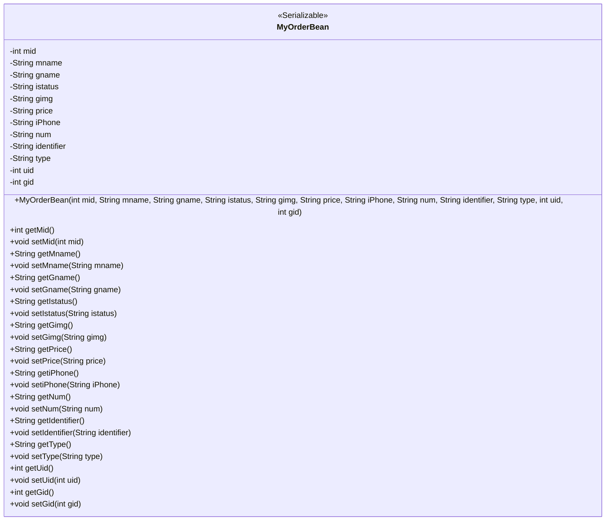

# Basic Information

|      |      |
|------|------|
| Name | MyOrderBean |
| Language | .java |
| Code Path | happycat/src/com/happycat/Bean/MyOrderBean.java |
| Package Name | com.happycat.Bean |
| Dependencies | ['java.io.Serializable'] |
| Brief Description | MyOrderBean is a serializable Java class that includes attributes such as order ID, product name, status, price, and quantity, and provides getter and setter methods. |

# Description

MyOrderBean is a Java class that implements the Serializable interface, used to represent order information. It contains 12 private fields: mid, mname, gname, istatus, gimg, price, iPhone, num, identifier, type, uid, and gid. These fields store the order ID, member name, product name, order status, product image, price, phone number, quantity, identifier, type, user ID, and product ID, respectively. The class provides a parameterized constructor and getter and setter methods for all fields to initialize and access these properties.

# Class Summary

| Name   | Type  | Description |
|-------|------|-------------|
| MyOrderBean | class | MyOrderBean is a serializable Java class that contains attributes such as order ID, product name, status, price, and quantity, and provides getter and setter methods. |

## Class MyOrderBean

|      |      |
|------|------|
| Access Modifier | public |
| Type | class |
| Name | MyOrderBean |
| Description | MyOrderBean is a serializable Java class that contains attributes such as order ID, product name, status, price, and quantity, and provides getter and setter methods. |

### UML Class Diagram

This code defines a Java class named MyOrderBean, which implements the Serializable interface and is primarily used to represent order information. The class contains 12 private fields for storing order ID, member name, product name, order status, product image, price, phone number, quantity, identifier, type, user ID, and product ID. These fields are initialized via a constructor, with corresponding getter and setter methods provided to access and modify their values. By implementing the Serializable interface, objects of this class can be serialized and deserialized, facilitating network transmission or persistent storage.

### Internal Method Call Graph

```mermaid
graph TD
    A["Class MyOrderBean"]
    B["Attribute: int mid"]
    C["Attribute: String mname"]
    D["Attribute: String gname"]
    E["Attribute: String istatus"]
    F["Attribute: String gimg"]
    G["Attribute: String price"]
    H["Attribute: String iPhone"]
    I["Attribute: String num"]
    J["Attribute: String identifier"]
    K["Attribute: String type"]
    L["Attribute: int uid"]
    M["Attribute: int gid"]
    N["Constructor: MyOrderBean(int mid, String mname, String gname, String istatus, String gimg, String price, String iPhone, String num, String identifier, String type, int uid, int gid)"]
    O["Method: int getMid()"]
    P["Method: void setMid(int mid)"]
    Q["Method: String getMname()"]
    R["Method: void setMname(String mname)"]
    S["Method: String getGname()"]
    T["Method: void setGname(String gname)"]
    U["Method: String getIstatus()"]
    V["Method: void setIstatus(String istatus)"]
    W["Method: String getGimg()"]
    X["Method: void setGimg(String gimg)"]
    Y["Method: String getPrice()"]
    Z["Method: void setPrice(String price)"]
    AA["Method: String getiPhone()"]
    AB["Method: void setiPhone(String iPhone)"]
    AC["Method: String getNum()"]
    AD["Method: void setNum(String num)"]
    AE["Method: String getIdentifier()"]
    AF["Method: void setIdentifier(String identifier)"]
    AG["Method: String getType()"]
    AH["Method: void setType(String type)"]
    AI["Method: int getUid()"]
    AJ["Method: void setUid(int uid)"]
    AK["Method: int getGid()"]
    AL["Method: void setGid(int gid)"]

    A --> B
    A --> C
    A --> D
    A --> E
    A --> F
    A --> G
    A --> H
    A --> I
    A --> J
    A --> K
    A --> L
    A --> M
    A --> N
    A --> O
    A --> P
    A --> Q
    A --> R
    A --> S
    A --> T
    A --> U
    A --> V
    A --> W
    A --> X
    A --> Y
    A --> Z
    A --> AA
    A --> AB
    A --> AC
    A --> AD
    A --> AE
    A --> AF
    A --> AG
    A --> AH
    A --> AI
    A --> AJ
    A --> AK
    A --> AL
```

This code defines a Java class named MyOrderBean, implementing the Serializable interface, to represent order information. The class contains 12 private attributes recording order ID, member name, product name, order status, product image, price, contact number, quantity, identifier, type, user ID, and product ID. These attributes are initialized and accessed through a constructor and corresponding getter/setter methods. The design of this class primarily serves to encapsulate order data, facilitating transmission and persistent storage within the system.

### Field List

| Name  | Type  | Description |
|-------|-------|------|
| uid | int | Private integer variable uid, used to store user identifiers. |
| istatus | String | The private string variable `istatus` is used to represent status information. |
| num | String | The private string variable num. |
| gname | String | Private string variable gname. |
| gid | int | Private integer variable gid |
| identifier | String | Private string variable identifier. |
| mname | String | Private string variable mname. |
| iPhone | String | Private string variable iPhone. |
| price | String | The private string-type variable `price` is used to store price information. |
| type | String | Declare a private string variable type. |
| mid | int | private int variable mid |
| gimg | String | The private string variable gimg is used to store image-related data. |

### Method List

| Name  | Type  | Description |
|-------|-------|------|
| setMname | void | Java Method: Set the value of the member variable mname. |
| setGimg | void | Java Method: Set the gimg String Property Value. |
| setType | void | Methods for setting the object type, assigning the input string to the internal variable type. |
| getPrice | String | Methods to obtain the price, returning the price value as a string type. |
| setNum | void | Set the value of the string-type variable num. |
| setGname | void | Java method: Sets the value of the gname attribute, with the parameter being a string gname. |
| setPrice | void | Methods for setting the price, assigning the input string to the class variable price. |
| getGimg | String | The method returns the value of the string-type variable gimg. |
| setUid | void | The method to set the user ID is to assign the parameter uid to the uid property of the current object. |
| getGname | String | Methods to obtain the string value of gname. |
| getGid | int | The method returns the value of the integer variable gid. |
| getIdentifier | String | The method returns a string-type identifier. |
| getIstatus | String | Methods to obtain the istatus string value. |
| setMid | void | Method for setting the member variable mid. |
| setIstatus | void | This is a Java method used to set the value of the class member variable `istatus`. The method takes a string parameter and assigns it to the `istatus` property of the current object. |
| getMname | String | This is a Java method that returns the value of the member variable `mname` of type String. |
| getiPhone | String | Methods to obtain string values on iPhone. |
| setIdentifier | void | Public method for setting the identifier, which assigns the input string to the class member variable `identifier`. |
| getType | String | The method returns the value of the type variable, which is of string type. |
| getNum | String | The method returns the value of the num variable of type string. |
| getMid | int | The method returns the value of the integer variable mid. |
| getUid | int | The method returns the value of the integer variable uid. |
| setGid | void | Method to set the object's gid attribute, with the parameter being an integer gid. |
| setiPhone | void | The method to set iPhone properties, assigning parameter values to the member variable iPhone. |

