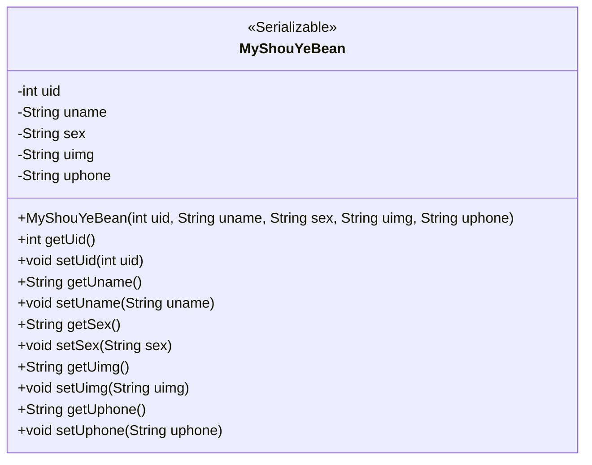

# Basic Information

|      |      |
|------|------|
| Name | MyShouYeBean |
| Language | .java |
| Code Path | happycat/src/com/happycat/Bean/MyShouYeBean.java |
| Package Name | com.happycat.Bean |
| Dependencies | ['java.io.Serializable'] |
| Brief Description | MyShouYeBean is a serializable class that includes fields for user ID, name, gender, avatar, and phone number, along with their corresponding getter and setter methods. |

# Description

MyShouYeBean is a Java class that implements the Serializable interface, designed to encapsulate user homepage information. This class contains five private attributes: uid represents the user ID, uname represents the username, sex represents the gender, uimg represents the user avatar, and uphone represents the user phone number. Each attribute has corresponding getter and setter methods. Additionally, the class provides a constructor method to initialize all attributes.

# Class Summary

| Name   | Type  | Description |
|-------|------|-------------|
| MyShouYeBean | class | MyShouYeBean is a serializable Java class that contains fields for user ID, name, gender, avatar, and phone number, along with corresponding getter/setter methods. |

## Class MyShouYeBean

|      |      |
|------|------|
| Access Modifier | public |
| Type | class |
| Name | MyShouYeBean |
| Description | MyShouYeBean is a serializable Java class that contains fields for user ID, name, gender, avatar, and phone number, along with corresponding getter/setter methods. |

### UML Class Diagram

This code defines a Java class named MyShouYeBean, which implements the Serializable interface, indicating that its instances can be serialized. The class contains five private fields: uid (user ID), uname (username), sex (gender), uimg (user image), and uphone (user phone), along with corresponding getter and setter methods for each field. Additionally, the class provides a constructor method to initialize all fields. This class is primarily used to encapsulate user homepage-related data, facilitating its transfer and processing within the program.

### Internal Method Call Graph

```mermaid
graph TD
    A["Class MyShouYeBean"]
    B["Property: int uid"]
    C["Property: String uname"]
    D["Property: String sex"]
    E["Property: String uimg"]
    F["Property: String uphone"]
    G["Method: getUid()"]
    H["Method: setUid(int uid)"]
    I["Method: getUname()"]
    J["Method: setUname(String uname)"]
    K["Method: getSex()"]
    L["Method: setSex(String sex)"]
    M["Method: getUimg()"]
    N["Method: setUimg(String uimg)"]
    O["Method: getUphone()"]
    P["Method: setUphone(String uphone)"]
    Q["Constructor: MyShouYeBean(int uid, String uname, String sex, String uimg, String uphone)"]

    A --> B
    A --> C
    A --> D
    A --> E
    A --> F
    A --> G
    A --> H
    A --> I
    A --> J
    A --> K
    A --> L
    A --> M
    A --> N
    A --> O
    A --> P
    A --> Q
```

This code defines a Java class named MyShouYeBean that implements the Serializable interface, representing a data structure for user homepage information. The class contains five private properties: uid (user ID), uname (username), sex (gender), uimg (user avatar), and uphone (user phone), with corresponding getter and setter methods provided for each property. Additionally, it includes a constructor with all properties for object initialization. This class is primarily used to encapsulate user information, facilitating data transfer and serialization operations within the program.

### Field List

| Name  | Type  | Description |
|-------|-------|------|
| uphone | String | private string variable uphone |
| uid | int | Private integer variable uid. |
| uimg | String | The private string variable uimg is used to store image data. |
| sex | String | Declare a private string variable sex to store gender information. |
| uname | String | Declare a private string variable uname. |

### Method List

| Name  | Type  | Description |
|-------|-------|------|
| setUphone | void | This is a Java method used to set the uphone property value of an object. The method takes a string parameter uphone and assigns it to the member variable of the same name in the object. |
| getUid | int | The method returns the value of the integer variable uid. |
| setSex | void | This is a Java method used to set the gender property of an object. The method accepts a string parameter 'sex' and assigns it to the 'sex' member variable of the current object. |
| getUphone | String | Methods to obtain user's mobile phone number. |
| getUimg | String | Methods to obtain user images, returning the value of the uimg variable. |
| setUname | void | Java Method: Set the value of member variable uname. |
| setUimg | void | Java Method: Set the uimg string attribute value. |
| getSex | String | Methods to obtain gender, returning a string variable named sex. |
| getUname | String | The method getUname returns the value of the string uname. |
| setUid | void | Methods for setting the user ID: assign the parameter uid to the uid property of the current object. |

