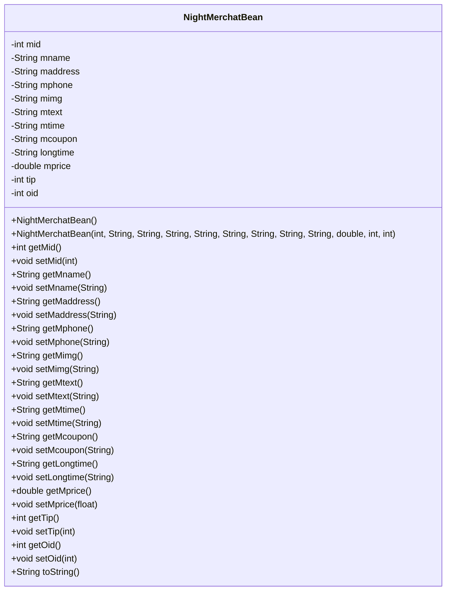

# Basic Information

|      |      |
|------|------|
| Name | NightMerchatBean |
| Language | .java |
| Code Path | happycat/src/com/happycat/Bean/NightMerchatBean.java |
| Package Name | com.happycat.Bean |
| Dependencies | ['java.io.Serializable'] |
| Brief Description | The NightMerchantBean class includes attributes such as merchant ID, name, address, phone number, image, description, business hours, discounts, duration, price, tips, order ID, and their corresponding methods. |

# Description

The NightMerchantBean is a Java class that implements the Serializable interface, designed to store merchant information. It includes 12 private attributes: `mid` (merchant ID), `mname` (name), `maddress` (address), `mphone` (phone), `mimg` (image), `mtext` (description), `mtime` (business hours), `mcoupon` (coupon), `longtime` (operating duration), `mprice` (price), `tip` (tip), and `oid` (order ID). The class provides getter and setter methods for all attributes, includes both a full-parameter constructor and a no-argument constructor, and overrides the `toString` method to output object information.

# Class Summary

| Name   | Type  | Description |
|-------|------|-------------|
| NightMerchatBean | class | The NightMerchantBean class implements the Serializable interface and includes attributes such as merchant ID, name, address, phone number, image, description, business hours, discounts, duration, price, tips, and order ID. It provides constructors and getter/setter methods. |

## Class NightMerchatBean

|      |      |
|------|------|
| Access Modifier | public |
| Type | class |
| Name | NightMerchatBean |
| Description | The NightMerchantBean class implements the Serializable interface and includes attributes such as merchant ID, name, address, phone number, image, description, business hours, discounts, duration, price, tips, and order ID. It provides constructors and getter/setter methods. |

### UML Class Diagram

This code defines a Java class named NightMerchatBean that implements the Serializable interface, primarily used for storing and manipulating merchant information. The class contains 12 private fields representing merchant ID, name, address, phone number, image, description, business hours, coupon information, operating duration, price, tip, and order ID. It provides complete getter/setter methods, two constructors (default and full-parameter), and a toString method. This is a typical Data Transfer Object (DTO) designed to pass merchant data between different layers, with serialization support making it suitable for network transmission or persistent storage.

### Internal Method Call Graph

```mermaid
graph TD
    A["Class NightMerchatBean"]
    B["Field: int mid"]
    C["Field: String mname"]
    D["Field: String maddress"]
    E["Field: String mphone"]
    F["Field: String mimg"]
    G["Field: String mtext"]
    H["Field: String mtime"]
    I["Field: String mcoupon"]
    J["Field: String longtime"]
    K["Field: double mprice"]
    L["Field: int tip"]
    M["Field: int oid"]
    N["Constructor: NightMerchatBean()"]
    O["Constructor: NightMerchatBean(all parameters)"]
    P["Method: getMid/setMid"]
    Q["Method: getMname/setMname"]
    R["Method: getMaddress/setMaddress"]
    S["Method: getMphone/setMphone"]
    T["Method: getMimg/setMimg"]
    U["Method: getMtext/setMtext"]
    V["Method: getMtime/setMtime"]
    W["Method: getMcoupon/setMcoupon"]
    X["Method: getLongtime/setLongtime"]
    Y["Method: getMprice/setMprice"]
    Z["Method: getTip/setTip"]
    AA["Method: getOid/setOid"]
    AB["Overridden Method: toString()"]

    A --> B
    A --> C
    A --> D
    A --> E
    A --> F
    A --> G
    A --> H
    A --> I
    A --> J
    A --> K
    A --> L
    A --> M
    A --> N
    A --> O
    A --> P
    A --> Q
    A --> R
    A --> S
    A --> T
    A --> U
    A --> V
    A --> W
    A --> X
    A --> Y
    A --> Z
    A --> AA
    A --> AB
```

This code represents a Java entity class NightMerchatBean that implements the Serializable interface, containing 12 fields and corresponding getter/setter methods. The class defines two constructors (no-argument and all-parameters constructors) and overrides the toString() method for formatted object output. The flowchart illustrates the complete class structure, including all private fields, constructors, accessor methods, and toString() method, reflecting the typical characteristics of this entity class as a data carrier suitable for merchant information storage and transmission scenarios.

### Field List

| Name  | Type  | Description |
|-------|-------|------|
| longtime | String | private string variable longtime |
| mtext | String | The private string variable mtext. |
| mimg | String | The private string variable `mimg` is used to store image information. |
| mphone | String | The private string variable mphone is used to store mobile phone number information. |
| mid | int | private integer variable mid |
| oid | int | Private integer variable oid |
| mprice | double | private double mprice |
| mcoupon | String | The private string variable mcoupon is used to store coupon information. |
| mtime | String | Declare a private string variable mtime. |
| tip | int | Private integer variable tip |
| maddress | String | The private string variable maddress is used to store address information. |
| mname | String | The private string variable mname. |

### Method List

| Name  | Type  | Description |
|-------|-------|------|
| setLongtime | void | This is a Java method used to set the value of the member variable longtime. The method is named setLongtime, which takes a String parameter named longtime and assigns it to the member variable of the same name in the current object. |
| getOid | int | The method returns the integer value of the object identifier oid. |
| getMtime | String | String method to obtain the mtime value. |
| setMprice | void | Method to set the product price, with the parameter being a floating-point number mprice. |
| setTip | void | The method to set the tip value assigns the parameter tip to the member variable tip. |
| setMtime | void | Java Method: Set the mtime string attribute value. |
| setMimg | void | This is a Java method used to set the value of the member variable mimg. The method is named setMimg, which takes a String parameter mimg and assigns it to the mimg property of the current object. |
| getLongtime | String | Methods to obtain the value of the longtime string. |
| setMphone | void | The method for setting the mobile phone number, with the parameter as mphone, assigns the value to the mphone property of the current object. |
| getMtext | String | The method getMtext returns the value of the string mtext. |
| setMname | void | Java Method: Set the value of the member variable mname. |
| getTip | int | The method returns the integer value of the tip variable. |
| setMcoupon | void | Java method: Set the value of the mcoupon string. |
| setMid | void | Set the value of the member variable mid. |
| getMid | int | The method returns the value of the integer variable mid. |
| setMaddress | void | This is a Java method used to set the value of the member variable maddress. The method takes a string parameter maddresss and assigns it to the maddress property of the current object. |
| getMcoupon | String | The method returns the value of the string variable mcoupon. |
| setOid | void | This is a Java method used to set the value of the oid property in an object. The method accepts an integer parameter oid and assigns it to the oid member variable of the current object. |
| toString | String | The toString method of MerchatBean returns a string containing 13 fields such as mid, mname, and maddress. |
| setMtext | void | This is a Java method used to set the value of the class member variable mtext. The method takes a string parameter mtext and assigns it to the mtext property of the current object. |
| getMprice | double | Public method to get the mprice value, returns a double type. |
| getMname | String | The method getMname returns the value of the member variable mname. |
| getMaddress | String | The method getMaddress returns the value of the member variable maddress. |
| getMimg | String | This is a Java method that returns the value of the member variable `mimg` of type String. |
| getMphone | String | Methods to obtain the phone number, returning the value of the mphone variable. |

