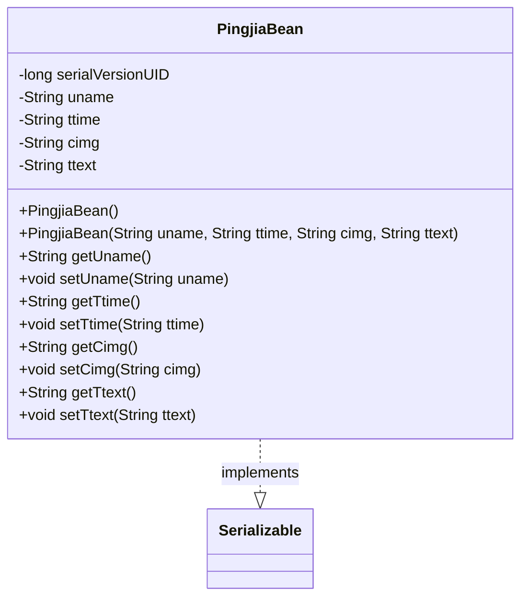

# Basic Information

|      |      |
|------|------|
| Name | PingjiaBean |
| Language | .java |
| Code Path | happycat/src/com/happycat/Bean/PingjiaBean.java |
| Package Name | com.happycat.Bean |
| Dependencies | ['java.io.Serializable'] |
| Brief Description | The Java class PingjiaBean implements serialization and includes fields for username, time, image, and text, along with their corresponding getter and setter methods. |

# Description

PingjiaBean is a Java class that implements the Serializable interface, designed to store evaluation information. This class contains four private string attributes: uname (username), ttime (time), cimg (image), and ttext (evaluation text). It provides a no-argument constructor and a parameterized constructor, along with getter and setter methods for each attribute. The serialVersionUID is used for version control.

# Class Summary

| Name   | Type  | Description |
|-------|------|-------------|
| PingjiaBean | class | PingjiaBean is a serializable class that includes fields for username, time, image, and text, along with their corresponding getter/setter methods. |

## Class PingjiaBean

|      |      |
|------|------|
| Access Modifier | public |
| Type | class |
| Name | PingjiaBean |
| Description | PingjiaBean is a serializable class that includes fields for username, time, image, and text, along with their corresponding getter/setter methods. |

### UML Class Diagram

Class diagram description:
PingjiaBean is a Java Bean class that implements the Serializable interface, designed to encapsulate evaluation information. It contains four private string attributes: uname (username), ttime (evaluation time), cimg (image path), and ttext (evaluation content), along with corresponding getter and setter methods. The class includes two constructors: a default no-argument constructor and a parameterized constructor with all fields. By implementing the Serializable interface, the class supports serialization functionality, with serialVersionUID used for version control.

### Internal Method Call Graph

```mermaid
graph TD
    A["Class PingjiaBean"]
    B["Static field: long serialVersionUID = 1L"]
    C["Private field: String uname"]
    D["Private field: String ttime"]
    E["Private field: String cimg"]
    F["Private field: String ttext"]
    G["No-arg constructor: PingjiaBean()"]
    H["Parameterized constructor: PingjiaBean(String uname, String ttime, String cimg, String ttext)"]
    I["Method: String getUname()"]
    J["Method: void setUname(String uname)"]
    K["Method: String getTtime()"]
    L["Method: void setTtime(String ttime)"]
    M["Method: String getCimg()"]
    N["Method: void setCimg(String cimg)"]
    O["Method: String getTtext()"]
    P["Method: void setTtext(String ttext)"]

    A --> B
    A --> C
    A --> D
    A --> E
    A --> F
    A --> G
    A --> H
    A --> I
    A --> J
    A --> K
    A --> L
    A --> M
    A --> N
    A --> O
    A --> P
```

This flowchart illustrates the complete structure of the PingjiaBean class, a Java Bean implementing the Serializable interface. The class contains four private String fields (uname, ttime, cimg, ttext) with corresponding getter/setter methods, along with both no-argument and full-parameter constructors. The static serialVersionUID field serves for serialization version control. The clear class structure exemplifies standard Java Bean design patterns, suitable for data encapsulation and serialization scenarios.

### Field List

| Name  | Type  | Description |
|-------|-------|------|
| cimg | String | The private string variable cimg is used to store image-related data. |
| serialVersionUID = 1L | long | Declare a private static final serial version ID with an initial value of 1L. |
| uname | String | private String variable uname. |
| ttext | String | Private string variable ttext. |
| ttime | String | Declare a private string variable ttime. |

### Method List

| Name  | Type  | Description |
|-------|-------|------|
| setUname | void | This is a Java method used to set the value of the class member variable uname. The method takes a string parameter uname and assigns it to the uname property of the current object. |
| getTtime | String | Methods to obtain the ttime string. |
| setTtime | void | Java Method: Set the ttime string attribute value. |
| getUname | String | The method getUname returns the value of the member variable uname. |
| getCimg | String | Methods to obtain the value of a cimg string. |
| setCimg | void | Java Method: Set the value of the cimg string attribute. |
| getTtext | String | The method getTtext returns the value of the string variable ttext. |
| setTtext | void | This is a Java method used to set the value of the class member variable ttext. The method takes a string parameter ttext and assigns it to the ttext property of the current object. |

