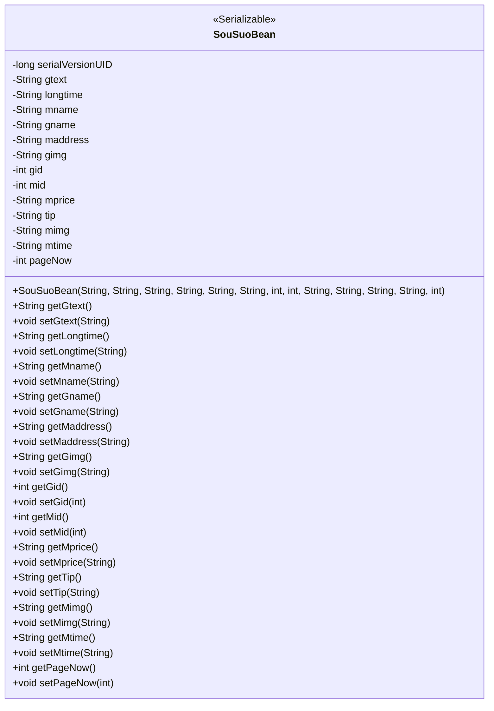

# Basic Information

|      |      |
|------|------|
| Name | SouSuoBean |
| Language | .java |
| Code Path | happycat/src/com/happycat/Bean/SouSuoBean.java |
| Package Name | com.happycat.Bean |
| Dependencies | ['java.io.Serializable'] |
| Brief Description | SouSuoBean is a serializable Java class that contains product and merchant information, such as name, address, price, image, etc., and provides getter and setter methods. |

# Description

SouSuoBean is a Java class that implements the Serializable interface, designed to store search-related data. The class contains multiple private fields, including gtext, longtime, mname, gname, maddress, gimg, gid, mid, mprice, tip, mimg, mtime, and pageNow, which respectively represent search text, long time, name, address, image, ID, price, tip information, image, time, and current page number. Each field has corresponding getter and setter methods for retrieving and setting field values. The class also provides a constructor to initialize all fields. This class is primarily used for data transfer and serialization operations.

# Class Summary

| Name   | Type  | Description |
|-------|------|-------------|
| SouSuoBean | class | SouSuoBean is a serializable Java class that contains fields for product and merchant information such as gtext, gname, mname, maddress, etc., and provides getter and setter methods. |

## Class SouSuoBean

|      |      |
|------|------|
| Access Modifier | public |
| Type | class |
| Name | SouSuoBean |
| Description | SouSuoBean is a serializable Java class that contains fields for product and merchant information such as gtext, gname, mname, maddress, etc., and provides getter and setter methods. |

### UML Class Diagram

This code defines a Java class named SouSuoBean that implements the Serializable interface, indicating its instances can be serialized. The class contains 13 private fields storing various search-related information (such as text, names, addresses, images, IDs, prices, etc.) and a field representing the current page number. It provides complete getter and setter methods for field access and modification, along with a constructor that initializes all fields. This class is typically used to encapsulate and transmit search result data in search functionality.

### Internal Method Call Graph

```mermaid
graph TD
    A["Class SouSuoBean"]
    B["Property: String gtext"]
    C["Property: String longtime"]
    D["Property: String mname"]
    E["Property: String gname"]
    F["Property: String maddress"]
    G["Property: String gimg"]
    H["Property: int gid"]
    I["Property: int mid"]
    J["Property: String mprice"]
    K["Property: String tip"]
    L["Property: String mimg"]
    M["Property: String mtime"]
    N["Property: int pageNow"]
    O["Constructor: SouSuoBean(13 parameters)"]
    P["Getter/Setter method group"]

    A --> B
    A --> C
    A --> D
    A --> E
    A --> F
    A --> G
    A --> H
    A --> I
    A --> J
    A --> K
    A --> L
    A --> M
    A --> N
    A --> O
    A --> P
```

This flowchart illustrates the complete structure of the SouSuoBean class, which includes 13 private property fields, 1 multi-parameter constructor, and multiple groups of Getter/Setter methods. As a serializable JavaBean, it is primarily used to encapsulate composite search-related data, containing fields such as product text (gtext), merchant information (mname/maddress), image resources (gimg/mimg), price information (mprice), time information (longtime/mtime), etc. It provides standardized accessor methods for data manipulation interfaces. The class design complies with POJO specifications and is suitable for data transfer and persistence scenarios.

### Field List

| Name  | Type  | Description |
|-------|-------|------|
| mid | int | private int variable mid |
| pageNow | int | Current page number variable |
| gname | String | The private string variable gname. |
| maddress | String | The private string variable maddress is used to store address information. |
| mimg | String | The private string variable mimg is used to store image-related data. |
| gimg | String | The private string variable gimg is used to store image data or paths. |
| longtime | String | Private string type variable longtime |
| serialVersionUID = 1L | long | Declare a private static final long serialVersionUID with an initial value of 1L. |
| tip | String | Private string variable tip. |
| mtime | String | The private string variable mtime is used to store time information. |
| gid | int | Private integer variable gid. |
| gtext | String | The private string variable gtext. |
| mprice | String | The private string variable mprice is used to store price information. |
| mname | String | private string variable mname |

### Method List

| Name  | Type  | Description |
|-------|-------|------|
| getMimg | String | The method getMimg returns the value of the string mimg. |
| setGimg | void | This is a Java method used to set the gimg string variable in the class. The method accepts a string parameter gimg and assigns it to the class member variable this.gimg. |
| setLongtime | void | The method `setLongtime` is used to set the value of the `longtime` variable, with the parameter being of string type. |
| getMid | int | The method returns the value of the integer variable mid. |
| getMname | String | This is a Java method that returns the value of the member variable `mname` of type String. |
| getLongtime | String | Methods to obtain the value of the longtime string. |
| setMname | void | Java Method: Set the value of member variable mname. |
| setGid | void | Methods for setting the gid attribute of an object, with the parameter being an integer gid. |
| setTip | void | The method setTip is used to set the value of the tip property, with the parameter being a string tip. |
| getMprice | String | This is a Java method that returns the mprice value of string type. |
| setMid | void | The method to set the member variable mid, with mid as the parameter. |
| setGtext | void | This is a Java method used to set the value of the gtext string variable in a class. The method takes a string parameter gtext and assigns it to the member variable of the same name in the class. |
| getGid | int | The method returns the value of the integer variable gid. |
| getGtext | String | This is a Java method that returns the value of the string variable gtext. |
| setMprice | void | Java Method: Set the value of the mprice string attribute. |
| getGname | String | The method getGname returns the value of the string variable gname. |
| getTip | String | Methods to obtain prompt strings. |
| setMaddress | void | The method to set the member address takes a string parameter maddress and assigns it to the maddress property of the current object. |
| setGname | void | Java method: Set the value of the gname variable to the input parameter. |
| getGimg | String | The method getGimg returns the string gimg. |
| getMaddress | String | Methods to obtain the maddress string value. |
| setMimg | void | Java Method: Set the value of member variable mimg. |
| getMtime | String | The method getMtime returns the member variable mtime of string type. |
| setMtime | void | Methods for setting the mtime attribute, with parameters of string type. |
| getPageNow | int | The method getPageNow returns the value of the current page number pageNow. |
| setPageNow | void | The method to set the current page number, with the parameter as pageNow. |

