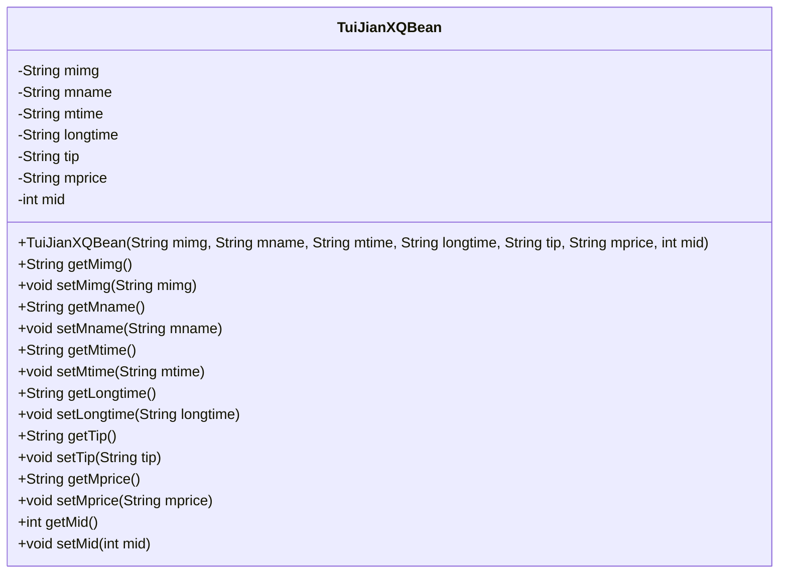

# Basic Information

|      |      |
|------|------|
| Name | TuiJianXQBean |
| Language | .java |
| Code Path | happycat/src/com/happycat/Bean/TuiJianXQBean.java |
| Package Name | com.happycat.Bean |
| Dependencies | ['java.io.Serializable'] |
| Brief Description | TuiJianXQBean is a serializable class that includes fields for image, name, time, duration, hint, price, and ID, along with their corresponding getter and setter methods. |

# Description

This is a Java class named TuiJianXQBean that implements the Serializable interface for serialization. The class contains seven private member variables: mimg (image), mname (name), mtime (time), longtime (duration), tip (hint), mprice (price), and mid (ID). Each variable has corresponding getter and setter methods. The class also provides a constructor to initialize all member variables. serialVersionUID is used for version control.

# Class Summary

| Name   | Type  | Description |
|-------|------|-------------|
| TuiJianXQBean | class | TuiJianXQBean is a serializable Java class that includes fields for image, name, time, duration, hint, price, and ID, along with their corresponding getter/setter methods. |

## Class TuiJianXQBean

|      |      |
|------|------|
| Access Modifier | public |
| Type | class |
| Name | TuiJianXQBean |
| Description | TuiJianXQBean is a serializable Java class that includes fields for image, name, time, duration, hint, price, and ID, along with their corresponding getter/setter methods. |

### UML Class Diagram

This class diagram illustrates a JavaBean class named TuiJianXQBean, which implements the Serializable interface and is primarily used for encapsulating recommendation detail data. The class contains 7 private fields (mimg, mname, mtime, etc.) along with their corresponding getter/setter methods, as well as a full-parameter constructor. All fields are private attributes accessed and modified through public methods, adhering to JavaBean design specifications. It is suitable for data encapsulation and serialized transmission scenarios.

### Internal Method Call Graph

```mermaid
graph TD
    A["Class TuiJianXQBean"]
    B["Property: String mimg"]
    C["Property: String mname"]
    D["Property: String mtime"]
    E["Property: String longtime"]
    F["Property: String tip"]
    G["Property: String mprice"]
    H["Property: int mid"]
    I["Method: getMimg()"]
    J["Method: setMimg(String mimg)"]
    K["Method: getMname()"]
    L["Method: setMname(String mname)"]
    M["Method: getMtime()"]
    N["Method: setMtime(String mtime)"]
    O["Method: getLongtime()"]
    P["Method: setLongtime(String longtime)"]
    Q["Method: getTip()"]
    R["Method: setTip(String tip)"]
    S["Method: getMprice()"]
    T["Method: setMprice(String mprice)"]
    U["Method: getMid()"]
    V["Method: setMid(int mid)"]
    W["Constructor: TuiJianXQBean(String mimg, String mname, String mtime, String longtime, String tip, String mprice, int mid)"]

    A --> B
    A --> C
    A --> D
    A --> E
    A --> F
    A --> G
    A --> H
    A --> I
    A --> J
    A --> K
    A --> L
    A --> M
    A --> N
    A --> O
    A --> P
    A --> Q
    A --> R
    A --> S
    A --> T
    A --> U
    A --> V
    A --> W
```

This code defines a Java class named TuiJianXQBean that implements the Serializable interface, representing a data structure for recommendation details. The class contains 7 private properties (mimg, mname, mtime, longtime, tip, mprice, mid) along with their corresponding getter and setter methods, as well as a full-parameter constructor. The design of this class is primarily used to encapsulate recommendation detail-related data, facilitating data transfer and serialization operations within the program. It is suitable for scenarios requiring storage or transmission of recommendation information.

### Field List

| Name  | Type  | Description |
|-------|-------|------|
| mimg | String | The private string variable `mimg` is used to store image information. |
| tip | String | Private string variable tip |
| longtime | String | private string variable longtime |
| serialVersionUID = 1L | long | Declare a private static constant serialVersionUID with a value of 1L for serial version control. |
| mtime | String | The private string variable mtime is used to store time information. |
| mid | int | private int variable mid |
| mprice | String | The private string variable mprice is used to store price information. |
| mname | String | Private string variable mname. |

### Method List

| Name  | Type  | Description |
|-------|-------|------|
| setTip | void | The method `setTip` is used to set the value of the `tip` property, with the parameter being a string type `tip`. |
| setMtime | void | Java Method: Set the mtime string attribute value. |
| setMimg | void | The method to set the member variable mimg, with the parameter being a string mimg. |
| getLongtime | String | Methods to obtain the "longtime" string. |
| getMname | String | This is a Java method that returns the value of the member variable mname. The method is named getMname, takes no parameters, and has a return type of String. |
| getMimg | String | The method getMimg returns the value of the string-type member variable mimg. |
| setMprice | void | This is a Java method used to set the value of the class member variable mprice. The method takes a string parameter mprice and assigns it to the mprice property of the current object. |
| getTip | String | Methods to Obtain Prompt Strings. |
| getMtime | String | String method to obtain the mtime value. |
| getMprice | String | The method getMprice returns the mprice value of string type. |
| setMname | void | Java method: Set the value of the member variable mname. |
| setLongtime | void | Java Method: Set longtime string attribute. |
| getMid | int | The method returns the value of the integer variable mid. |
| setMid | void | The method to set the member variable mid, with mid as the parameter. |

