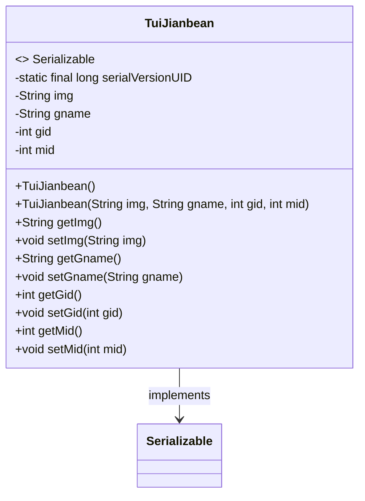

# Basic Information

|      |      |
|------|------|
| Name | TuiJianbean |
| Language | .java |
| Code Path | happycat/src/com/happycat/Bean/TuiJianbean.java |
| Package Name | com.happycat.Bean |
| Dependencies | ['java.io.Serializable'] |
| Brief Description | TuiJianbean is a serializable Java class that includes attributes such as img, gname, gid, and mid, providing constructors and getter/setter methods. |

# Description

This is a Java class named TuiJianbean, which implements the Serializable interface for serialization. The class contains four private attributes: img (String type, storing image information), gname (String type, storing the name), gid (integer type, storing the ID), and mid (integer type, storing another ID). It provides a no-argument constructor and a parameterized constructor, as well as getter and setter methods for each attribute. The serialVersionUID is set to 1L for version control.

# Class Summary

| Name   | Type  | Description |
|-------|------|-------------|
| TuiJianbean | class | TuiJianbean is a serializable Java class containing img, gname, gid, and mid attributes, providing constructors and getter/setter methods. |

## Class TuiJianbean

|      |      |
|------|------|
| Access Modifier | public |
| Type | class |
| Name | TuiJianbean |
| Description | TuiJianbean is a serializable Java class containing img, gname, gid, and mid attributes, providing constructors and getter/setter methods. |

### UML Class Diagram

This code defines a Java class named TuiJianbean, which implements the Serializable interface, indicating that its instances can be serialized. The class contains four private fields (img, gname, gid, mid) along with their corresponding getter and setter methods, as well as two constructors (a no-argument constructor and a full-argument constructor). The serialVersionUID field is used to control serialization version compatibility. This class is primarily used to encapsulate recommendation-related data, such as image paths, names, and ID information.

### Internal Method Call Graph

```mermaid
graph TD
    A["Class TuiJianbean"]
    B["Attribute: String img"]
    C["Attribute: String gname"]
    D["Attribute: int gid"]
    E["Attribute: int mid"]
    F["No-arg constructor: TuiJianbean()"]
    G["Parameterized constructor: TuiJianbean(String img, String gname, int gid, int mid)"]
    H["Method: String getImg()"]
    I["Method: void setImg(String img)"]
    J["Method: String getGname()"]
    K["Method: void setGname(String gname)"]
    L["Method: int getGid()"]
    M["Method: void setGid(int gid)"]
    N["Method: int getMid()"]
    O["Method: void setMid(int mid)"]

    A --> B
    A --> C
    A --> D
    A --> E
    A --> F
    A --> G
    A --> H
    A --> I
    A --> J
    A --> K
    A --> L
    A --> M
    A --> N
    A --> O
```

This code defines a Java class named TuiJianbean that implements the Serializable interface, indicating its instances can be serialized. The class contains four private attributes: img, gname, gid, and mid, representing image, name, game ID, and member ID respectively. It provides both a no-argument constructor and a parameterized constructor, along with getter and setter methods for each attribute. The flowchart clearly illustrates the class structure, including the hierarchical relationships between attributes, constructors, and various methods.

### Field List

| Name  | Type  | Description |
|-------|-------|------|
| gid | int | Private integer variable gid |
| serialVersionUID = 1L | long | Declare a private static final serial version ID with an initial value of 1L. |
| gname | String | Private string variable gname. |
| mid | int | private int mid |
| img | String | The private string variable img is used to store image information. |

### Method List

| Name  | Type  | Description |
|-------|-------|------|
| getGname | String | Methods to obtain gname, returns the gname value of string type. |
| setImg | void | The method to set image properties assigns the parameter `img` to the `img` property of the current object. |
| getImg | String | The method returns the value of the string-type variable img. |
| getGid | int | The method getGid returns the value of the integer variable gid. |
| setGid | void | Method to set the gid attribute of an object, with the parameter being an integer gid. |
| getMid | int | The method returns the value of the integer variable mid. |
| setMid | void | Method for setting the member variable mid. |
| setGname | void | This is a Java method used to set the value of the class member variable gname. The method takes a string parameter gname and assigns it to the property of the same name in the current object. |

