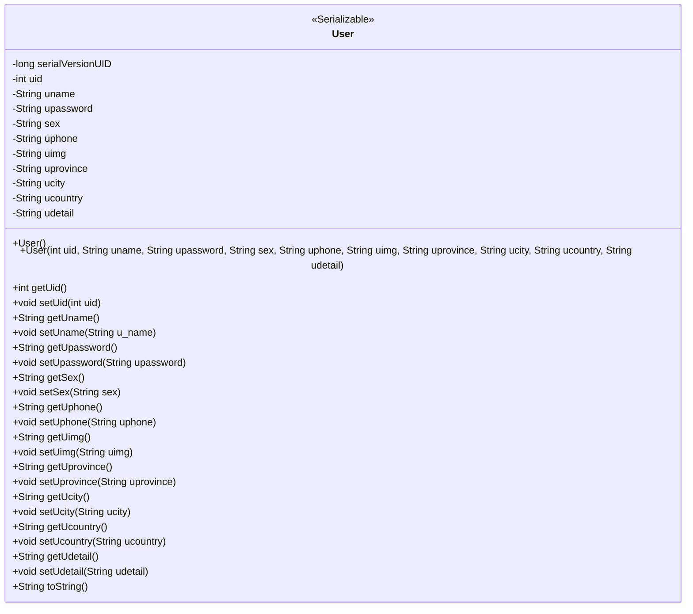

# Basic Information

|      |      |
|------|------|
| Name | User |
| Language | .java |
| Code Path | happycat/src/com/happycat/Bean/User.java |
| Package Name | com.happycat.Bean |
| Dependencies | ['java.io.Serializable'] |
| Brief Description | The User class includes attributes such as ID, name, password, gender, phone number, avatar, province/city/district, and detailed address, and provides constructors and getter/setter methods. |

# Description

This is a Java class named User, which implements the Serializable interface for serialization. The class includes basic user information fields: uid (user ID), uname (username), upassword (password), sex (gender), uphone (phone), uimg (avatar), uprovince (province), ucity (city), ucountry (country), and udetail (detailed address). It provides getter and setter methods for all fields, as well as a constructor with all fields and a no-argument constructor. The class also overrides the toString method for outputting object information and defines serialVersionUID for version control.

# Class Summary

| Name   | Type  | Description |
|-------|------|-------------|
| User | class | Java User class, implementing the Serializable interface, includes attributes such as user ID, name, password, gender, phone, avatar, province, city, country, details, and corresponding getter/setter methods. It provides a full-parameter constructor and an empty constructor, and overrides the toString method. |

## Class User

|      |      |
|------|------|
| Access Modifier | public |
| Type | class |
| Name | User |
| Description | Java User class, implementing the Serializable interface, includes attributes such as user ID, name, password, gender, phone, avatar, province, city, country, details, and corresponding getter/setter methods. It provides a full-parameter constructor and an empty constructor, and overrides the toString method. |

### UML Class Diagram

This code defines a class named User that implements the Serializable interface, representing user information. The class includes basic attributes such as uid, uname, upassword, etc., along with corresponding getter and setter methods. Additionally, it provides two constructors (a no-argument constructor and a full-argument constructor) and a toString method. This class is primarily used for encapsulating and serializing user data, suitable for scenarios requiring user information persistence or transmission.

### Internal Method Call Graph

```mermaid
graph TD
    A["Class User"]
    B["Implements Interface: Serializable"]
    C["Static Field: long serialVersionUID = 1L"]
    D["Private Field: int uid"]
    E["Private Field: String uname"]
    F["Private Field: String upassword"]
    G["Private Field: String sex"]
    H["Private Field: String uphone"]
    I["Private Field: String uimg"]
    J["Private Field: String uprovince"]
    K["Private Field: String ucity"]
    L["Private Field: String ucountry"]
    M["Private Field: String udetail"]
    N["Constructor: User(full parameters)"]
    O["Constructor: User()"]
    P["Method: toString()"]
    Q["Getter/Setter Method Group"]

    A --> B
    A --> C
    A --> D
    A --> E
    A --> F
    A --> G
    A --> H
    A --> I
    A --> J
    A --> K
    A --> L
    A --> M
    A --> N
    A --> O
    A --> P
    A --> Q
```

This code demonstrates a User class implementing the Serializable interface, containing 10 private fields and corresponding Getter/Setter methods. The class defines two constructors (full-parameter and no-argument) along with an overridden toString method. The flowchart clearly illustrates the class composition, including interface implementation, static constants, field attributes, constructors, and grouped method relationships. This design represents a typical data model class for storing user information with serialization support.

### Field List

| Name  | Type  | Description |
|-------|-------|------|
| sex | String | Define a private string variable sex to store gender information. |
| udetail | String | The private string variable udetail is used to store detailed information. |
| uimg | String | The private string variable uimg is used to store image data. |
| uname | String | The private string variable uname is used to store the username. |
| upassword | String | Private string type variable used to store user passwords. |
| ucity | String | Private string variable ucity, used to store city information. |
| uphone | String | private string variable uphone |
| uid | int | Private integer variable uid. |
| uprovince | String | Private string variable uprovince |
| ucountry | String | Declare a private string variable ucountry to store country information. |
| serialVersionUID = 1L | long | Declare a private static final serial version UID 1L for object serialization compatibility. |

### Method List

| Name  | Type  | Description |
|-------|-------|------|
| getSex | String | Methods for obtaining gender, returning the value of the string variable sex. |
| setUname | void | Java method for setting username, assigning the parameter u_name to the member variable uname. |
| setUimg | void | This is a Java method used to set the uimg property value of an object. The method accepts a string parameter uimg and assigns it to the uimg field of the current object. |
| getUphone | String | Methods to obtain user phone numbers. |
| getUcity | String | The method getUcity returns the value of the string-type variable ucity. |
| getUprovince | String | The method returns the province information string. |
| setUpassword | void | The method to set the user password assigns the input parameter upassword to the member variable upassword of the class. |
| getUname | String | The method getUname returns the value of the string uname. |
| setUphone | void | Java method: Set user phone number, assign parameter uphone to the class member variable this.uphone. |
| setUid | void | Methods for setting the user ID: Assign the parameter uid to the uid property of the current object. |
| toString | String | Override the toString method to return a string containing the user ID, name, password, gender, phone number, image, province, city, country, and detailed address. |
| setSex | void | Methods for setting the gender attribute, where the parameter is of string type sex. |
| setUcity | void | Java Method: Set the ucity string attribute value. |
| setUprovince | void | The method to set the user's province assigns the parameter uprovince to the class member variable of the same name. |
| getUpassword | String | Methods for obtaining user passwords, returning the password value as a string. |
| getUid | int | The method returns the value of the integer variable uid. |
| getUimg | String | Methods to obtain the uimg string value. |
| getUcountry | String | The method getUcountry returns the value of the string-type variable ucountry. |
| setUcountry | void | Methods for setting the user country attribute, with the parameter as ucountry. |
| getUdetail | String | This is a Java method that returns the value of the string variable `udetail`. |
| setUdetail | void | Java Method: Set the udetail string attribute. |
| getSerialversionuid | long | Methods for obtaining the serialized version identifier, returning the value of the static constant serialVersionUID. |

