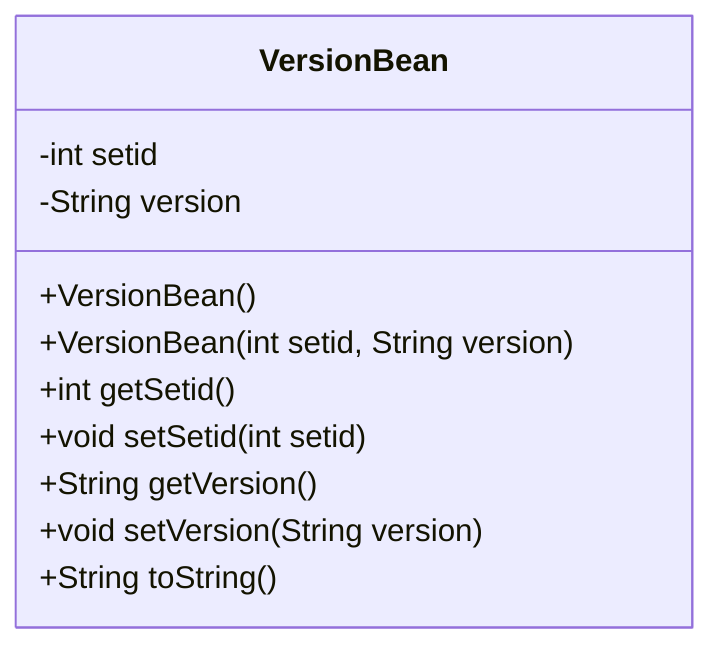
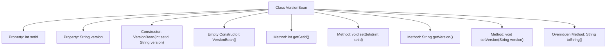

# Basic Information

|      |      |
|------|------|
| Name | VersionBean |
| Language | .java |
| Code Path | happycat/src/com/happycat/Bean/VersionBean.java |
| Package Name | com.happycat.Bean |
| Dependencies | [] |
| Brief Description | The VersionBean class contains the setid and version attributes, providing getter/setter methods, parameterized and no-argument constructors, as well as a toString method. |

# Description

VersionBean is a Java class used to store version information. This class contains two private attributes: an integer-type setid and a string-type version. Getter and setter methods are provided for these two attributes. The class defines two constructors: a no-argument constructor and a constructor that accepts setid and version parameters. Additionally, the toString method is overridden to return a string representation containing setid and version.

# Class Summary

| Name   | Type  | Description |
|-------|------|-------------|
| VersionBean | class | The VersionBean class contains the setid and version attributes, providing constructor methods, getter/setter, and toString method. |

## Class VersionBean

|      |      |
|------|------|
| Access Modifier | public |
| Type | class |
| Name | VersionBean |
| Description | The VersionBean class contains the setid and version attributes, providing constructor methods, getter/setter, and toString method. |

### UML Class Diagram

This code defines a Java class named VersionBean, which is a typical Java Bean designed to encapsulate version information data. The class contains two private fields: setid (integer type) and version (string type), along with complete getter and setter methods. It implements two constructors (a no-argument constructor and a full-argument constructor) as well as a toString() method for object string representation. The primary purpose of this class is to serve as a data carrier for storing and transmitting version-related information, complying with Java Bean design specifications.

### Internal Method Call Graph

This code defines a Java class named VersionBean, primarily used for storing and manipulating version information. The class contains two private properties: an integer-type setid and a string-type version, which are accessed and modified via getter and setter methods respectively. The class provides two constructors: a parameterized constructor for initializing properties and a no-argument constructor with empty implementation. Additionally, it overrides the toString() method to format the object's content for output. The flowchart clearly illustrates the class structure, the invocation relationships between properties and methods, embodying the standard Java Bean design pattern.

### Field List

| Name  | Type  | Description |
|-------|-------|------|
| version | String | The private string variable `version` is used to store version information. |
| setid | int | Private integer variable setid |

### Method List

| Name  | Type  | Description |
|-------|-------|------|
| getSetid | int | The method returns the value of setid. |
| setSetid | void | This is a Java method used to set the value of the class member variable `setid`. The method accepts an integer parameter `setid` and assigns it to the `setid` member variable of the current object. |
| getVersion | String | The method to obtain the current version number directly returns the value of the version variable. |
| setVersion | void | The method to set the version number assigns the input parameter to the internal variable `version`. |
| toString | String | Override the toString method in Java to return a string containing setid and version. |

