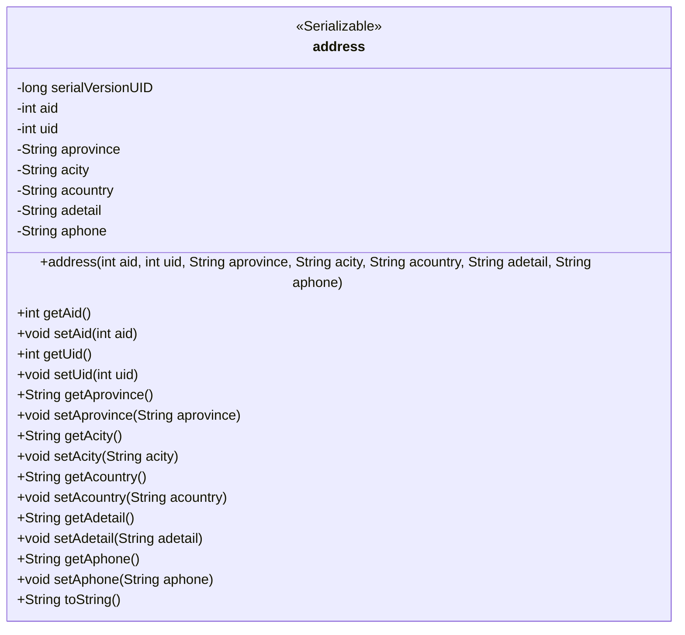

# Basic Information

|      |      |
|------|------|
| Name | address |
| Language | .java |
| Code Path | happycat/src/com/happycat/Bean/address.java |
| Package Name | com.happycat.Bean |
| Dependencies | ['java.io.Serializable'] |
| Brief Description | The Java class `address` implements the `Serializable` interface and includes fields for address ID, user ID, province, city, country, detailed address, and phone number. It provides constructors and getter/setter methods. |

# Description

This is a Java class named `address` that implements the `Serializable` interface, representing address information. The class includes private fields: `aid` (address ID), `uid` (user ID), `aprovince` (province), `acity` (city), `acountry` (country), `adetail` (detailed address), and `aphone` (phone number). It provides a parameterized constructor along with getter and setter methods for all fields. The `toString` method is overridden to return a string representation containing all field values. The class supports serialization with a serial version UID of `1L`.

# Class Summary

| Name   | Type  | Description |
|-------|------|-------------|
| address | class | The Java class `address` implements the `Serializable` interface and includes fields such as address ID, user ID, province, city, country, detailed address, and phone number, providing getter and setter methods. |

## Class address

|      |      |
|------|------|
| Access Modifier | public |
| Type | class |
| Name | address |
| Description | The Java class `address` implements the `Serializable` interface and includes fields such as address ID, user ID, province, city, country, detailed address, and phone number, providing getter and setter methods. |

### UML Class Diagram

This code defines a class named `address` that implements the `Serializable` interface, representing address information. The class contains seven private fields: `aid` (address ID), `uid` (user ID), `aprovince` (province), `acity` (city), `acountry` (country), `adetail` (detailed address), and `aphone` (contact phone number), along with corresponding getter and setter methods. The constructor initializes all fields, and the `toString()` method returns a string representation of the address information. This class is designed for serialized storage of address data, suitable for network transmission or persistent storage.

### Internal Method Call Graph

```mermaid
graph TD
    A["Class address"]
    B["Attribute: int aid"]
    C["Attribute: int uid"]
    D["Attribute: String aprovince"]
    E["Attribute: String acity"]
    F["Attribute: String acountry"]
    G["Attribute: String adetail"]
    H["Attribute: String aphone"]
    I["Constructor: address(int aid, int uid, String aprovince, String acity, String acountry, String adetail, String aphone)"]
    J["Method: int getAid()"]
    K["Method: void setAid(int aid)"]
    L["Method: int getUid()"]
    M["Method: void setUid(int uid)"]
    N["Method: String getAprovince()"]
    O["Method: void setAprovince(String aprovince)"]
    P["Method: String getAcity()"]
    Q["Method: void setAcity(String acity)"]
    R["Method: String getAcountry()"]
    S["Method: void setAcountry(String acountry)"]
    T["Method: String getAdetail()"]
    U["Method: void setAdetail(String adetail)"]
    V["Method: String getAphone()"]
    W["Method: void setAphone(String aphone)"]
    X["Overridden Method: String toString()"]

    A --> B
    A --> C
    A --> D
    A --> E
    A --> F
    A --> G
    A --> H
    A --> I
    A --> J
    A --> K
    A --> L
    A --> M
    A --> N
    A --> O
    A --> P
    A --> Q
    A --> R
    A --> S
    A --> T
    A --> U
    A --> V
    A --> W
    A --> X
```

This code defines a class named `address` that implements the `Serializable` interface, representing address information. The class contains 7 private attributes: `aid` and `uid` are of integer type, while the remaining 5 are of string type, representing province, city, country, detailed address, and phone number respectively. The class provides a constructor to initialize all attributes and includes getter and setter methods for each attribute. Additionally, it overrides the `toString()` method to return a string representation of the object. This class is primarily used for storing and manipulating address-related data and is suitable for scenarios requiring serialized address information.

### Field List

| Name  | Type  | Description |
|-------|-------|------|
| serialVersionUID = 1L | long | Declare a private static final long serialVersionUID with an initial value of 1. |
| uid | int | Define two private integer variables: aid and uid. |
| aphone | String | Private string variables: province, city, country, detailed address, phone number. |

### Method List

| Name  | Type  | Description |
|-------|-------|------|
| getUid | int | The method returns the value of the integer variable uid. |
| getAdetail | String | Methods to obtain the adetail string. |
| setAcity | void | Methods for setting city attributes, with the parameter being a string acity. |
| getAprovince | String | A public method to retrieve province information, returning a string-type variable named aprovince. |
| getAid | int | The method returns the value of the integer variable aid. |
| getAcountry | String | Methods to obtain the country field, returning a string variable named `acountry`. |
| setAid | void | The method to set the aid attribute assigns the parameter aid to the aid member variable of the current object. |
| setAcountry | void | Methods for setting the country attribute, with the parameter being a string `acountry`. |
| getAcity | String | Methods to obtain the value of the string-type property `acity`. |
| setUid | void | The method to set the user ID assigns the parameter uid to the uid property of the current object. |
| setAprovince | void | Method for setting the province attribute, with the parameter being of string type. |
| setAdetail | void | This is a Java method used to set the value of the class member variable `adetail`. The method accepts a string parameter `adetail` and assigns it to the `adetail` property of the current object. |
| getAphone | String | This is a Java method that returns the value of the private string variable `aphone`. The method name is `getAphone`, it has no parameters, and the return type is `String`. |
| setAphone | void | This is a Java method used to set the value of the class member variable `aphone`. The method accepts a string parameter `aphone` and assigns it to the `aphone` property of the current object. |
| toString | String | Override the toString method to return a string containing aid, uid, province, city, country, detailed address, and phone number. |

