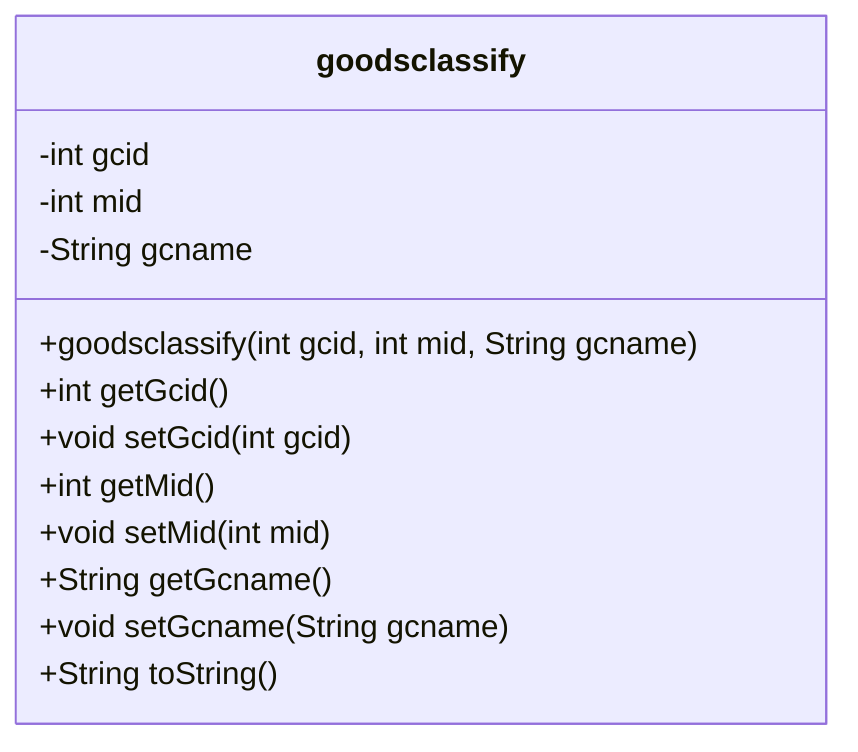
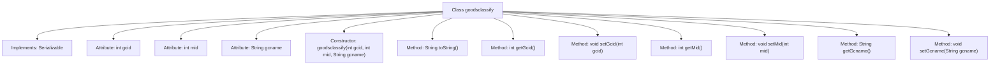

# Basic Information

|      |      |
|------|------|
| Name | goodsclassify |
| Language | .java |
| Code Path | happycat/src/com/happycat/Bean/goodsclassify.java |
| Package Name | com.happycat.Bean |
| Dependencies | ['java.io.Serializable'] |
| Brief Description | Product category class, implements serialization, includes ID, merchant ID, and name fields, provides constructor methods and getter/setter. |

# Description

This is a Java class named goodsclassify that implements the Serializable interface for serialization. The class contains three private fields: integer-type gcid and mid, and string-type gcname. It provides getter and setter methods for these fields and overrides the toString method to return a string containing all field values. The class also includes a constructor for initializing all fields. The serialVersionUID is set to 1L to ensure serialization compatibility.

# Class Summary

| Name   | Type  | Description |
|-------|------|-------------|
| goodsclassify | class | Product category class, implements serialization, includes attributes such as category ID, module ID, and category name, provides constructor methods and getter/setter. |

## Class goodsclassify

|      |      |
|------|------|
| Access Modifier | public |
| Type | class |
| Name | goodsclassify |
| Description | Product category class, implements serialization, includes attributes such as category ID, module ID, and category name, provides constructor methods and getter/setter. |

### UML Class Diagram

This class diagram illustrates a serializable Java class named `goodsclassify`, representing product classification information. The class contains three private fields: `gcid` (classification ID), `mid` (associated ID), and `gcname` (classification name), along with corresponding getter and setter methods. The constructor accepts these three parameters for initialization and overrides the `toString()` method to provide a string representation of the object. By implementing the `Serializable` interface, this class supports serialization operations, making it suitable for network transmission or persistent storage scenarios. The class structure is simple and clear, compliant with JavaBean specifications, facilitating data encapsulation and access control.

### Internal Method Call Graph

This code defines a class named goodsclassify that implements the Serializable interface, containing three private attributes: gcid, mid, and gcname. The class provides a constructor for initializing these three attributes, along with corresponding getter and setter methods for accessing and modifying the attribute values. The toString method is overridden to return a string representation containing all attribute values. The flowchart clearly illustrates the class structure, attributes, constructor, and the hierarchical relationships between the various methods.

### Field List

| Name  | Type  | Description |
|-------|-------|------|
| gcid | int | private int gcid |
| serialVersionUID = 1L | long | Declare a private static constant serialVersionUID with a value of 1L for serial version control. |
| gcname | String | Declare a string variable gcname. |
| mid | int | private int variable mid |

### Method List

| Name  | Type  | Description |
|-------|-------|------|
| setGcid | void | Java Method: Set the gcid attribute value. The parameter is an integer gcid, which is directly assigned to the gcid member variable of the class. |
| getGcid | int | The method returns the value of the integer variable gcid. |
| toString | String | Override the toString method to return a string containing gcid, mid, and gcname. |
| setMid | void | Method for setting the member variable mid. |
| getMid | int | The method returns the value of the integer variable mid. |
| getGcname | String | The method returns the value of the string-type variable gcname. |
| setGcname | void | Java Method: Set the value of the string-type member variable gcname. |

