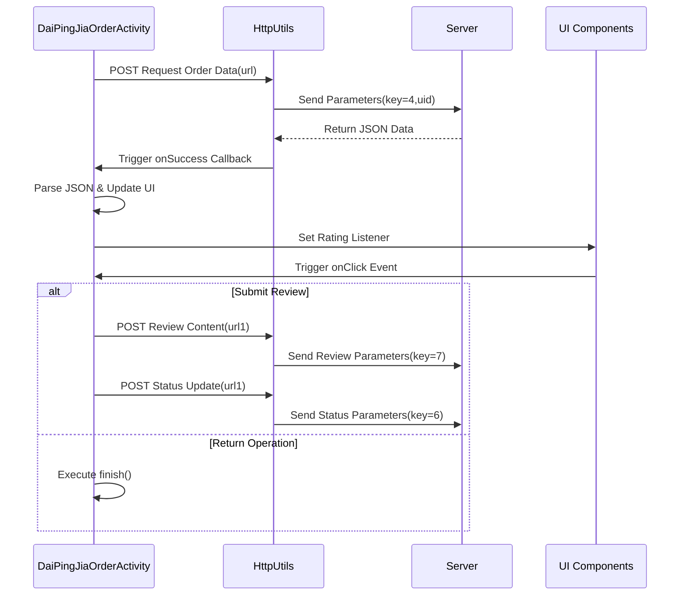

# Basic Information

|      |      |
|------|------|
| Name | DaiPingJiaOrderActivity |
| Language | .java |
| Code Path | happycat/src/com/happycat/DaiPingJiaOrderActivity.java |
| Package Name | com.happycat |
| Dependencies | ['java.io.UnsupportedEncodingException', 'java.lang.reflect.Type', 'java.net.URLEncoder', 'java.util.LinkedList', 'java.util.List', 'com.example.happucat.R', 'com.example.happucat.R.layout', 'com.example.happucat.R.menu', 'com.google.gson.Gson', 'com.google.gson.reflect.TypeToken', 'com.happycat.Bean.MerchatXqBean', 'com.happycat.Bean.MyOrderBean', 'com.happycat.Bean.SouSuoBean', 'com.happycat.global.GlobalContacts', 'com.happycat.util.MyApplication', 'com.lidroid.xutils.HttpUtils', 'com.lidroid.xutils.exception.HttpException', 'com.lidroid.xutils.http.RequestParams', 'com.lidroid.xutils.http.ResponseInfo', 'com.lidroid.xutils.http.callback.RequestCallBack', 'com.lidroid.xutils.http.client.HttpRequest.HttpMethod', 'android.os.Bundle', 'android.app.ActionBar', 'android.app.Activity', 'android.content.Intent', 'android.util.Log', 'android.view.Menu', 'android.view.View', 'android.view.View.OnClickListener', 'android.widget.Button', 'android.widget.EditText', 'android.widget.ImageButton', 'android.widget.ImageView', 'android.widget.RatingBar', 'android.widget.RatingBar.OnRatingBarChangeListener', 'android.widget.TextView', 'android.widget.Toast'] |
| Brief Description | DaiPingJiaOrderActivity is an order evaluation interface that includes order information display, star rating, and comment submission functions. It retrieves order data via HTTP requests, allows users to input comments and submit them, and updates the order status upon submission. It also supports return operations. |

# Description

DaiPingJiaOrderActivity is an Android order evaluation interface that extends Activity and implements click listeners. Its primary functions include initializing view components, fetching order data via HTTP requests, and displaying product images, names, prices, and other details. Users can rate using RatingBar and input comments via EditText. Clicking the submit button sends the evaluation content to the server via a POST request while updating the order status. The interface includes a back button to return to the order page or directly close the current screen. Network requests are handled using HttpUtils, and data parsing is performed with the Gson framework.

# Class Summary

| Name   | Type  | Description |
|-------|------|-------------|
| DaiPingJiaOrderActivity | class | Android order review page, displaying order details, star rating, and comment submission features, interacting with the server via HTTP requests, and supporting return operations. |


## Class DaiPingJiaOrderActivity

|      |      |
|------|------|
| Access Modifier | public |
| Type | class |
| Name | DaiPingJiaOrderActivity |
| Description | Android order review page, displaying order details, star rating, and comment submission features, interacting with the server via HTTP requests, and supporting return operations. |


### UML Class Diagram

```mermaid
classDiagram
    class DaiPingJiaOrderActivity {
        <<Interface>>
        +OnClickListener
        -ImageView gimg
        -HttpUtils httpUtils
        -Intent intent
        -String url
        -String url1
        -String uid
        -TextView mname
        -TextView gname
        -TextView istatus
        -TextView sumprice
        -TextView number
        -TextView iphone
        -TextView identifier
        -List~MyOrderBean~ mlist
        -EditText editText
        -Button button
        -ImageButton imageButton
        -String cimg
        -RatingBar ratingBar
        +onCreate(Bundle savedInstanceState) void
        -initData() void
        -initViews() void
        +onClick(View arg0) void
    }

    class MyApplication {
        <<static>>
        +String SP_user_id
        +String getIp() String
        +BitmapUtils bitmapUtils
    }

    class MyOrderBean {
        +String gimg
        +String mname
        +String gname
        +String istatus
        +String price
        +String num
        +String iPhone
        +String identifier
        +String mid
    }

    class HttpUtils {
        +send(HttpMethod method, String url, RequestParams params, RequestCallBack~String~ callback) void
    }

    class RequestParams {
        +addBodyParameter(String key, String value) void
    }

    class RequestCallBack~R~ {
        <<Interface>>
        +onSuccess(ResponseInfo~R~ responseInfo) void
        +onFailure(HttpException error, String msg) void
    }

    class Gson {
        +fromJson(String json, Type typeOfT) Object
    }

    class TypeToken~T~ {
        +getType() Type
    }

    DaiPingJiaOrderActivity --> MyApplication : Uses static members
    DaiPingJiaOrderActivity --> HttpUtils : Sends HTTP requests
    DaiPingJiaOrderActivity --> MyOrderBean : Stores order data
    DaiPingJiaOrderActivity --> RequestParams : Constructs request parameters
    DaiPingJiaOrderActivity --> RequestCallBack~String~ : Handles response
    DaiPingJiaOrderActivity --> Gson : JSON parsing
    DaiPingJiaOrderActivity --> TypeToken~LinkedList~MyOrderBean~~ : Gets type information
    HttpUtils --> RequestCallBack~String~ : Callback handling
    Gson --> TypeToken~LinkedList~MyOrderBean~~ : Gets generic type
```

This code implements an Android order rating interface with key functionalities: 1) Fetching and displaying order data via HTTP requests; 2) Providing star rating and comment input features; 3) Updating order status after submitting reviews. The class diagram illustrates core components and their relationships, including Activity, network utilities, data models, and JSON parsing tools, reflecting an MVC architecture pattern. Special attention is given to handling the complete workflow of network request callbacks, data parsing, and UI updates.


### Internal Method Call Graph

```mermaid
graph TD
    A["DaiPingJiaOrderActivity"]
    B["Property: ImageView gimg"]
    C["Property: HttpUtils httpUtils"]
    D["Property: String url/url1/uid"]
    E["Property: TextView/EditText Component Group"]
    F["Property: RatingBar ratingBar"]
    G["onCreate: Initialize Activity"]
    H["initViews: Initialize UI Components"]
    I["initData: Load Order Data"]
    J["onClick: Handle Button Click Events"]
    K["HTTP Request: Fetch Order Data"]
    L["HTTP Request: Submit Review"]
    M["HTTP Request: Update Order Status"]

    A --> B
    A --> C
    A --> D
    A --> E
    A --> F
    A --> G
    G --> H
    G --> I
    H -->|"Set Listeners"| J
    I --> K
    K -->|"Parse JSON"| E
    J -->|"R.id.tijiao"| L
    L --> M
    J -->|"R.id.sjreturn"| "finish/Navigate"
```



The flowchart demonstrates the core logic of the order review page: 1) Loading order data via HTTP requests and rendering UI during initialization; 2) Collecting user input through rating components; 3) Branching operations based on user actions to either submit reviews (involving dual HTTP requests) or return. The sequence diagram details the network request interactions, including the complete chained calls for order data retrieval, review submission, and status updates, as well as the triggering relationship between UI events and network requests.

### Field List

| Name  | Type  | Description |
|-------|-------|------|
| gimg | ImageView | Define the image view variable gimg. |
| intent | Intent | Declare an Intent object |
| editText | EditText | Defined a variable named editText of type EditText. |
| identifier | TextView | Define seven TextView variables: mname for name, gname for group name, istatus for status, sumprice for total price, number for quantity, iphone for phone, and identifier for identifier. |
| url = "http://" + MyApplication.getIp() + ":8080/happycat/myServlet" | String | Splicing URL strings in code, using the application IP address and port 8080, with the path as happycat/myServlet. |
| httpUtils | HttpUtils | Declared a variable httpUtils of type HttpUtils. |
| cimg | String | Declare a string variable cimg. |
| button | Button | Declare a button object named button. |
| mlist | List<MyOrderBean> | The variable mlist is a list of type MyOrderBean. |
| url1 = "http://" + MyApplication.getIp() + ":8080/happycat/MG" | String | Splicing URL strings in code, using the application IP address and fixed path /happycat/MG, with port 8080. |
| ratingBar | RatingBar | RatingBar is a rating control in Android used for displaying and selecting star ratings. |
| uid = MyApplication.SP_user_id + "" | String | Convert the user ID to a string and assign it to the variable uid. |
| imageButton | ImageButton | Declare a variable imageButton of type ImageButton. |

### Method List

| Name  | Type  | Description |
|-------|-------|------|
| onCreate | void | In the onCreate method of an Android Activity, hide the title bar, set the layout, and initialize views and data. |
| initData | void | The method `initData` initializes the data by sending a POST request to fetch order information. After parsing the JSON response, it updates the UI to display order details, including images, names, products, status, price, quantity, phone number, and identifiers. Logs are recorded in case of failure. |
| initViews | void | Initialize the view component and set up click listeners, configuring corresponding images based on the rating. |
| onClick | void | Click Event Handling: Perform different operations based on button IDs. The submit button validates the length of the review text, and upon passing, uses HttpUtils to send a POST request to submit the review and update the order status, displaying an error if it fails. The return button checks the input before either redirecting or closing the page. |


