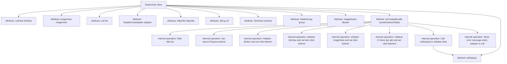

# Basic Information

|      |      |
|------|------|
| Name | DayActivity |
| Language | .java |
| Code Path | happycat/src/com/happycat/DayActivity.java |
| Package Name | com.happycat |
| Dependencies | ['java.lang.reflect.Type', 'java.util.ArrayList', 'java.util.List', 'com.example.happucat.R', 'com.google.gson.Gson', 'com.google.gson.reflect.TypeToken', 'com.happycat.Bean.DayMerchatBean', 'com.happycat.adapter.DayMerchatadapter', 'com.happycat.util.MyApplication', 'com.lidroid.xutils.HttpUtils', 'com.lidroid.xutils.exception.HttpException', 'com.lidroid.xutils.http.ResponseInfo', 'com.lidroid.xutils.http.callback.RequestCallBack', 'com.lidroid.xutils.http.client.HttpRequest.HttpMethod', 'android.os.Bundle', 'android.app.ActionBar', 'android.app.Activity', 'android.content.Intent', 'android.util.Log', 'android.view.View', 'android.view.View.OnClickListener', 'android.widget.AdapterView', 'android.widget.BaseAdapter', 'android.widget.ImageButton', 'android.widget.ImageView', 'android.widget.ListAdapter', 'android.widget.ListView', 'android.widget.RadioGroup', 'android.widget.TextView', 'android.widget.AdapterView.OnItemClickListener'] |
| Brief Description | DayActivity is an Android Activity class that includes controls such as list views and image buttons, handles user click events, fetches data via HTTP requests, parses JSON using Gson, and updates the list adapter. |

# Description

DayActivity is an Android Activity class designed to display a list of takeout merchants. The interface includes a list view, image buttons, and a notification icon. The list data is retrieved from the server via HTTP requests, parsed using Gson, and populated into an adapter. Clicking on a list item navigates to the merchant details page, passing information such as merchant ID, name, and delivery fee. At the bottom, there are six category buttons; clicking different buttons navigates to the corresponding merchant list page for that category. During initialization, the title bar is hidden, and if the adapter is empty, an error prompt is displayed. Clicking the image button closes the current page, while clicking the notification icon navigates to another activity.

# Class Summary

| Name   | Type  | Description |
|-------|------|-------------|
| DayActivity | class | DayActivity is an Android Activity class that includes controls such as list views and image views, handles user click events and navigates to different activities, fetches data via HTTP requests and displays it. |


## Class DayActivity

|      |      |
|------|------|
| Access Modifier | public |
| Type | class |
| Name | DayActivity |
| Description | DayActivity is an Android Activity class that includes controls such as list views and image views, handles user click events and navigates to different activities, fetches data via HTTP requests and displays it. |


### UML Class Diagram

```mermaid
classDiagram
    class Activity {
        <<Android>>
    }
    
    class DayActivity {
        -ListView listView
        -ImageView imageView
        -List~DayMerchatBean~ list
        -DayMerchatadapter adapter
        -HttpUtils httpUtils
        -String url
        -TextView textView
        -RadioGroup group
        -ImageButton iButton
        +onCreate(Bundle savedInstanceState) void
        -initDatas() void
    }
    
    class DayMerchatadapter {
        <<Adapter>>
        +notifyDataSetChanged() void
    }
    
    class DayMerchatBean {
        <<DataModel>>
        +getMid() int
        +getMname() String
        +getTip() String
        +getLongtime() String
        +getMprice() double
        +getMtime() String
        +getMimg() String
    }
    
    class HttpUtils {
        +send(HttpMethod method, String url, RequestCallBack~String~ callback) void
    }
    
    class RequestCallBack~T~ {
        <<Interface>>
        +onFailure(HttpException e, String msg) void
        +onSuccess(ResponseInfo~T~ info) void
    }
    
    class Gson {
        +fromJson(String json, Type type) Object
    }
    
    class TypeToken~T~ {
        <<GenericType>>
        +getType() Type
    }
    
    Activity <|-- DayActivity
    RequestCallBack~String~ <|.. DayActivity
    DayActivity --> DayMerchatadapter : uses
    DayActivity --> DayMerchatBean : contains data
    DayActivity --> HttpUtils : uses
    HttpUtils --> RequestCallBack~String~ : callback
    DayActivity --> Gson : uses
    Gson --> TypeToken~List~DayMerchatBean~~ : uses
```

This class diagram illustrates the structure of DayActivity and its related components. DayActivity inherits from Android's Activity class, containing multiple UI components (such as ListView, ImageView, etc.) and business logic components (like HttpUtils, Gson). It displays a list of DayMerchatBean data through DayMerchatadapter, uses HttpUtils for network requests, and parses JSON data via Gson. The RequestCallBack interface handles callback results of network requests, while TypeToken is used to obtain generic type information. Overall, it demonstrates a typical architecture for data loading, display, and event handling in Android activities.


### Internal Method Call Graph



This code implements the DayActivity class on the Android platform, primarily functioning to display a takeout-related interface. The code flow includes: initializing UI elements (hiding the title bar, setting the layout), setting click event listeners for multiple buttons, initializing the list view and its click events, fetching data via network requests and updating the UI. Notably, the code handles click events for 6 different categories, each constructing distinct URL parameters and navigating to WaiMAIMainActivity, along with list item clicks that navigate to MerchatDataActivity for detailed logic. Error messages are displayed when data loading fails.

### Field List

| Name  | Type  | Description |
|-------|-------|------|
| iButton | ImageButton | Image Button Control iButton |
| list = new ArrayList<DayMerchatBean>() | List<DayMerchatBean> | Create an ArrayList named list to store objects of type DayMerchatBean. |
| listView | ListView | Declare a variable named listView of type ListView. |
| textView | TextView | Define the TextView control variable textView. |
| url | String | The private string variable url is used to store the web address. |
| httpUtils | HttpUtils | Declaration of HttpUtils utility class instance. |
| imageView | ImageView | Declare a variable named imageView of type ImageView. |
| adapter | DayMerchatadapter | Declaration of the DayMerchantAdapter adapter instance. |
| group | RadioGroup | Defined a variable named group of type RadioGroup. |

### Method List

| Name  | Type  | Description |
|-------|-------|------|
| onCreate | void | Implement the code for the takeout app interface features, including hiding the title bar, button click events, list item click navigation and data transfer, as well as the click navigation logic for multiple category buttons. |
| initDatas | void | Initialization data method: Create an adapter and set up the list view, fetch data from the server via an HTTP GET request, parse the JSON result using Gson, and update the adapter. |


